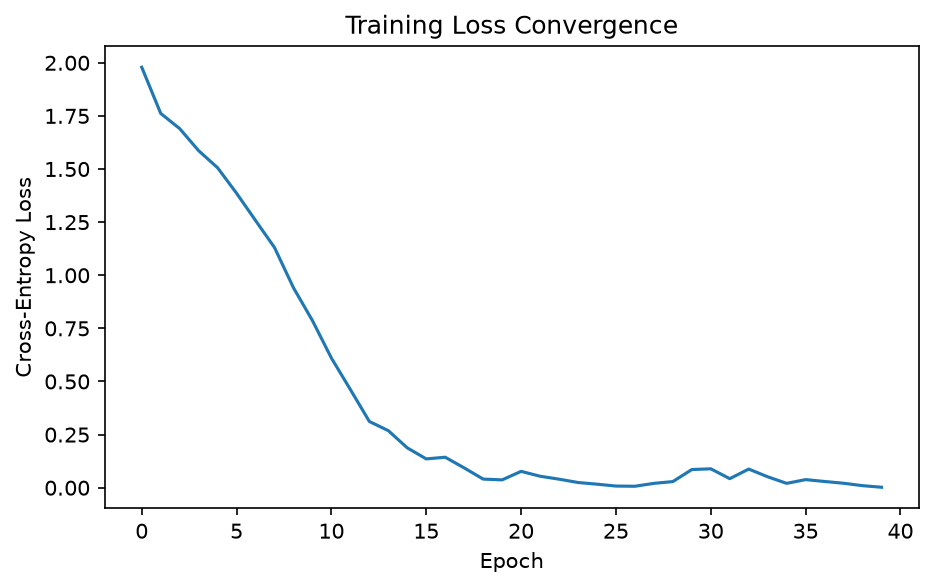
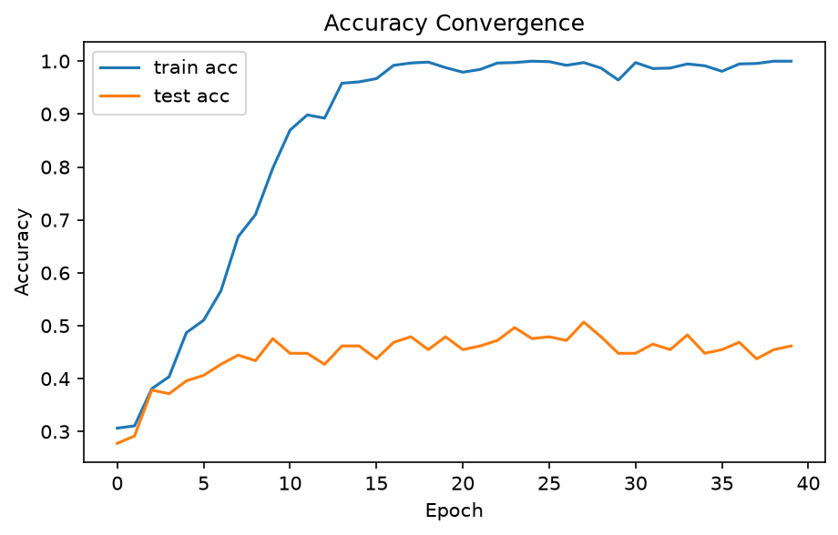
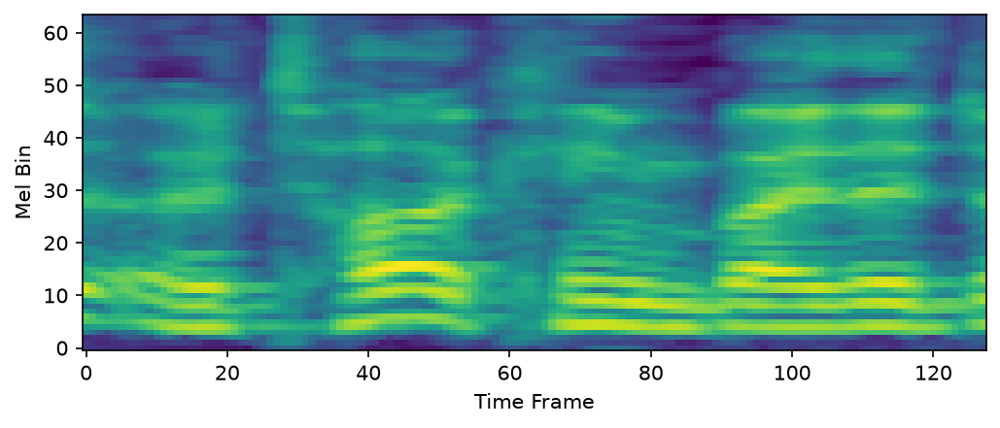
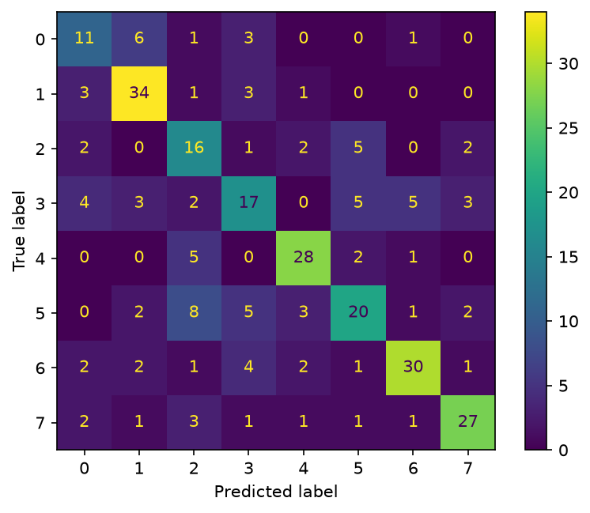

# CNN-Speech-Emotion · 语音情感识别（CNN）

基于 **卷积神经网络（CNN）** 的语音情感识别系统：将语音的 log-Mel 频谱图视为"图像"，用 LeNet 风格的 CNN 在 **RAVDESS** 数据集上完成 8 类情感分类（课程作业完整实现，含实验报告）。

   

## 实验结果

| 指标 | 数值 |
|---|---|
| 数据集 | RAVDESS 语音子集（1440 条，24 名演员，8 类情感均衡） |
| 模型 | 3 × (Conv2d + ReLU + MaxPool) + 2 × FC，共 1,073,032 参数（约 107 万） |
| 训练设置 | Adam（lr=1e-3）· batch=32 · 40 epoch · 80/20 划分（seed=42） |
| **测试集正确率** | **63.54%**（183 / 288，为随机基线 12.5% 的 5.1 倍） |
| 硬件 | NVIDIA RTX 4080（WSL2 + CUDA） |

**混淆矩阵中的典型现象**：fearful↔happy、neutral↔calm 互混最多——高唤醒度情感共享相似的声学特征（高音高、快语速）；calm（81%）与 angry（78%）识别最好。

## 项目结构

```text
cnn-speech/
├── src/                        # 核心代码
│   ├── check_data.py           # 数据集统计校验（1440 条 / 8 类各 192）
│   ├── dataset.py              # 特征提取 + Dataset/DataLoader + 8:2 划分
│   ├── model.py                # SpeechCNN 网络定义
│   ├── train.py                # 训练循环 + 存盘 + 收敛曲线 + 混淆矩阵
│   └── test.py                 # 加载训练好的模型复测
├── 作业报告/                    # 实验报告（作业交付物）
│   ├── 作业报告-第3问-编程实现与实验验证.md / .pdf
│   └── gen_pdf.py              # 报告 PDF 生成脚本（fpdf2）
├── cnn-guide/                  # 实验指导书（HTML + 清洗版 MD）
├── train.py代码逐行详解.md     # 源码逐行中文详解（新手友好）
├── dataset.py代码逐行详解.md
├── model.py代码逐行详解.md
├── .gitignore                  # 排除数据集、模型权重、缓存
└── README.md
```

## 方法

### 1. 特征：波形 → log-Mel 频谱图

| 步骤 | 参数 | 说明 |
|---|---|---|
| 重采样 | 48 kHz → 16 kHz | 语音标准采样率；防止 Mel 刻度错位 3 倍（见下"关键 bug"） |
| 加窗分帧 | n_fft=1024（64 ms） | 每帧 FFT 得频率分布 |
| 帧移 | hop_length=125 | 16 kHz / 125 = 128 帧/秒，配套 128 帧定长 |
| Mel 滤波 | n_mels=64 | 人耳感知非线性频带，压成 64 频带 |
| log 压缩 | log(mel + 1e-6) | 压缩动态范围，1e-6 防止 log(0) |
| 定长 | 中心裁剪 / 补零 | 统一为 [1, 64, 128] 单通道"图像" |

### 2. 网络结构（[src/model.py](src/model.py)）

```text
输入 [N, 1, 64, 128]
  → Conv2d(1→16, 3×3, pad=1) + ReLU + MaxPool2d(2)   → [N, 16, 32, 64]
  → Conv2d(16→32, 3×3, pad=1) + ReLU + MaxPool2d(2)  → [N, 32, 16, 32]
  → Conv2d(32→64, 3×3, pad=1) + ReLU + MaxPool2d(2)  → [N, 64, 8, 16]
  → Flatten → Linear(8192→128) + ReLU → Linear(128→8) → logits [N, 8]
```

目标函数为 softmax 交叉熵（`CrossEntropyLoss`，内部自带 log_softmax，模型末层不加 softmax），优化器为 Adam。

### 3. 训练五步曲

```python
for x, y in train_loader:
    x, y = x.to(device), y.to(device)
    logits = net(x)            # ① 前向
    loss = criterion(logits, y) # ② 计算交叉熵损失
    optimizer.zero_grad()       # ③ 清旧梯度（PyTorch 梯度默认累加）
    loss.backward()             # ④ 反向传播
    optimizer.step()            # ⑤ 更新参数
```

## 快速开始

```bash
# 1. 环境（Python ≥ 3.9）
pip install torch torchaudio scikit-learn matplotlib soundfile

# 2. 数据：下载 RAVDESS 语音部分，解压到 data/ 下
#    目录结构需为 data/Actor_XX/*.wav（1440 个 .wav）

# 3. 校验数据
python src/check_data.py        # 预期输出：1440 条、8 类各 192

# 4. 训练（自动完成：训练 → 存盘 speech_cnn.pth → 出三张图）
python src/train.py

# 5. 复测（加载已训练的权重）
python src/test.py
```

**必须从项目根目录运行**：`data/`、`speech_cnn.pth` 等均为相对路径，在别处运行会静默失败（找不到数据不报错、空转）。

## 结果图示

| | |
|---|---|
|  |  |
| 图 1 训练损失收敛：初始值 ≈ ln(8)=2.079（理论校验点），单调下降趋平 | 图 2 train/test 正确率同步上升，过拟合可控 |
|  |  |
| 图 3 CNN 的输入：一条真实语音的 log-Mel 频谱图 | 图 4 8×8 混淆矩阵：对角线为答对，格外为混淆对 |

## 关键 bug 复盘（工程记录）

**MelSpectrogram 的 sample_rate 参数只定频率刻度、不重采样音频**。未先将 48 kHz 波形降到 16 kHz 时，频率刻度整体错位 3 倍、hop=125 每秒产生 384 帧 → 128 帧仅覆盖 0.33 秒语音，训练**不报错但静默劣化**：

| | 测试正确率 |
|---|---|
| 未重采样（bug 版） | 46.2% |
| 重采样后（修复版） | **63.5%** |

> 教训：数据管道的参数必须逐一对账，"能跑通"不等于"跑对了"。

## 说明

- `data/`（音频数据）、`speech_cnn.pth`（模型权重）体积较大，已通过 `.gitignore` 排除，不入库；
- 根目录的三个《xxx代码逐行详解.md》是面向初学者的源码逐行中文详解（含 Q&A 与术语表），`作业报告/` 是提交给老师的实验报告。

## 引用

```bibtex
@dataset{ravdess,
  author  = {Livingstone, Steven R. and Russo, Frank A.},
  title   = {The Ryerson Audio-Visual Database of Emotional Speech and Song (RAVDESS)},
  year    = {2018},
  journal = {PLoS ONE},
  volume  = {13},
  number  = {5},
  doi     = {10.1371/journal.pone.0196391}
}
```
