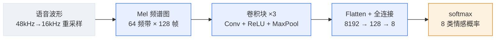

<!-- 由同目录 cnn-guide.html 清洗生成（2026-08-28）：剥离样式/脚本/交互组件，保留全部文字、代码、公式、表格与问答。交互图表与可勾选清单请看 HTML 原版。 -->

# CNN 在语音上的应用 从目标函数推导到收敛曲线的完整通关手册

作业指导书 · 我教你做，代码你写

对应老师任务书第 (2)(3) 问。本手册给思路、给推导、给骨架和验收标准；所有需要动手的部分（装环境、写代码、跑实验）由你自己完成——这也是你进组前的第一次系统性训练。

任务：选择 CNN 模型 / 目标函数 / 导数求解 / 编程验证 / 收敛曲线 · 选题：语音情感识别（RAVDESS · 8 分类） · 环境：WSL2 + Ubuntu 26.04（已核验就绪）+ Conda + RTX 4080 GPU · 预计总工时：2–3 个全天

================= 0 任务解读 =================

## SECTION 0 · 任务解读与总体技术路线

老师任务书原文（第 2、3 问）：

> **任务书**

（2）选择一种你能理解的卷积神经网络模型，给出目标函数，给出导数求解过程。 （3）通过编程实现该算法，找一个数据集验证该方法的有效性，并画出算法的收敛曲线。

拆开看，这实际是 **4 个交付物**：

| 交付物 | 对应章节 | 形式 |
| --- | --- | --- |
| ① 模型选择 + 结构说明 | 本手册第 1 章 | 报告正文：结构图 + 维度流表 + 选择理由 |
| ② 目标函数 + 导数求解过程 | 本手册第 2、3 章 | 报告正文：公式推导（手推，这是得分核心） |
| ③ 代码 + 实验验证 | 本手册第 4 章 | 可运行的 .py 文件 + 数据集 |
| ④ 收敛曲线 + 有效性结论 | 本手册第 5 章 | 两张图 + 一句话结论（对比随机基线） |

### 总体技术路线（先背下来，答辩要能脱口而出）

你上传的课件截图出自经典论文 *Convolutional Neural Networks for Speech Recognition*（Abdel-Hamid et al., IEEE/ACM TASLP 2014）[1]——它回答了"CNN 凭什么能处理语音"这个根本问题：

> **核心思想（一句话版）**

语音先被转成**频谱图**（频率 × 时间的二维矩阵），它就是一张"图像"；CNN 用卷积核在频谱图上滑动，提取**局部时频模式**（共振峰、能量包络），用**权值共享**获得时间平移不变性，用**最大池化**获得局部变形鲁棒性——这三个性质正是全连接网络没有的。



*图 1：总体技术路线——语音 → 频谱图 → CNN → 情感分类（对应课件架构图的数据流）*

任务选题定为**语音情感识别**（speech emotion recognition）：输入一段语音，输出说话人的情绪类别（平静 / 快乐 / 愤怒 / 悲伤等 8 类）。为什么选它而不是语音识别（ASR）？① ASR 需要 CTC / 序列建模，超出"手推 CNN"的作业范围；② 情感识别是**整段分类**任务，softmax + 交叉熵的标准范式，推导干净；③ 它本身就是 RL×Audio 主线上"情感可控生成"的认知基础（第 5 章 L3 音频栈的延伸阅读）。

================= 1 模型选择 =================

## SECTION 1 · 第一步：模型选择——频谱图 + LeNet 风格 CNN

### 1.1 为什么选 LeNet 风格，而不是 ResNet / VGG

任务书写的是"选择一种**你能理解**的卷积神经网络模型"——这句话本身就是评分点。你的选择和理由要写进报告：

| 候选 | 结构 | 能否手推全部导数 | 结论 |
| --- | --- | --- | --- |
| **LeNet 风格 CNN**（选定） | 3×(Conv–ReLU–MaxPool) + 2×FC | ✔ 每层都能在第 3 章推出闭式解 | **选它**：结构完整覆盖卷积/池化/全连接三种层型，参数少，CPU 可训 |
| AlexNet / VGG | 更深、更宽的同构堆叠 | ✔（同 LeNet，只是更长） | 不选：参数量大，CPU 训不动，且"更深"不带来推导上的新知识点 |
| ResNet | 引入残差连接 | △ 可推，但多一路分支求和 | 不选：增加推导复杂度，收益（防退化）在小数据集上体现不出来 |

这个结构与课件（Abdel-Hamid 2014[1]）一脉相承：那篇论文的 CNN 本质就是把 LeNet 的输入从图像换成了频谱图（课件图中的 "Frequency bands × Frames"、"Convolution layer feature maps"、"max pooling feature maps"、"fully connected hidden layers" 逐项对应下表）。

### 1.2 网络结构与维度流（你写 model.py 时照此对账）

#### 读表之前 ①：Conv2d 是什么？Conv1/Conv2/Conv3 又是什么？

**卷积层在做什么**：拿一个 3×3 的小窗口（里面装 9 个可学习的权重 + 1 个偏置，合称**卷积核**）贴在输入图的左上角，窗口盖住的 9 个像素与 9 个权重对应相乘再求和 → 输出 1 个数；窗口右移一格再算 → 又 1 个数……扫完整张图，把所有输出拼成一张新的二维图，叫**特征图（feature map）**。这一整套动作就是一次**二维卷积**；PyTorch 里实现它的类叫 `nn.Conv2d`——"2d"指窗口在二维平面上滑动。

**表里 Conv2d(1→16, 3×3, pad=1) 怎么读**：输入 1 个通道 → 这一层放 16 个卷积核 → 每个核 3×3 大小 → pad=1 表示先在图四周补一圈 0 再卷积。下游效果：**16 个核各扫一遍、各产出一张特征图，所以输出通道数变成 16**；pad=1 用来抵消卷积对尺寸的侵蚀——尺寸公式 `H_out = H + 2×pad − k + 1 = 64 + 2 − 3 + 1 = 64`（尺寸不变，这行公式写报告可直接用）。

**Conv1 / Conv2 / Conv3 是什么**：不是三种不同的算子，是**我们给这个网络里第 1、2、3 个卷积层起的名字**——就像家里三个孩子叫老大、老二、老三，姓都是 Conv2d。它们对应你 model.py 里的 `self.block1 / block2 / block3`。参数量自查里"Conv1: 16×1×3×3+16=160"算的就是老大那层：16 个核 × 每核 (1 通道 × 3 × 3) 个权重 + 16 个偏置。

#### 读表之前 ②：[N, C, H, W] 四个数与"输出维度"一列

PyTorch 用**四维张量** `[N, C, H, W]` 表示一批图像数据，从左到右：

- **N**（batch）：一次同时喂进网络的语音条数。网络不是一条一条学，而是 32 条一批一起算——批内并行、梯度取平均，又快又稳；
- **C**（channel，通道）：每条数据叠了几张"图层"。灰度照片 1 层、彩色照片 RGB 3 层；到了网络中层，通道数 = 特征图张数；
- **H**（height）/ **W**（width）：每张图的高和宽。在这里 H 沿**频率**方向、W 沿**时间**方向。

**"输出维度"一列 = 数据流过这一层之后，[N, C, H, W] 变成了什么。**比如第 2 行 MaxPool2d(2) 之后是 [N, 16, 32, 64]：还是那 N 条语音、还是 16 张特征图，但高宽各减半（64→32、128→64）。整张表就是一张"形状流水账"。为什么必须盯形状：① 神经网络本质是张量形状的流水线，每层输出形状必须严丝合缝对上下一层输入；② 写代码时报错 90% 是 shape 不匹配（Step 3 验收就在查这个）；③ 第 3 章推导里，梯度的形状必须和参数的形状一一对应。

#### 读表之前 ③：Mel 频谱图是什么——从声音到"图"的五步

SECTION 0 给过一句话版本（"频谱图就是二维图像"），这里是完整链条，每一步都能在 Step 2 的代码里找到对应：

1. **采样**：声音是空气振动，麦克风每秒测几万次振幅，得到一长串数字——wav 文件就是这串数（RAVDESS 原生每秒 48000 次；Step 2 先统一降到每秒 16000 次——语音能量几乎都在 8 kHz 以下，16 kHz 足够且省 3 倍计算）。此时它是**一维**信号：只有"什么时刻多强"；
2. **加窗分帧**：把长串切成小段（每段 1024 个采样点 ≈ 64ms，叫一"帧"；每 125 个点向前挪一步）；
3. **FFT 求频谱**：对每帧做傅里叶变换——任何一段振动都可拆成一组不同频率正弦波的叠加，FFT 告诉你这帧里**每个频率各占多强**。一帧 → 一根"频率-强度"竖条；
4. **拼成频谱图**：把所有帧的竖条按时间排开，得到**横轴时间、纵轴频率、亮度 = 强度**的二维图。这就是频谱图（spectrogram）——语音从此变成一张图；
5. **换成 Mel 刻度**：人耳对低频分辨精细、对高频迟钝（100 与 200 Hz 听着差很远，4000 与 4100 Hz 几乎无差别）。Mel 刻度按这种感知把频率轴非线性重排（低频拉开、高频压拢），再归并成 64 个频带。经过这一步的叫 **Mel 频谱图**，对语音任务普遍比线性频率轴更好用。

所以输入 `[1, 64, 128]` 读作：**一张 64 行 × 128 列的灰度图**——64 行 = 64 个 Mel 频带（频率从低到高），128 列 = 128 帧（时间从左到右），每个像素值 = 该时刻该频带的能量（log 压缩后）。这也回答了**为什么通道数是 1**：每个"像素"只有一个能量数值，就像黑白照片；数据是 RGB 彩色图时通道才是 3。通道数由数据本身的物理属性决定，**不是**可以随手调的超参。

#### 读表之前 ④：[1, 64, 128] 里每个数是谁定的——超参数来源表

**超参数（hyperparameter）** = 开工前由你设定、训练过程不去学习的量（对比：**参数** = 卷积核里那 9 个权重、全连接层的 8192×128 权重——它们是训练学出来的。答辩 Q5/Q6 考这个区分）。维度流表里每个数的来历：

> **数字的三种身份——写每个数字前先归类（本作业 48k bug 的制度性教训）**

项目里每个数字必属以下三类，**处理纪律完全不同，混用即埋雷**： **① 数据事实（fact）**——由数据集客观决定，**不许猜，必须实测**（读文件头 / `print(wav.shape, sr)` / 数文件数），猜错 = bug。本项目的：源采样率 **48000**、样本总数 1440、类别数 8、声道数 1（5 条例外）——来源 = Step 1 体格检查表。 **② 管道一致性（consistency）**——由你上游的选择**推导**出来，不许独立拍板，**必须对账**：对不上要么报 shape 错、要么静默错位。本项目的：Resample 的 `orig_freq=48000`（对账①的实测值）、MelSpectrogram 的 `sample_rate=16000`（对账 Resample 的 new_freq）、model.py 的 Linear 输入 `8192 = 64×8×16`（对账 n_mels × 三层池化后的宽高）。 **③ 人为超参（choice）**——安全区内自由选，**无唯一真值**，依据 = 物理夹逼 + 社区惯例 + 消融实验（详见 6B Q15 的三级细分）。本项目的：n_fft=1024、hop=125、n_mels=64、target_frames=128、lr=1e-3、batch=32、epoch=40。 **48k bug 解剖**：`sample_rate=16000` 长得像③（"16k 是语音惯例值"随手就写），实际是②——它成立的前提"数据已是 16k"是①类事实，而事实是 48k。**①没验证 → ②断了链 → 错位 3 倍且静默不报错**。分类清后纪律就一句话：**看到①去验证，看到②去对账，看到③才轮到你选**。下表"数字身份"列已给每个数标好类别。

| 量 | 本作业取值 | 数字身份 | 能改吗 | 理由 / 改了会怎样 |
| --- | --- | --- | --- | --- |
| 输入通道 C | 1 | ①数据事实 | ✘ | Mel 频谱每像素只有一个能量值（灰度）；RGB 图像才是 3 |
| 分类数（输出维） | 8 | ①数据事实 | ✘ | RAVDESS 共 8 类情感——由文件名第 3 段的取值范围（01~08）数出来的，不是你选的 |
| 采样率 | 16000 Hz | ①实测 48k → ②对账 16k | △ | RAVDESS 原生 48 kHz；Mel 只关心 8 kHz 以下语音频段 → Step 2 先 T.Resample 降到 16 kHz（语音标准，wav2vec2 等模型同款）。**MelSpectrogram 的 sample_rate 参数只定刻度不重采样音频，漏降则频率错位 3 倍**（Step 2 bug 修复框有全记录） |
| 频带数 n_mels | 64 | ③人为超参 | ✔ 常用 40–128 | 把 0–8 kHz 压成 64 个 Mel 频带，即图的"高度"。越大频率越细，但图更高、算得越多；64 是语音惯例值 |
| 时间帧数 | 128 帧 | ③人为超参 | ✔ | 配合 hop=125 恰好 = 1 秒音频；batch 训练要求所有样本等长 → 长的取**中心 1 秒**（情感最饱满的中段）、短的右侧补零。想覆盖全长可加大，但 flatten 维度和全表都要重算 |
| 帧移 hop_length | 125 | ③人为超参 | △ 慎动 | 每秒帧数 = 16000 / 125 = 128，与目标 128 帧配套；动它则"秒数 ↔ 帧数"换算全变 |
| FFT 窗长 n_fft | 1024 | ③人为超参 | ✔ | 每帧 64ms，决定频率分辨率；1024 对 16 kHz 语音常用 |
| 卷积核大小 | 3×3 | ③人为超参 | ✔ | 小核堆叠参数少、感受野靠层数攒；改 5×5 则尺寸公式里的 k 跟着变 |
| 每层核数（通道） | 16 / 32 / 64 | ③人为超参 | ✔ | 即每层特征图张数；空间尺寸逐层减半时通道翻倍，是 LeNet 以来的设计惯例 |
| Linear 输入 8192 | 8192 | ②管道一致性 | △ 联动 | = n_mels 64 × 三层池化后高 8 × 宽 16；改 n_mels / target_frames / 池化层数，它必须跟着重算，否则 model.py 直接报 shape 错 |
| batch 大小 N | 32 | ③人为超参 | ✔ 16–64 | 一批 32 条一起算；显存够则大些更稳 |
| 学习率 lr | 1e-3 | ③人为超参 | ✔ | Adam + 1e-3 是安全起点；第 5 章讲按收敛曲线调 |

#### 读表之前 ⑤：全篇高频术语速查（后文直接用，不再重复解释）

| 术语 | 一句话定义 | 详见 |
| --- | --- | --- |
| 张量 (Tensor) | 多维数组；PyTorch 中一切数据的容器，[N, C, H, W] 就是四维张量 | 1.2② |
| batch / epoch | 一次前向同时处理 N 条样本 = 一个 batch；训练集完整过一遍 = 一个 epoch | Step 3 / 5 |
| 特征图 (feature map) | 一个卷积核扫完整张输入得到的那张输出图 | 1.2① |
| 通道 (channel) | 数据叠的"图层"数：灰度 1、RGB 3、网络中层 = 特征图张数 | 1.2② |
| ReLU | 激活函数 max(0, x)：负数归零、正数保留，给网络非线性 | 式 (5) |
| MaxPool（最大池化） | 2×2 窗口只留最大值：尺寸减半 + 保留最强响应 | 3.4 节 |
| Flatten | 把 [64, 8, 16] 立方体摊平成 8192 维向量，才能接全连接层 | 1.2 表第 7 行 |
| 全连接层 (FC) | 每个输入与每个输出都有一条独立权重的层（本质是矩阵乘法） | 3.2 节 |
| 预激活值 z | 线性变换 Wa+b 的结果、激活函数的输入——不是网络最终输出（最后一层例外：z 直接当 logits 进 softmax） | 3.2 节 |
| 滤波器 / 卷积核 (filter / kernel) | 同一事物的两个名字：卷积窗口里那组可学习的权重（3×3=9 个数 + 偏置） | 3.5 节 |
| logits | 网络最后输出的 8 个未归一化分数（可正可负、和不为 1），越大越像该情感 | 2.0 节 |
| Softmax | "取指数再除以总和"——把 logits 压成和为 1 的概率分布 | 2.0 节 |
| 温度 (temperature) | 除在 logit 上的系数 T：T 小分布更陡、T 大更平缓；LLM 采样与 RL 的常用旋钮 | 2.2 节 |
| one-hot 标签 | 真值的向量形态：正确类别位置为 1、其余为 0（如 happy = [0,0,1,0,0,0,0,0]） | 2.0 节 |
| 交叉熵 (CE) | −ln(正确类别的预测概率)，分类任务的标准损失；注意不是"相减"——相减出现在它的梯度 p−y 里 | 2.0 节 |
| 损失 (loss) | 一个数：这批样本上网络错得多离谱；训练唯一目标就是压低它 | 第 2 章 |
| 梯度 | 损失对每个参数的导数：指明该参数往哪挪、挪多少 | 第 3 章 |
| 雅可比矩阵 | 向量值函数的全部一阶偏导排成的表：第 i 行第 j 列 = ∂(第 i 个输出)/∂(第 j 个输入) | 3.1 疑问三 |
| 克罗内克符号 δ_{jk} | "下标相等指示器"：j=k 取 1 否则取 0；softmax 推导里标记"分子含不含 z_{k}" | 3.1 疑问四 |
| 反向传播 | 链式法则从损失出发、逐层回传算出所有梯度的算法 | 第 3 章 |
| 学习率 (lr) | 每步参数更新的步长；本作业 1e-3 | Step 5 |
| 过拟合 | 训练集分数高、测试集分数低——模型在背题而非学规律 | 5.1 节 |

前置齐了。下面这张维度流表，从输入 `[N, 1, 64, 128]` 到输出 `[N, 8]`，就是数据流经整个网络的形状流水账——写 model.py 时逐行对账：

| # | 层 | 输出维度 | 说明 |
| --- | --- | --- | --- |
| 0 | 输入 | [N, 1, 64, 128] | 单通道 Mel 频谱图 |
| 1 | Conv2d(1→16, 3×3, pad=1) + ReLU | [N, 16, 64, 128] | 16 个卷积核 → 16 张特征图；pad 保持尺寸 |
| 2 | MaxPool2d(2) | [N, 16, 32, 64] | 2×2 池化，尺寸减半 |
| 3 | Conv2d(16→32, 3×3, pad=1) + ReLU | [N, 32, 32, 64] | 通道翻倍 |
| 4 | MaxPool2d(2) | [N, 32, 16, 32] |  |
| 5 | Conv2d(32→64, 3×3, pad=1) + ReLU | [N, 64, 16, 32] |  |
| 6 | MaxPool2d(2) | [N, 64, 8, 16] | 三连减半后：64×8×16 |
| 7 | Flatten | [N, 8192] | 64×8×16 = 8192 |
| 8 | Linear(8192→128) + ReLU | [N, 128] | 全连接隐层 |
| 9 | Linear(128→8) | [N, 8] | logits（未过 softmax） |

**参数量自查**（写报告时用）：`Conv1: 16×1×3×3+16=160；Conv2: 32×16×3×3+32=4,640；Conv3: 64×32×3×3+64=18,496；FC1: 8192×128+128=1,048,704；FC2: 128×8+8=1,032`，总计 **1,073,032 ≈ 107 万**。对比：若第一层直接用全连接（64×128=8192 维输入），仅一层就要百万级参数——卷积的参数效率由此可见（这也是答辩问题 8 的答案素材）。

### 1.3 学术脉络与前沿：这条路线从哪来，现在到哪了（答辩必问）

**本手册从哪来**：不是抄某个开源仓库的 train.py，而是四个来源的组合——① 网络结构系谱出自你的课件论文 Abdel-Hamid et al. 2014[1]（其思想又承接 LeCun 1998 的 LeNet：把图像 CNN 的输入换成频谱图）；② Mel 频谱前端是 torchaudio 官方标准管线；③ 维度流与参数量（107 万）按你的输入尺寸逐步推算；④ 数据集为官方 RAVDESS[2]，情感标签直接来自文件名编码。这是一条"教科书标准路线"——也正因为标准，它是所有前沿方法的对照组。

**语音情感识别（SER）的三十年谱系**——你的作业落在第二阶段：

| 阶段 | 时期 | 代表工作 | 核心思想 |
| --- | --- | --- | --- |
| ① 手工特征时代 | 1990s–2013 | HMM/GMM + 韵律、MFCC、eGeMAPS + SVM | 特征工程决定上限，"情感"被编码成几十维统计量 |
| **② 深度分类器时代** | 2014–2018 | Han et al. 2014（首个 DNN 做 SER）；**Abdel-Hamid 2014（你的课件）**；Trigeorgis 2016（端到端原始波形）；RAVDESS 2018 发布 | 让网络自己从频谱图/波形学特征。**你的作业在这一档**——练的是从特征、结构、推导到训练的完整基本功 |
| ③ 结构创新时代 | 2019–2021 | CNN + LSTM + Attention 混合结构 | 时序建模成为重点，注意力开始入场 |
| ④ 自监督预训练时代 | 2021–2023 | wav2vec 2.0 / HuBERT / WavLM[5] | 先在海量无标注语音上学通用表征，再微调到情感任务——"预训练+微调"范式成为标配，wav2vec2 在 RAVDESS 上约 84%[4] |
| ⑤ 通用情感表征与音频大模型时代 | 2024–现在 | **emotion2vec / emotion2vec+**（ACL 2024，首个通用语音情感表征模型）[3]；Transformer-CNN 融合（RAVDESS 91.3%）[6]；Qwen2-Audio / GPT-4o 类音频大模型 zero-shot 识别 | 情感表征本身被预训练成通用资产；音频大模型把它当一项涌现能力 |

**同一张考卷上的分数差距**（RAVDESS 测试精度，写进报告"相关工作"即可显得很懂）：

| 方法 | 阶段 | RAVDESS 精度 | 你做不做 |
| --- | --- | --- | --- |
| LeNet 风格 CNN（本作业） | ② | **旧配置实测 46.2%**（采样率 bug 版；修复重采样后预期更高，见 6B 节 Q12）。文献同类设置约 60–75% | **主线，必做** |
| wav2vec2 base 微调 / 线性探测 | ④ | 约 84%[4] | 加分实验可选（模型约 360 MB，1 天） |
| Transformer-CNN 融合（含可解释性设计） | ⑤ | 91.3%[6] | ✘ 超出作业范围，引文即可 |
| emotion2vec+（通用情感表征） | ⑤ | 主战场在 IEMOCAP：仅训线性层即 SOTA[3] | 加分实验可选（开源，GitHub/HuggingFace 可取） |

> **两个加分实验（有余力再做，报告直接上一个档次）**

**① 池化消融**：训练一个去掉三个 MaxPool 的变体（用 1×1 conv 或小 FC 控制参数量），两组收敛曲线并排画——用数据回答"池化丢的信息对分类是否致命"，把课堂讨论变成实验证据。**② 前端替换**：把 Mel 频谱换成预训练模型（wav2vec2 / emotion2vec）的 embedding，接同一个分类头对比精度——一条 pip 命令的距离，就能摸到 2024 年的前沿，并在报告里画出"手工特征 → CNN → SSL 预训练"的完整演进图。

> **与你读博路线的一条暗线**

emotion2vec 的末位（资深）作者正是 **Xie Chen（陈谐）**——你另一份规划里瞄准的上海创智学院全时导师、F5-TTS 通讯作者。也就是说：这份 CNN 作业所在的领域，与你未来要进的音频生成实验室在同一条河上——谱系表从 ② 一路走到 ⑤，终点就是你想去的地方。

================= 2 目标函数 =================

## SECTION 2 · 第二步：目标函数——softmax 交叉熵

### 2.0 读公式之前：六个关键词的人话版（一条语音贯穿到底）

公式不难，难的是符号背后的直觉。设有一条语音，真实情绪是 **happy**（8 类中的第 3 类）。网络最后一层（全连接层）对它打出 8 个分——下面这张表就是这 8 个分的一生：

| 类别 k | logit z_{k} （原始打分） | e^{z_k} | softmax p_{k} （预测概率） | one-hot y_{k} （真值） |
| --- | --- | --- | --- | --- |
| 1 neutral | 2.0 | 7.39 | 0.147 | 0 |
| 2 calm | 1.1 | 3.00 | 0.060 | 0 |
| **3 happy ★真值** | **3.5** | 33.12 | **0.659** | **1** |
| 4 sad | −0.5 | 0.61 | 0.012 | 0 |
| 5 angry | 0.3 | 1.35 | 0.027 | 0 |
| 6 fearful | −1.2 | 0.30 | 0.006 | 0 |
| 7 disgust | −0.8 | 0.45 | 0.009 | 0 |
| 8 surprised | 1.4 | 4.06 | 0.081 | 0 |
| **合计** | 无约束（可为负、和≠1） | 50.28 | **1.000** | **1** |

这张表把六个词一次讲清：

**① logits（原始打分）与"未归一化"。**网络最后一层吐出的就是 logit 那一列：8 个任意实数，可正可负，**加起来不等于任何特定值**。它只表达相对高低——3.5 最大，说明网络觉得这条语音"最像 happy"。"归一化"指的是**把一组数变换成总和为 1 的标准形式**（这样每个数才可解释为概率、互相之间才能比较占比）。logit 列还没做这件事，所以叫"未归一化的打分"。它们不是概率：说"65.9% 是 happy"必须有 softmax 那一列才成立。

**② softmax（归一化的具体做法）。**式 (1) 干的事，对照上表就三步：**取指数** e^{z}（全部变正数，且拉大差距：3.5 与 2.0 只差 1.5，e 值却是 33.1 vs 7.4，4 倍多）→ **求和** 50.28 → **每个除以总和** → 得到和恰为 1 的概率列。一句话：softmax = "取指数再除以总和"，就是那个把打分变概率的归一化函数。

**③ one-hot 标签（真值的概率形态）。**y 那一列：正确类别写 1、其余全 0——"one hot"直译"只有一个位置是热的"。它其实是"标准答案的概率分布版"：100% 是 happy、0% 是其他。训练时我们把标签从整数 3 变成这个 8 维向量，就是为了和 softmax 输出的 8 维概率**同形态可比**。

**④ 交叉熵——注意，它不是"实际减期望"。**"预测值 − 真实值再平方"是**回归任务**的 MSE 损失的做法；分类任务不用减法，因为两个概率分布之间的差距用"减"量不出来。交叉熵的定义是对**真实类别那个概率取 −ln**：上例 L = −ln(0.659) ≈ **0.42**。感受一下这个函数的脾气——它只看正确类别的概率 p：

| 模型给正确类别的概率 p | 0.999（对且自信） | 0.659（上例） | 0.5（半信半疑） | 0.01（几乎判错） | 0.001（自信地错） |
| --- | --- | --- | --- | --- | --- |
| 损失 −ln(p) | ≈0.001 | 0.42 | 0.69 | 4.6 | 6.9 |

越对越接近 0，**自信地错罚到无穷**——这正是我们想要的损失形状。顺带解释一个你会遇到的巧合：你的"相减"直觉其实没有全错，只是相减出现在**梯度**里而不是损失里——第 3 章式 (3) 会推出 ∂L/∂z = p − y（预测概率减 one-hot，8 维逐位相减）。损失是 −ln(p)，它对 logits 的导数恰好长成减法样子，这是 softmax+交叉熵这对组合被选中的核心原因：求导干净利落。

**⑤ 损失（loss）与交叉熵的关系。**loss 是**泛称**——训练中要压低的那个数，任何可以写成"参数的函数、越小越好"的量都叫损失；交叉熵是**具体公式**——分类任务的标准款损失（回归用 MSE，是另一款）。本作业里两者合一：目标函数 = softmax 交叉熵。上表是 1 条样本；一个 batch 32 条各自算完取平均，才是代码里打印的那个 loss 数。

**⑥ 反向传播（backpropagation）。**前向传播是上表的全过程：语音 → 卷积层 → logits → softmax → 损失 0.42。反向传播就是**从损失 0.42 出发、用链式法则逐层倒推"每个参数该负多少责"**：损失先怪 softmax 输出（p−y），softmax 怪 logits，logits 怪最后一层全连接的权重，全连接怪 flatten 之前的特征图……一路倒回第一个卷积核的 9 个权重，途中算出损失对**全部 107 万个参数**各自的导数（梯度）。类比：考试丢了 0.42 分，逐题倒查"这分丢在哪一步、哪一步里哪个笔误贡献了多少"。注意反向传播只负责**算出梯度**；真正更新参数的是梯度下降（参数 −= 学习率 × 梯度，Step 5 里那行代码）。整个第 3 章就是把这条倒推路线逐层写出来。

> **自测（能不看书答出，2.0 就过关）**

① 网络输出 [5.0, 2.0, 0.1]，softmax 之前能说"第一个概率最大"吗？能说"它是 83%"吗？② 真值是第 2 类时，one-hot 是什么？交叉熵算哪个 p？③ 损失 2.3 意味着模型把正确类别的概率压到了大约多少？（答案：① 能比大小、不能给百分比——那是未归一化打分；② [0,1,0]、算 p₂；③ e^{−2.3} ≈ 0.10）

### 2.1 记号约定（先把符号钉死，推导才不乱）

- 训练集 N 条样本，类别数 K = 8（情感类别）。
- 对第 n 条样本：网络最后一层（全连接）输出 **logits** z^{(n)} = (z_{1}, …, z_{K})，共 K 个数——注意 logits 是**未归一化的打分**。
- softmax 把 logits 变成概率分布：预测概率 p_{k} 取值在 0 到 1 之间（取不到端点），且 Σ_{k}p_{k} = 1——Σ 的下标 k 表示"k 从 1 取到 K 逐项相加"，即 8 个概率之和恒为 1。
- 真实标签 one-hot：y_{k} 只能取 0 或 1，只有一个 1（同样 Σ_{k}y_{k} = 1，从 1 加到 K）。

### 2.2 softmax 函数

**式 (1) softmax**

```text
p_{k} = (e^{z_{k}})/(Σ_{j = 1}^{K} e^{z_{j}}) ， k = 1, …, K
```

作用：把任意实数的 logits 压成合法概率分布。指数放大差异（logits 大的类别概率显著更大），归一化保证和为 1。**求和号 Σ 怎么读**（本作业全部公式通用）：Σ *上方*的符号是终点，*下方*的符号是"起点 = 求和变量"。分母这个 Σ 读作"j 从 1 取到 K，逐项相加"，展开就是 e^{z_{1}} + e^{z_{2}} + … + e^{z_{K}}——对照 2.0 节的例子，即那列 e^{z} 的总和 50.28。下方只写变量（如 Σ 下方只写 u, v）时，表示"取遍该维度所有位置"，范围由上下文给出（式 (7)–(9) 的 u, v 取遍核内 3×3 共 9 个位置）。

#### 深一层：放大差距为什么必须用指数，不能用 y = kx + b？

**先承认你对的部分**：用线性系数控制"差距拉多大"这个想法不但成立，而且已经内置在 softmax 里，叫**温度系数** T：p_{k} = e^{z_{k}/T} / Σ_{j} e^{z_{j}/T}。T 小 → 分布更陡（放大差距）；T 大 → 更平（缩小差距）。LLM 文本采样和 RL 策略分布里天天在调它——你读博主攻 RL，这个旋钮以后是老朋友。但注意：温度是乘在指数**里面**的，它能调放大倍率，却不能取代指数本身。为什么取代不了，三个硬理由：

**理由一：概率必须恒正，线性映射做不到。**logits 是任意实数、可为负。线性映射 kz + b 只在一段区间内为正——z = (−5, −6) 时 k=1, b=1 给出 (−4, −5)，"负概率"直接崩掉。e^{z} 对一切实数恒正，这是它能当概率分子的资格。

**理由二（最致命）：概率必须只依赖相对差，线性违反平移不变性。**打分 (1, 0) 和 (11, 10) 表达的是同一份偏好——"第 1 类比第 2 类好 1 分"，概率理应相同：

| 打分 | softmax 概率 | 线性归一化（k=1, b=1） |
| --- | --- | --- |
| (1, 0) | (0.731, 0.269) | (0.667, 0.333) |
| (11, 10) | **(0.731, 0.269)——完全相同** | (0.522, 0.478)——同一份证据给出不同概率 |

网络给 8 个类打分，本质上只定义到"全体加一个常数 c 不改变任何相对偏好"的程度——所以概率必须对 z → z + c 完全不变。softmax 恰好满足（分子分母同乘 e^{c} 约掉）。深层原因一句话：**exp 是把"加法世界"（打分相减）映到"乘法世界"（概率相除）的唯一自然桥梁**——p_{i} / p_{j} = e^{z_{i} − z_{j}}，每对类的概率之比只由它们的分差决定。

**理由三：你说的"不平均"不是缺陷，是语义。**等距打分 (0, 1, 2) 的概率是 (0.090, 0.245, 0.665)——间隔 0.155 与 0.420，确实不等。但 logits 的本职是**对数几率**（log-odds）：分差 1 = 证据**比率**差 e 倍。等距 logit 对应的恰是等**比率**概率：p_{2}/p_{1} = p_{3}/p_{2} = e ≈ 2.72——在"比率"意义上，指数放大是严格均匀的。反过来，若要求"等差打分 → 等差概率"，就等于宣称底部 0.10 vs 0.20 的一分与顶部 0.80 vs 0.90 的一分等价——可后者离"确定"近得多，一分不该等价。概率落在有界的 [0, 1] 里，"等比"与"等差"不可兼得，对数语义选了前者。

顺带记住这个模式："e^{打分}再归一"是把任意分数变成概率分布的通用招式——二分类的 sigmoid、注意力机制的权重、统计物理的玻尔兹曼分布，全是它。

### 2.3 交叉熵损失（这就是"目标函数"）

**式 (2) 批平均交叉熵损失**

```text
L = 1/N Σ_{n = 1}^{N} Σ_{k = 1}^{K} ( −y_{nk} ln p_{nk} )
```

直觉：one-hot 标签下，求和号里只有真实类别那一项非零——**损失 = −ln(真实类别的预测概率) 的平均值**。预测对且自信（p→1）则损失→0；预测错（p→0）则损失→+∞。训练目标：**最小化 L**（对全部参数 W, b）。

#### 交叉熵不是拍脑袋定的——三步从"让数据最可能"推出来（极大似然）

上面"直觉版"说了交叉熵**表现如何**，但它的定义从哪来？标准答案：极大似然估计（maximum likelihood）。训练的真实愿望只有一句话——**调参数，让训练集里这些标签在模型下出现的概率最大**。三步走到式 (2)：

1. **写似然**：一条真值为 happy 的样本被模型"给对"的概率就是 p_{happy}；N 条独立样本全体出现的概率是连乘 Π_{n} p_{n,c_{n}}。目标：它最大。
2. **取对数**：N 个小于 1 的数连乘会数值下溢、求导也麻烦；ln 单调、不改变最优解，把连乘变连加：Σ_{n} ln p_{n,c_{n}} 最大。
3. **加负号取平均**：优化界习惯"最小化损失"，两边取负再除 N——L = −(1/N) Σ ln p_{n,c_{n}}，正是式 (2)。

所以交叉熵 = **负对数似然（NLL）**。−ln 不是谁发明的"惩罚函数"，它是"让观察到的数据概率最大"这个朴素愿望的数学形态。"自信地错罚到无穷"也有了出处：模型把真实标签的概率压到 0，等于宣称"这数据不可能发生"，而数据就在眼前——极大似然给这宗罪判 −∞。

> **第二出身：信息论（答辩说出这个视角是加分项）**

香农熵 H(p) = −Σ p ln p：按分布 p 采样、平均每个样本需要多少比特编码。交叉熵 H(p, q) = −Σ p ln q：**数据来自 p、却用按 q 设计的编码方案**时的平均比特数。KL 散度 D(p‖q) = H(p,q) − H(p) ≥ 0：用错编码白浪费的比特数。于是"最小化交叉熵" = "最小化 KL 散度" = "让模型分布 q 逼近真实分布 p"。one-hot 标签的熵 H(y) = 0，此时交叉熵与 KL 完全相等——训练网络 = 给数据找一套最省比特的编码 = 学到数据的真实分布。

**为什么不换个损失（比如对概率做 MSE）？**历史上真试过（早期 sigmoid + MSE）：sigmoid 饱和区导数趋 0，误差信号 = (预测−真值) × 导数——两个小数相乘更小，网络"错了却学不动"。softmax + 交叉熵的梯度恰好是 `p − y`：错多少、梯度就多大，永不饱和。这是这对组合成为分类标配的第三条理由（前两条：似然出身、编码出身），也是第 3 章式 (3) 将亲手推出的结果。

> **工程注记（写进报告是加分项）**

直接算 e^{z} 会数值溢出。标准做法是先减去每行最大值（softmax 不变性）：p_{k} = e^{z_{k}−m} / Σ_{j} e^{z_{j}−m}，其中 m = max_{j}z_{j}。PyTorch 的 `nn.CrossEntropyLoss` 内部用的就是这个数值稳定版（log-softmax + NLL），所以模型 forward 里**不要**再手动加 softmax。

================= 3 导数推导 =================

## SECTION 3 · 第三步：导数求解过程（逐层反向传播）

这是任务 (2) 的核心，也是老师真正想考察的部分。**反向传播不是新算法，就是链式法则的分层组织**。整体框架一句话：先算输出层的 *∂L/∂z*^{(输出)}，再逐层往回传，每层用"本层误差 δ"表达对本层参数的梯度。

> **通用记号（贯穿全章）**

第 l 层：输入 **a**^{(l−1)}，线性输出 **z**^{(l)} = **W**^{(l)}**a**^{(l−1)} + **b**^{(l)}，激活输出 **a**^{(l)} = σ(**z**^{(l)})。定义**误差信号** δ^{(l)} ≜ *∂L/∂z^{(l)}（对第 l 层线性输出的梯度）。我们的目标永远是两个：*∂L/∂W*^{(l)} 和 *∂L/∂b*^{(l)}。*

### 3.1 输出层：softmax + 交叉熵的联合梯度（最重要的一步）

**结论先行**（背下来）：对单样本，

**式 (3) softmax+CE 对 logits 的梯度**

```text
∂L/(∂z_{k}) = p_{k} − y_{k} ， 批平均时再除以 N
```

**推导过程**（三步，每步只用链式法则）：单样本损失 L = −Σ_{j}y_{j} ln p_{j}，而 p_{j} 依赖所有 z_{k}，所以要经过每个 p_{j} 中转：

**第 ① 步：展开链式法则**

```text
∂L/(∂z_{k}) = Σ_{j = 1}^{K} ∂L/(∂p_{j}) · (∂p_{j})/(∂z_{k})
```

**第 ② 步：两个偏导各自的结果**

```text
∂L/(∂p_{j}) = (−y_{j})/(p_{j}) ；
(∂p_{j})/(∂z_{k}) = p_{j}(δ_{jk} − p_{k})
```

这一步是全章新知识最密集的一步，值得放慢镜头。先解决容易的那个：第一式 `∂L/∂p_{j} = −y_{j}/p_{j}`——因为 L = −Σ_{j} y_{j} ln p_{j}，对某个 p_{j} 求导时求和号里只有含 p_{j} 的那一项活着，而 ln 的导数是 1/x，完事。难点全在第二式 ∂p_{j}/∂z_{k} = p_{j}(δ_{jk} − p_{k})。读它时自然冒出五个疑问，逐个拆：

#### 疑问一：什么叫"p_{j} 依赖所有 z_{k}"？分子不是只有 z_{j} 吗？

看 softmax 的完整结构：p_{j} = e^{z_{j}} / D，其中分母 D = Σ_{i} e^{z_{i}}——**分母里装着全部 8 个 z**。分子确实只认自己的 z_{j}，但分母是"全班的总分"。于是任何一个 z_{k} 变化 → D 变 → **所有 8 个概率一起变**。数值演示（取 2.0 节例子的前 3 类）：

| 情形 | z₁ | z₂ | z₃ | p₁ | p₂ | p₃ |
| --- | --- | --- | --- | --- | --- | --- |
| 原来 | 2.0 | 1.1 | 3.5 | 0.170 | 0.069 | 0.761 |
| 只把 z₃ 加 1 | 2.0（没动） | 1.1（没动） | **4.5** | **0.074 ↓** | **0.030 ↓** | **0.897 ↑** |

z₁、z₂ 分毫未动，p₁、p₂ 却跌了一半多——因为分母 D 从 43.5 涨到了 100.4。softmax 是**全班竞争**：一人涨分，人人被压。这条"人人相关"正是第 ① 步里求和号 Σ_{j} 存在的原因。

#### 疑问二：为什么求的是 ∂p_{j}/∂z_{k}，而不是 ∂p_{k}/∂z_{k}？

因为链式法则数的是"**路**"。L 到 z_{k} 之间有 8 条并联的路：L ← p₁ ← z_{k}、L ← p₂ ← z_{k}、…、L ← p₈ ← z_{k}（条条都通，因为疑问一）。每条路贡献一个 ∂L/∂p_{j} · ∂p_{j}/∂z_{k}，8 条全部加起来才是完整的 ∂L/∂z_{k}。两个下标角色别混：**j 标记"走哪条路"（要遍历 1..8），k 标记"从哪个源头出发"（本次固定）**。你问的 ∂p_{k}/∂z_{k} 并没有缺席——它是 j=k 的那一条路，只是八分之一。

L p₁ p₂ p₃ z₃（源头 k=3） ∂L/∂pⱼ ∂p₁/∂z₃ = −0.129 ∂p₂/∂z₃ = −0.053 ∂p₃/∂z₃ = +0.182

图：z₃ 的梯度回传路网（8 条路画出 3 条）。边上数字 = ∂p_{j}/∂z₃，即雅可比矩阵第 j 行第 3 列：红 = 概率被压，绿 = 概率上涨。Σ_{j} 把每条路的贡献加总。

#### 疑问三：什么是雅可比矩阵？

一元函数 y=f(x) 的导数是**一个数**；向量值函数（进 n 个数、出 m 个数）的导数是一张表：第 i 行第 j 列放 ∂(第 i 个输出)/∂(第 j 个输入)，这张表就叫雅可比矩阵。softmax 进 8 个 z、出 8 个 p，雅可比就是 8×8 = 64 个偏导的大表。"∂p_{j}/∂z_{k} 是 softmax 雅可比矩阵的元素"这句话的全部意思：**它是大表里第 j 行第 k 列的那个格子**。我们不需要整张表，只需要格子的通项公式（第二式）。

#### 疑问四：什么是克罗内克符号 δ_{jk}？为什么会有它？

定义一行：**j=k 时 δ=1，j≠k 时 δ=0**——"下标相等指示器"，纯简写，不是新数学。它出现的原因藏在分子里：p_{j} 的分子 e^{z_{j}} 是个单变量函数，**只有 j=k 时它才含 z_{k}**（此时分子对 z_{k} 的导数 = e^{z_{j}}）；j≠k 时分子与 z_{k} 无关（导数 = 0）。"分子含不含 z_{k}"这个二选一事实，正好被 δ_{jk} 一个符号写完——看看下面的数值表，δ 其实就是那张表的**对角线开关**。

#### 疑问五：p_{j}(δ_{jk} − p_{k}) 具体怎么导出来的？（商法则，两种情况）

写 D = Σ_{i} e^{z_{i}}，则 p_{j} = e^{z_{j}}/D。先备一个零件：D 对 z_{k} 的导数——求和号 8 项里只有含 z_{k} 的那项活着，得 e^{z_{k}}。然后套商法则 (u/v)′ = (u′v − uv′)/v²，分两种情况：

| 情况 | 分子 u = e^{z_{j}} 对 z_{k} 的导数 u′ | 代入商法则化简 | 结果 |
| --- | --- | --- | --- |
| j = k（自己） | e^{z_{j}}（分子里含 z_{k}） | (e^{z_{j}}D − e^{z_{j}}e^{z_{k}})/D² = p_{j} − p_{j}p_{k} | p_{j}(1 − p_{k}) > 0（此行 j=k，p_{j}=p_{k}，故也即 p_{k}(1 − p_{k})） |
| j ≠ k（别人） | 0（分子里没有 z_{k}） | (0 − e^{z_{j}}e^{z_{k}})/D² | −p_{j}p_{k} < 0 |
| **合并两种情况** | 用 δ_{jk} 统一 u′ 的两种取值 | **p_{j}(δ_{jk} − p_{k})** |  |

代回验证合并式：j=k 时 δ=1，得 p_{j}(1−p_{k}) = p_{k}(1−p_{k}) ✓；j≠k 时 δ=0，得 −p_{j}p_{k} ✓。一个公式管住两种情况，这就是 δ 的全部作用。

#### 数值验证：3 类迷你雅可比表（把公式放到数字上）

仍用 z = (2.0, 1.1, 3.5)，对应 p = (0.170, 0.069, 0.761)。逐格套第二式：

| ∂p_{j}/∂z_{k} | z₁ | z₂ | z₃ | 行和 |
| --- | --- | --- | --- | --- |
| p₁ | +0.141 | −0.012 | −0.129 | ≈ 0 |
| p₂ | −0.012 | +0.064 | −0.053 | ≈ 0 |
| p₃ | −0.129 | −0.053 | +0.182 | ≈ 0 |

三个读数，全部和直觉对上：① **对角线为正**（自己涨自己也涨）；② **非对角线为负**（别人涨我被压——疑问一的"全班竞争"）；③ **每行加起来恰好为 0**——这是"概率之和恒为 1"的微分版本：Σ_{j} ∂p_{j}/∂z_{k} = ∂(Σ_{j}p_{j})/∂z_{k} = ∂1/∂z_{k} = 0。一人所得必为他人所失，概率在类别间守恒。答辩时能讲出这一条，说明你真懂了而非背公式。

**第 ③ 步：代入相乘，注意抵消**

```text
∂L/(∂z_{k}) = Σ_{j = 1}^{K} (−y_{j})/(p_{j}) · p_{j}(δ_{jk} − p_{k})
= Σ_{j = 1}^{K} (−y_{j})(δ_{jk} − p_{k})
= −y_{k} + p_{k} Σ_{j = 1}^{K}y_{j}
= p_{k} − y_{k} （用了 Σ_{j}y_{j} = 1）
```

**为什么这个结果"漂亮"且重要**：梯度 = 预测概率 − 真实标签。预测不足（p<y）则梯度为负、参数往上推；预测过头（p>y）则往回拉；预测正确且自信时梯度恰为零。误差信号天然带"方向和幅度"，没有饱和区梯度消失问题（对比：若用 MSE + sigmoid，误差小时梯度也被压小——答辩问题 4 的标准答案）。

### 3.2 全连接层（Linear）

先把一个词钉死，免得困惑：**z = **W****a** + **b** 不是网络的输出**——你说得对，它只是线性变换这一步的结果，术语叫**预激活值**（pre-activation），正是即将送进 ReLU 的那个值。完整的一层分两步：① 线性变换 z = **W****a** + **b**；② 过激活函数，ReLU(z) 才是这一层真正交给下一层的输出。对照第 1 章维度流：fc1 的 z 进 ReLU 得到 128 维特征；唯一例外是最后一层 fc2——后面不接 ReLU，z 直接作为 logits 送进 softmax（式 (1)–(3) 里的 z 说的就是它）。所以 3.2 与 3.3 合起来才是一层完整的全连接层：本节推"①"的梯度，3.3 推"②"的。现在设：输入向量 **a**（d′ 维，上一层传来），权重 **W** 是 d×d′ 的矩阵（d 个输出、d′ 个输入），偏置 **b** 为 d 维；下游已传回 δ = *∂L/∂z*（d 维）。要算三样东西：对 W 的梯度、对 b 的梯度、传给上一层的梯度：

**式 (4) 全连接层梯度**

```text
∂L/(∂W_{ij}) = δ_{i} · a_{j} ；
∂L/(∂b_{i}) = δ_{i} ；
∂L/(∂a_{j}) = Σ_{i = 1}^{d} δ_{i} W_{ij}
```

**推导要点**：本层每个输出 z_{i} = Σ_{j}W_{ij}a_{j} + b_{i}。对 W_{ij} 求导时求和号里只有含它的那一项活着，得 a_{j}（第一式）；对 b_{i} 求导得 1（第二式）；第三式是"梯度往回走"：a_{j} 影响所有 z_{i}，所以把每个 z_{i} 的贡献加起来（矩阵写法 **W**^{T}δ，T 表示转置）。拿到 ∂L/∂a 后，**再逐元素乘上一层激活函数的导数**，就是继续向前传的梯度。矩阵形式（写报告推荐，清爽）：**∂L/∂W** = δ**a**^{T}。

### 3.3 ReLU 激活函数

ReLU(z) = max(0, z)，分段函数，导数几乎处处存在：

**式 (5) ReLU 导数**

```text
σ′(z) = { 1, z > 0
0, z ≤ 0 } 简写作 1[z > 0]
⇒ 传给上一层的梯度 = δ ⊙ 1[z > 0]
```

记号说明：**1[条件]** 是"开关函数"——条件成立取 1、不成立取 0，普通数字 1 加方括号，不是特殊符号；**⊙** 读"逐元素相乘"——两个同长度向量对应位置相乘，如 (3, 5) ⊙ (1, 0) = (3, 0)。反向看，ReLU 是一扇**门**：前向激活为正的位置，梯度原样通过；为负的位置，梯度归零（该路径此样本不更新）。z=0 处不可导，工程约定取 0（对训练无实际影响）。

### 3.4 最大池化层（MaxPool 2×2）

前向：窗口内取最大值，输出尺寸减半——y_{*r,c*} = 窗口 (*r,c*) 内所有 x_{*u,v*} 的最大值。反向：梯度只**路由**给窗口内的胜者：

**式 (6) MaxPool 梯度路由**

```text
∂L/(∂x_{u,v}) = Σ_{含 (u,v) 的窗口 (r,c)} δ_{r,c} · 1[x_{u,v} 是窗口 (r,c) 的最大值] ， 其余位置梯度为 0
```

实现上需要前向时**记录每个窗口的 argmax 位置**（PyTorch 的 MaxPool2d 自动记录）。语义：池化层没有可学习参数（无 W、b 要更新），它唯一的职责是把上游 δ 按胜者位置"放大回"输入尺寸。它带来的**局部平移不变性**——特征在窗口内小幅偏移，池化输出不变——正是语音需要的（同一音素在时间轴上稍有偏移不应改变识别结果，对应课件 "share same weights" 与 max pooling 的组合效果[1]）。

### 3.5 卷积层（Conv2d）——推导的最后一座山

**滤波器 = 卷积核 = kernel，同一个东西的三个名字**：就是卷积窗口里那组可学习权重——3×3 小矩阵里的 9 个数，外加 1 个偏置。"滤波器"（filter）是图像处理界的叫法，"核"（kernel）是数学界的叫法，论文和代码里混着用。**"单通道、单滤波器"**是刻意选的最简情形：输入只有 1 张图（1 个通道）、只放 1 个核去扫、产出 1 张特征图。为什么先这么简化——看你第 1 章维度流里的真实 Conv2(16→32)：32 个核，每个核还要同时横跨输入的全部 16 个通道，直接推它得再多背两个求和号；先推单核版看清结构，末段"多通道推广"两句话就能扩到真实网络。推导设定：stride=1、无 padding，输入 **x**，核 **W** 是 3×3 的小矩阵；Σ 下方的 u, v 表示取遍核内 3×3 共 9 个位置。前向：

**式 (7) 卷积前向（单通道单核）**

```text
z_{i,j} = Σ_{u, v} W_{u,v} x_{i+u, j+v} + b ， a_{i,j} = σ(z_{i,j})
```

#### 式 (7) 的下标怎么读：x_{i+u, j+v} 是什么意思？

三个角色别混：**i, j 是"锚点"**——窗口左上角此刻停在输入图的第 i 行第 j 列，这个位置同时就是输出特征图的第 (i,j) 格；**u, v 是"核内偏移"**——取 0、1、2，扫过核内 3×3 共 9 个格子；**x_{i+u, j+v} = 锚点 (i,j) 向右挪 u 步、向下挪 v 步落到的那个输入格子**——恰好就是被核权重 W_{u,v} 压住、要与之相乘的格子。为什么用加法而不是让下标直接写 u：窗口是**滑**的，权重记住的是"相对偏移"——锚点一动 (i,j)，同一组 9 个权重就换一批格子相乘。这就是"权值共享"四个字的数学形态。

输入图 x（4×4） 0 1 2 3 0 1 2 3 x₀,₀ x₀,₁ x₀,₂ x₀,₃ x₁,₀ x₁,₁ x₁,₂ x₁,₃ x₂,₀ x₂,₁ x₂,₂ x₂,₃ x₃,₀ x₃,₁ x₃,₂ x₃,₃ 卷积核 W（3×3） 0 1 2 0 1 2 W₀,₀ W₀,₁ W₀,₂ W₁,₀ W₁,₁ W₁,₂ W₂,₀ W₂,₁ W₂,₂ W(u,v) 对位乘 x(1+u, 1+v)

图：式 (7) 的下标对位（锚点 i=1, j=1 的情形）。蓝框 = 算 z_{1,1} 时窗口盖住的 9 格（输入的行 1–3、列 1–3）；核的行号 u 标在核左侧、列号 v 标在核上方。三条箭头示例三组对应：核内第 (u,v) 格的权重 W_{u,v}，恰好压在输入第 (1+u, 1+v) 格上。窗口滑动 = 换锚点，同一组 W 扫全图。

展开一遍最清楚。取 4×4 输入、3×3 核（输出是 2×2），算输出右下角那格 z_{1,1}（锚点 i=1, j=1）：

**式 (7) 展开示例（4×4 输入）**

```text
z_{1,1} = W_{0,0}·x_{1,1} + W_{0,1}·x_{1,2} + W_{0,2}·x_{1,3} + W_{1,0}·x_{2,1} + W_{1,1}·x_{2,2} + W_{1,2}·x_{2,3} + W_{2,0}·x_{3,1} + W_{2,1}·x_{3,2} + W_{2,2}·x_{3,3} + b
```

对上图逐项验证：锚点 (1,1) 时窗口盖住行 1–3、列 1–3；u, v 每取一组值，x 的下标恰为 (1+u, 1+v)——9 项正好扫完窗口内 9 格，无一重复无一遗漏。换锚点算 z_{0,0}，窗口滑到行 0–2、列 0–2，**同一组 W 换一批 x 相乘**。越界问题不存在：i, j 只取合法输出位置（0 到 4−3=1），i+u 最大 = 1+2 = 3，恰是输入最后一行/列，永不越界。

**对核权重的梯度**：固定一个 W_{*u,v*}，它出现在**每一个**输出位置的计算里（权值共享！），所以梯度是所有位置的贡献之和：

**式 (8) 卷积核梯度 = 输入与误差的互相关**

```text
∂L/(∂W_{u,v}) = Σ_{i, j} δ_{i,j} · x_{i+u, j+v} ；
∂L/∂b = Σ_{i, j} δ_{i,j}
```

#### 对输入的梯度（式 9）——思路只有一句话：查前向时"谁用过这个格子"

先回答"为什么要算它"：反向传播要把误差一路送回最浅层，浅层的权重才更新得了。而本层的输入 x，正是上一层算出来的输出——把 ∂L/∂x 求出来交给上一层，链子才接得上。

求法：固定一个输入格子，把前向时"**读过它**"的输出格全部列出来，每个贡献一项 δ·W，加总。沿用 4×4 输入、3×3 核、2×2 输出，追一下 x_{1,1} 被谁用过——它不偏不倚，四个输出格全读过它：

算 z₀,₀ 时 x₁,₁ x₁,₁ 在窗口 (1,1) 贡献 δ₀,₀ · W₁,₁ 算 z₀,₁ 时 x₁,₁ x₁,₁ 在窗口 (1,0) 贡献 δ₀,₁ · W₁,₀ 算 z₁,₀ 时 x₁,₁ x₁,₁ 在窗口 (0,1) 贡献 δ₁,₀ · W₀,₁ 算 z₁,₁ 时 x₁,₁ x₁,₁ 在窗口 (0,0) 贡献 δ₁,₁ · W₀,₀

图：追一个格子的"被读记录"。四张小图 = 同一张输入图上的四个窗口位置（蓝框），橙色格 = x_{1,1}。它被全部四个输出格读过，但在各窗口内的相对位置不同，配对的核权重因此各不相同。四项相加就是 ∂L/∂x_{1,1}。

**示例：x1,1 的梯度**

```text
∂L/(∂x_{1,1}) = δ_{0,0}·W_{1,1} + δ_{0,1}·W_{1,0} + δ_{1,0}·W_{0,1} + δ_{1,1}·W_{0,0}
```

推广到任意格子，就是通项：

**式 (9) 对输入的梯度（通项）**

```text
∂L/(∂x_{m,n}) = Σ_{读过 x_{m,n} 的 (i,j)} δ_{i,j} · W_{m−i, n−j}
```

读法：Σ 只对"读过 x_{m,n} 的那些输出格 (i,j)"求和；配对的权重下标 = **两个格子的位置差**。验证两例：x_{1,1} 对 z_{0,0}，位置差 (1−0, 1−0) = (1,1) → 配 W_{1,1} ✓；x_{1,1} 对 z_{1,1}，位置差 (0,0) → 配 W_{0,0} ✓——和上图完全一致。

三个观察：① **又出现求和**，但原因和式 (8) 恰好对偶——那里是一个 W 被所有输出位置共享（对位置求和），这里是一个 x 被多个输出窗口读过（对窗口求和）；② **权重"反着配对"**：δ_{0,0} 配 W_{1,1}、δ_{1,1} 配 W_{0,0}，像是核转了 180° 再配上——这不是巧合（选读框解释）；③ **角上的格子责任小**：x_{0,0} 只被 z_{0,0} 一个窗口读过，梯度只有一项；中心格子被多个窗口读过、项数多，"责任"更大。

**传到头就停**：到了第一个卷积层，它的输入是 Mel 频谱图——那是数据、不是参数，不存在"更新"一说，反向链在这里自然终止（PyTorch 对 requires_grad=False 的张量不算梯度，输入默认如此）。

> **选读：式 (9) 的矩阵等价简写（答辩被问再展开）**

把四个配对权重 W_{1,1}、W_{1,0}、W_{0,1}、W_{0,0} 摆回核矩阵里看：恰好等于**把核绕中心旋转 180°，再与误差图 δ 做一次扩边滑窗**（PyTorch 语境下叫 full 卷积），记作 δ_{x} = conv_{full}(δ, rot180(**W**))。也正因这个"翻转"，工程上把"由梯度反推输入"的操作叫**转置卷积**（transposed convolution）。作业里记住"被读记录表 + 求和"这个朴素版本就够。

直观解读式 (8)：**∂L/∂W 是"输入图 × 误差图"的互相关**——哪个位置的输入特征和误差同时活跃，就强化核的对应位置。多通道推广：核 W_{c,c′,u,v} 的梯度对输入通道 c′、输出通道 c 各自按式 (8) 求和；式 (9) 回传时对输出通道求和。你不需要手写多通道版——理解单通道版 + "对通道求和"这句话即可过关。

### 3.6 参数更新（导数的用武之地）

拿到所有梯度后，梯度下降更新（η 为学习率）：

**式 (10) SGD / Adam 更新**

```text
W ← W − η ∂L/∂W ， b ← b − η ∂L/∂b
```

实践中用 Adam（自适应学习率，每个参数有独立的步长自适应），默认 η = 10^{−3}。

> **把推导和代码连起来（答辩必问）**

你手推的式 (3)–(9)，就是 PyTorch 里 `loss.backward()` 这一行在背后做的事（自动微分逐层执行链式法则）。作业的意义正在于此：**证明你理解的不是"调框架的 API"，而是框架在替你算什么**。报告里建议放一张"推导 ↔ 代码"对照表：式(3)↔CrossEntropyLoss、式(4)↔nn.Linear、式(5)↔nn.ReLU、式(6)↔nn.MaxPool2d、式(7)-(9)↔nn.Conv2d、式(10)↔optimizer.step()。

================= 4 编程路线图 =================

## SECTION 4 · 第四步：编程实现九步路线图（主线 7 步 + 优化实验 2 步）

规则：**骨架、参数含义、验收标准我给；代码你写**。**每个 Step 标题都写明本步动哪个文件**（新建还是续写）——一步只动一个文件，验收通过再进下一步；再没有"写完后把代码追加到某某文件末尾"这种事（测试代码除外，它留在各文件自己的 `if __name__ == "__main__":` 里）。每步末尾的"验收"是自检点——全绿再进下一步，返工成本最低。项目结构（主线五个 .py 一人一责；Step 8–9 优化实验再添两个——只新建文件，主线一个字不动）：

```text
~/cnn-speech/        # 项目根目录在 WSL 文件系统（见 0-D 决策）
├── data/            # 数据集（Step 1 下载）
├── src/             # 主线五个 .py 一步一个，一个文件一个职责：
│   ├── dataset.py   # Step 2 创建 + Step 3 续写：数据管道
│   ├── model.py     # Step 4 创建：SpeechCNN
│   ├── train.py     # Step 5 创建：只管训练
│   ├── plot.py      # Step 6 创建：只管画收敛曲线
│   ├── evaluate.py  # Step 7 创建：只管终评 + 混淆矩阵
│   ├── model_gap.py # Step 8 创建（优化实验）：GAP 减参版模型图纸
│   └── cv.py        # Step 9 创建（优化实验）：交叉验证选模型
├── speech_cnn.pth   # train.py 产出：107 万参数值（~4 MB；.gitignore 忽略）
├── history.json     # train.py 产出：40 轮曲线数据（plot.py 的唯一输入）
├── loss / acc / fig_confusion.png  # plot.py / evaluate.py 产出（报告证据）
├── cv_results.json / fig_cv_compare.png  # cv.py 产出（优化实验证据）
└── cnn-guide/       # 本指导书
```

> **五个 .py 文件的关系：一条流水线（先建立这张图，再往下读）**

用做菜打比方：**dataset.py 是备菜，model.py 是图纸（锅的形状），train.py 是开火炒菜，plot.py 是把全程录像剪成集锦，evaluate.py 是请评委试吃打分**——一个文件一个职责，谁也不替谁干活。 ① **dataset.py（备菜）**——回答"磁盘上 1440 个 wav 怎么变成网络能吃的格式"。三个部件：`wav_to_logmel()` 把波形变成 64×128 频谱图（CNN 只认图）；`RavdessDataset` 类是"清单管理员"，谁来取第几条就现场读哪个 wav 并转换好递出去；`make_loaders()` 把数据打乱切成 1152 训练 + 288 测试，包装成自动按 32 条一批送货的 DataLoader。 ② **model.py（图纸）**——只定义网络长什么样（三个卷积块 + 分类头），它自己不读数据、不训练。单独运行它只做一件事：造 2 条假数据过一遍网络，验证图纸尺寸没画错。 ③ **train.py（炒菜）**——只做一件事：40 轮训练。炒完装盘两样东西：`speech_cnn.pth`（炒好的菜 = 107 万参数值）和 `history.json`（全程录像 = 40 轮曲线数据）。每 epoch 的 print 仪表盘照打（训练中监控用），但画图、终评都不归它管。 ④ **plot.py（剪集锦）**——读 history.json，产出 loss.png / acc.png。想改画图样式只重跑它（几秒），不用重炒一遍菜。 ⑤ **evaluate.py（评委试吃）**——读 speech_cnn.pth 把模型复活，在测试集上正式打分 + 出混淆矩阵。训练完随时可评，同样不用重训。 依赖关系（箭头 = 读谁的产出）：

```text
dataset.py ─(make_loaders)─┐
                           ├─→ train.py ─→ speech_cnn.pth ─→ evaluate.py
model.py ───(SpeechCNN)────┘              └→ history.json ──→ plot.py
```

两种依赖长得像但报错不同：**代码依赖**（train / evaluate 用 import 搬前两个文件）断了报 ImportError；**数据依赖**（plot / evaluate 读训练产物文件）断了报 FileNotFoundError——看到哪种错，就知道断在哪条链上。所以执行顺序固定：**dataset → model → train → plot → evaluate**，每写完一个先单独验收再进下一个。 **关键澄清（初学者第一大误区）：训练完的"菜"不是 model.py**。训练真正学到的是那 **1,073,032 个参数的具体数值**——model.py 只定义参数的"位置和形状"（"有个 3×3 的卷积核"），不含数值；训练前后 model.py 一个字都不变。类比：model.py 是**空白答题卡**，训练是往卡上填答案，训练好的模型是**填满答案的那张卡**。这张卡默认只活在显存里、程序一结束就随内存释放——想留住它，Step 5 的 train.py 在训练循环刚结束处存盘两样（菜 + 录像），下游 plot.py / evaluate.py 各读各的：

```python
# train.py 训练循环结束后（存两样：模型 + 曲线数据）——已并入 Step 5 代码清单
torch.save(net.state_dict(), "speech_cnn.pth")   # 菜：107 万参数值（evaluate.py 要读）
with open("history.json", "w") as f:   # 录像：40 轮曲线数据（plot.py 要读）
    json.dump(history, f)

# 以后要用模型时两行"复原"：先照图纸造空模型，再把存好的数值灌回去
net = SpeechCNN()                                   # ① 造空模型（图纸）
net.load_state_dict(torch.load("speech_cnn.pth"))     # ② 灌入数值（答案）——这两行就是 evaluate.py 的开头
```

三者关系一句话：**model.py 是图纸（永远不变），speech_cnn.pth 是炒好的菜（训练产物，约 4 MB），train.py 是炒菜过程（把图纸+数据变成那盘菜）**。所以 GitHub 仓库的灵魂是五个 .py——权重和曲线数据丢了，随时重新炒一盘（你的 4080 上只要 1~2 分钟）。

### 4.0 先定边界：这份作业对 PyTorch 的要求是"用户级"，不是"工程师级"

Step 2 往后代码会连续出现 `import torchaudio.transforms as T` 这类行。先把两件事说死，免得你以为必须先把 PyTorch 系统学完才能开工——**不需要**。

> **import 这行字到底在干什么**

`import` 就是"把别人写好的库搬进我这个脚本"：`import torch` = 加载 PyTorch 主库，之后用 `torch.函数` 调用；`import torchaudio.transforms as T` = 加载 torchaudio 的"变换"子模块并起个短别名 T（纯为少打字）；`from torch import nn` = 只借 torch 里的 nn 子模块（各种网络层都住在里面）；`import matplotlib.pyplot as plt` = 借画图模块、别名 plt。类比：用计算器不需要懂电路图——import 就是把计算器放到桌面上。后面骨架代码里出现的每个库，都会在用到的地方用一行注释告诉你它提供的是什么。

**你真正需要掌握的 API 就这 12 个**——每一个都对应你已经（或即将）推导过的数学，框架没有发明任何新数学，只是把你手推的公式封装成了函数：

| 你会敲到的 | 它替你干了什么 | 对应指导书哪里 |
| --- | --- | --- |
| `torchaudio.load(path)` | 读 wav 文件 → 波形数组 + 采样率 | 1.2 节五步链条的① |
| `T.MelSpectrogram(...)` | 五步链条②–⑤一步做完（分帧/FFT/Mel/取对数） | 1.2 节 Mel 频谱图推导 |
| `nn.Conv2d` | 卷积层的前向计算 | 式 (7) |
| `nn.ReLU` | 激活函数的前向 | 3.3 节 |
| `nn.MaxPool2d` | 最大池化的前向 | 3.4 节 |
| `nn.Linear` | 全连接层前向 z = Wa + b | 式 (4) |
| `nn.CrossEntropyLoss()` | softmax + 交叉熵合体成一个损失值 | 式 (1)(2) |
| `loss.backward()` | 第 3 章整章推导的自动化版 | 第 3 章全部 |
| `optimizer.step()` | 参数更新 θ ← θ − lr·梯度 | 3.6 节 |
| `.to(device)` | 把数据/模型搬进 GPU 显存 | 0-C 节 |
| `DataLoader` | 每轮自动把数据切成一批 32 条喂给网络 | 2.0 节 batch 概念 |
| `net.train() / net.eval()` | 切换训练/评估模式（影响个别层的行为） | Step 5 用到时讲 |

> **达标线（不用再看第二眼的标准）**

① 代码不用你自己从零写——**所有 Step 的完整代码（含原 TODO 部分）都已写在手册里**，逐字抄进对应文件即可；② 抄完后能用一句人话解释**每行代码在干嘛**（不需要解释框架内部怎么实现的）——这是老师答辩时真会问的。做到这两条，本作业的 PyTorch 部分就满分——**老师考的是你对 CNN 和推导的理解，不是框架熟练度**。系统学 PyTorch 排在交作业之后（读博路线 L2 层）：莫烦 1–2 小时过 API 手感 → Karpathy Zero to Hero 第 1 集从零手写自动求导（和你第 3 章推导完全同构，届时看会非常亲切）。现在停在这里，先交作业。

STEP 0

### STEP 0 · 环境准备：WSL2 + Conda + GPU（WSL 已就绪；系统更新已完成）（≈ 25 分钟）

你的机器有 **RTX 4080 Laptop GPU**（驱动 610.62 / CUDA 13.3），用 WSL2 + Ubuntu 跑 PyTorch 是最佳组合：GPU 直通 + Linux 原生工具链 + PyCharm 远程无缝。**已替你核验（2026-08-22）：WSL2 + Ubuntu 26.04 已装好，GPU 直通正常**（WSL 内 nvidia-smi 可见 RTX 4080），所以只剩"装 conda + PyTorch + 挂 PyCharm"三件事。

**安装总清单**——你要下载/安装的全部东西就这一张表。最后一列是**手动打钩区**：点小方框即标记完成，浏览器自动记住（刷新、重开页面都不丢）：

| # | 要装什么 | 在哪执行 | 命令 / 操作 | 状态（点击打钩） |
| --- | --- | --- | --- | --- |
| 1 | WSL2 + Ubuntu 26.04 | — | 无需安装 | **已就绪 ✔**（已核验） |
| 2 | 系统包更新（apt update/upgrade） | WSL Ubuntu 终端 | sudo apt update && sudo apt upgrade -y | [x] 已完成 |
| 3 | Miniconda（Linux 版，理由见 0-B 蓝框） | WSL Ubuntu 终端 | wget 官方脚本 + bash 安装（完整命令见 0-B） | [ ] 完成 |
| 4 | conda 环境 cnn（Python 3.11） | WSL Ubuntu 终端 | conda create -n cnn python=3.11 -y | [ ] 完成 |
| 5 | PyTorch GPU 版 + torchaudio | WSL Ubuntu 终端 | 清华镜像（路线 A，推荐）或官方 cu126 源（路线 B），见 0-B ③ | [ ] 完成 |
| 6 | matplotlib / soundfile / scikit-learn | WSL Ubuntu 终端 | pip install matplotlib soundfile scikit-learn -i 清华镜像（完整命令见 0-B ④） | [ ] 完成 |
| 6b | torchcodec + ffmpeg（torchaudio 2.13 读音频必需） | WSL Ubuntu 终端 | pip install torchcodec -i 清华镜像；sudo apt install -y ffmpeg（缺它会报 libavutil.so not found，见 0-B ⑤） | [ ] 完成 |
| 7 | RAVDESS 数据集（约 215 MB） | WSL Ubuntu 终端 | 先 apt 装 unzip，再 wget + unzip → ~/cnn-speech/data/ | [ ] 完成 |
| 8 | PyCharm 挂 WSL 解释器 | Windows 侧 PyCharm | File → Open → 粘贴 \\wsl.localhost\Ubuntu\home\slphy_kai\cnn-speech（注意用户名拼写，见 0-D 踩坑记录） | [ ] 完成 |
| 9 | git 安装 + 身份配置 | WSL Ubuntu 终端 | sudo apt install -y git + git config --global user.name/email（见 SECTION 8.5） | [ ] 完成 |
| 10 | GitHub 仓库 + 首次 push | WSL 终端 + github.com | 建仓库 → 生成 PAT → 五步上传（见 SECTION 8.5） | [ ] 完成 |

#### 0-A. WSL2 环境核验（你已装好，无需安装）

已在你机器上核验（2026-08-22）：`wsl -l -v` 显示 **Ubuntu · WSL 版本 2**；WSL 内 `nvidia-smi` 可见 **RTX 4080 Laptop GPU（驱动 610.62）**——直通正常。这步只剩两件事：

1. 打开 Ubuntu 终端：开始菜单搜 "Ubuntu"（或在任意终端输入 `wsl` 回车）。
2. 更新系统包（**你已于 2026-08-24 完成 ✔**，此步跳过；之后偶尔再跑即可）：

```bash
# Ubuntu 终端中执行
sudo apt update && sudo apt upgrade -y
```

> **GPU 驱动不要在 WSL 里装**

WSL2 的 GPU 直通靠的是 **Windows 侧的 NVIDIA 驱动**（你已有 610.62，足够）。WSL 里**不要**执行 `sudo apt install nvidia-*`——装了反而冲突。直通状态已替你验证通过，如需复查：WSL 里跑 `nvidia-smi` 能看到 4080 即正常。

> **你的 Ubuntu 是 26.04 LTS（很新）**

系统自带 Python 3.14——**不要直接拿它装 torch**（确切原因见 0-B 蓝框：PEP 668 限制 + CUDA wheel 版本覆盖），一律走 0-B 的 conda 独立环境（Python 3.11）。这也是深度学习的标准姿势：每个项目一个隔离环境，互不污染。

#### 0-B. 在 Ubuntu 里装 Miniconda + PyTorch GPU 版

> **为什么不用 Windows 上已装的 Anaconda？WSL 里不是有 python3 吗？**

① **Windows 的 Anaconda 是 Windows 程序**：它的环境全是 Windows 二进制，而 WSL Ubuntu 是另一套独立的 Linux 系统——两边互相看不见对方的 conda。你在 WSL 里跑的 python、PyCharm 挂的 WSL 解释器，都必须是 Linux 版。**Windows 的 Anaconda 不用卸也不用动，两边各管各的操作系统，互不干扰。** ② **WSL 自带的 python3（3.14）不能直接用**：新版 Ubuntu 按 PEP 668 把系统 Python 标记为 externally-managed，直接 `pip install` 会被拒绝（报 externally-managed-environment 错误）；且 PyTorch 的 CUDA wheel（cu126 渠道）目前只覆盖到 Python 3.13——就算强装，3.14 也拿不到 GPU 版。 ③ **Miniconda 不是新工具**：它就是你那套 Anaconda 的轻量版——同一个 conda、同样的 `conda create / conda activate` 命令一字不差，只是去掉 250+ 预装包和图形界面（3GB+ 缩到约 400MB）。装它不是"再学一个东西"，而是在你已经会的工具里开一家 Linux 分店。

在 WSL Ubuntu 终端里依次执行（全部 Linux 命令，和 Windows 侧无关）：

```python
# ⓪ 确保基础工具在位（WSL 最小化 Ubuntu 可能没装 unzip/wget；已装则秒过，无害）
sudo apt install -y wget unzip

# ① 下载并运行 Miniconda 安装脚本（官方地址）
wget https://repo.anaconda.com/miniconda/Miniconda3-latest-Linux-x86_64.sh
bash Miniconda3-latest-Linux-x86_64.sh
# 安装器四步交互：按 Enter 翻阅许可(看完按 q) → 输 yes 接受 → 按 Enter 用默认位置 ~/miniconda3
#              → 问 conda init 时输 yes；装完关闭终端再重开，提示符出现 (base) 即成功

# ② 换清华镜像 + 拆掉安装器埋的雷（两步缺一不可，2026-08-24 已在你机器上实测验证）
# 坑1：Miniconda 26.x 安装器在安装目录预置 ~/miniconda3/.condarc（内容 channels:-defaults），
#      它与 ~/.condarc 合并后会把官方 defaults 悄悄加回频道列表 → 即使配了镜像，TOS 报错照旧
# 坑2：TUNA 的 pkgs/r 频道当前 404（实测），网上流传的标准清华配方含 r 会直接炸，故不配 r
mv ~/miniconda3/.condarc ~/miniconda3/.condarc.bak
cat > ~/.condarc <<'EOF'
channels:
  - https://mirrors.tuna.tsinghua.edu.cn/anaconda/pkgs/main
  - conda-forge
show_channel_urls: true
custom_channels:
  conda-forge: https://mirrors.tuna.tsinghua.edu.cn/anaconda/cloud
  pytorch: https://mirrors.tuna.tsinghua.edu.cn/anaconda/cloud
EOF
conda clean -i -y
conda create -n cnn python=3.11 -y
conda activate cnn

# ③ 装 GPU 版 PyTorch —— 两条路线选一（国内网络通常 A 快得多）
# 路线 A（清华镜像，推荐）：Linux/WSL 下 PyPI 的 torch 默认 wheel 本身就是 CUDA 版（与 Windows 不同！）
pip install torch torchaudio -i https://pypi.tuna.tsinghua.edu.cn/simple
# 路线 B（官方源，精确锁 cu126 = CUDA 12.6 运行时，约 2.5 GB，网络好时用）：
# pip install torch torchaudio --index-url https://download.pytorch.org/whl/cu126
# 无论 A/B：驱动 610.62（支持 CUDA 13.3）向下兼容 cu12 运行时；装完必跑 0-C 验证 CUDA 可用

# ④ 装其余包（同样走清华镜像；soundfile 的 wheel 自带 libsndfile，无需额外 apt 包）
pip install matplotlib soundfile scikit-learn -i https://pypi.tuna.tsinghua.edu.cn/simple

# ⑤ torchaudio 2.13 起读音频文件改用 torchcodec 引擎，需两个补丁（2026-08-26 实测踩坑）：
#    pip 包装 torchcodec（Python 侧）；apt 装 ffmpeg（系统侧 .so 库——Ubuntu 最小安装不带！）
pip install torchcodec -i https://pypi.tuna.tsinghua.edu.cn/simple
sudo apt install -y ffmpeg
#    缺后者时 torchaudio.load() 报 "Could not load libtorchcodec / libavutil.so.XX not found"，
#    补装 ffmpeg 即愈；两个都装上后 torchaudio.load() 恢复正常。
```

**勘误与说明**（2026-08-24）：① 本指导书曾写"torch 必须用官方 CUDA 源、否则装成 CPU 版"——那是 **Windows** 的规则；**Linux/WSL 上 PyPI 默认 wheel 本身就是 CUDA 版**，清华镜像路线完全可用。② 曾写"换镜像后 ToS 报错自然消失"——**只对了一半**：Miniconda 26.x 安装器在 `~/miniconda3/.condarc` 预置了 `channels: - defaults`，与用户配置合并后官方源被悄悄加回，TOS 照样触发；必须先把这个安装器配置文件改名移走（0-B ② 第一条命令）。两条路线最终都由 0-C 的 `CUDA 可用: True` 说了算——这是唯一裁判。

#### 0-C. 验证 GPU（必须打印 True）

在 WSL 终端里跑这段验证脚本（存成 `check_env.py`，用 `python check_env.py` 执行）：

```python
import torch, torchaudio
print(torch.__version__, torchaudio.__version__)
print("CUDA 可用:", torch.cuda.is_available())
print("显卡:", torch.cuda.get_device_name(0))
print(torch.randn(2, 3, device="cuda").mean())
```

> **验收**：打印 `CUDA 可用: True` 和 `GeForce RTX 4080 Laptop GPU`。若为 `False`，九成装成了 CPU 版——执行 `pip uninstall torch torchaudio` 后重新执行第 ③ 步命令（GPU 直通本身已核验正常，出问题只会出在 torch 装错版本）。

#### 0-D. PyCharm 连接 WSL 环境（你的版本已确认可用）

你用的是 **PyCharm Professional 教育版**（About 面板无 "Community Edition" 字样、订阅授权至 2027-07）——功能与商业版完全一致，支持 WSL 解释器。项目按已定决策放在 **WSL 文件系统 ~/cnn-speech**（I/O 最快，训练读 wav 不跨系统边界）：

1. PyCharm → `File → Open` → 路径栏粘贴（你的机器实测可用，直接复制）：`\\wsl.localhost\Ubuntu\home\slphy_kai\cnn-speech` → 打开（Windows 资源管理器地址栏输入 `\\wsl$` 可浏览同一位置）。

> **实测踩坑记录：路径栏手输报"网络错误"，侧边栏点进去却正常——先查拼写**

Windows 弹"无法访问 \\wsl.localhost\...\ 请检查名称的拼写"时，多数情况**不是网络问题**（点"诊断"是白费劲），而是路径中某一段拼错了——不存在的子路径在这条网络共享上就报这个错。实测案例：用户名是 `slphy_kai`（s-l-phy），手输成了 `slyphy_kai`（第三位多了个 y）→ 报网络错误；换成正确拼写立即可达。两条防呆建议：① 上述完整路径已在你机器上验证过，直接复制粘贴，不要手敲；② 万一再遇到此错，在 PowerShell 跑 `Get-ChildItem '\\wsl.localhost\Ubuntu\home\'` 列出真实存在的用户名，照着抄。另外：**侧边栏点 Linux → Ubuntu → home → … 逐级点进去，和路径栏输入是完全等价的**——能点进去就直接用，不是绕路。

2. `Settings → Project → Python Interpreter` → 齿轮 → `Add Interpreter → On WSL` → 选 `Ubuntu` → 进到配置页后**注意"环境"栏的两个单选钮，必须选「选择现有」**（默认停在被选中的「生成新的」上——那个模式只列可新装的 Python 版本、不列已有环境，找不到 cnn 不是环境丢了）→ 环境列表选 `cnn`（解释器路径应显示 `/home/slphy_kai/miniconda3/envs/cnn/bin/python`）→ OK。**千万别在「生成新的」状态下点确定**——那会另建一个名叫 cnn-speech 的空环境（无 torch、Python 3.13），白占 300 MB 还会让你误以为环境坏了。
3. **正确路径（本机实测）**：保持「选择现有」→ 类型保持 `Conda` → 点开「环境」下拉 → 列表里有 `cnn` → 选中 → 确定。注意别把「conda 的路径」字段（显示 `/home/slphy_kai/miniconda3`，那是 conda 程序自己的位置）误当成环境列表——环境是它下面的另一个下拉框。
4. **通用备用方案**（仅当某台机器上 Conda 下拉确实扫不出环境时才用，本机用不着）：类型改选 `Python`（系统解释器）→ 路径直填 `/home/slphy_kai/miniconda3/envs/cnn/bin/python`。原理：cnn 环境本质就是"一个装着 torch 的 python"，PyCharm 只需要知道那个可执行文件的完整路径，Conda 扫描和直填路径殊途同归。
5. 右下角解释器应显示 `Python 3.11 (cnn) (WSL: Ubuntu)`。
6. IDE 下方 **Terminal 面板点下拉箭头 → 切成 WSL**——终端直接变成 Ubuntu 的 bash，pip / conda / python 命令都在里面敲。

> **和 TRAE / CodeBuddy 的"远程资源管理器"是一回事吗——殊途同归，架构不同**

**VS Code 家族（VS Code / Cursor / TRAE / CodeBuddy 同源）走"远程服务器"架构**：点"连接 WSL"时，IDE 往 WSL 里装一个 server 组件；界面跑在 Windows，但终端、代码补全、调试、文件读写**全部原生跑在 WSL 里**——所以你一点终端图标出来的就是真 bash，跟独立 Ubuntu 窗口一模一样。**PyCharm Professional 走"文件桥"架构**：IDE 本体整个跑在 Windows，通过 `\\wsl.localhost` 这条路径读写 WSL 里的文件（Windows 把 WSL 文件系统共享成了网络路径，底层 9P 协议），运行时再调 wsl.exe 把 python 命令送进 WSL 的 cnn 环境执行——**编辑在 Windows 侧、执行在 Linux 侧**。体感差别：VS Code 系对大项目更快（文件操作原生）；PyCharm 走桥，大项目索引偏慢（你这个项目规模完全无感）。**两者可以同时用**：编辑的是同一套文件，git 不关心是哪个 IDE 改的。嫌 PyCharm 终端切换麻烦的话，最朴素的工作流也成立——PyCharm 只管写代码，旁边开一个独立 Ubuntu 终端窗口跑命令。

> **与 TRAE / WorkBuddy 等 Agent 工作流兼容**

你惯用的 agent 远程连 WSL 的方式与上面完全兼容——agent 访问 `\\wsl$` 路径即可，和 PyCharm 编辑的是同一套文件，不会打架。PyCharm 另有更重的 Gateway 模式（欢迎页 Remote Development → WSL，IDE 后端整个跑进 WSL），日常用不到，知道有这东西即可。

> **性能预期**

这个作业在 CPU 上要跑 10–20 分钟，在 RTX 4080 上大约 **1–2 分钟**。但真正的收益在未来——等你复现 F5-TTS / CosyVoice 这类模型时，GPU 是刚需，现在把 WSL2+GPU 管道搭好是值得的投资。

STEP 1

### STEP 1 · 数据集：下载 RAVDESS 并读懂文件名（≈ 30 分钟）

数据集选 **RAVDESS Speech**（Ryerson Audio-Visual Database of Emotional Speech and Song[2]）：24 名演员 × 8 种情感 × 2 强度 × 2 语句 = 1440 条语音，每条约 4 秒，**原生 48 kHz / 16-bit 单声道**（实测三条文件头均为 48000；Step 2 特征提取时先统一降到 16 kHz），共约 215 MB。在 WSL 终端里直接 wget 下载并解压到项目 `data/` 目录：

```bash
# 在 WSL 终端中执行（项目按 0-D 决策放在 ~/cnn-speech）
mkdir -p ~/cnn-speech/src ~/cnn-speech/data && cd ~/cnn-speech/data
wget -O ravdess_speech.zip "https://zenodo.org/records/1188976/files/Audio_Speech_Actors_01-24.zip?download=1"
# 若报 unzip: command not found → 先 sudo apt install -y unzip（0-B ⓪ 步装过则不会遇到）
unzip ravdess_speech.zip
# 解压后得到 Actor_01 ~ Actor_24 共 24 个文件夹，每个内含 60 个 .wav
```

> **经验：读音频数据集先做"体格检查"——从图片数据集迁移过来的直觉清单**

看图片数据集你会本能地先问**分辨率、像素大小、通道数**；换成声音，对应的先验是五个物理参数，拿到任何新音频数据集都要先过一遍这张表：

| 图片里的直觉 | 声音里的对应 | RAVDESS 实测值 |
| --- | --- | --- |
| 分辨率 / 像素尺寸 | **采样率**：每秒采多少个振幅点——同时决定时间精细度与最高可表示频率（sr/2，奈奎斯特） | **48000 Hz（不是 16k！）** |
| 每像素位深（8/16 bit） | **位深**：每个振幅点用几比特量化（声强精细度；16-bit = 65536 级） | 16-bit |
| 通道数（RGB=3 / 灰度=1） | **声道**：1=单声道，2=立体声（决定张量第一个维度） | 1（实测 5 条例外为 2） |
| 一张图的宽×高 | **时长**：一条语音几秒（决定帧数与裁剪策略） | 约 4 秒 |
| 拍摄条件与内容 | 内容属性：说话人数、语种、棚录/野外、标注质量 | 24 人、英语、棚录、8 类情感 |

关键差别：图片的分辨率打开文件就**看得见**；声音的采样率**埋在文件头元数据里，不看就踩坑**。体检命令一行：`wav, sr = torchaudio.load(任一条); print(wav.shape, sr)`——wav.shape[0]=声道数、wav.shape[1]/sr=时长、sr=采样率。本作业"48k 当 16k"的 bug，本质就是跳过了这个体检（Step 2 深挖框有完整原理分析）。

**文件名即标签**（这是本数据集最巧的设计，面试官也常拿它考人）：7 段数字 `03-01-08-02-02-01-12.wav` 依次是 模态-声道-**情感**-强度-语句-重复-演员。第 3 段就是标签：

| 编码 | 情感 | 编码 | 情感 |
| --- | --- | --- | --- |
| 01 | 中性 neutral | 05 | 愤怒 angry |
| 02 | 平静 calm | 06 | 恐惧 fearful |
| 03 | 快乐 happy | 07 | 厌恶 disgust |
| 04 | 悲伤 sad | 08 | 惊讶 surprised |

> **验收**：写一个小脚本，遍历 `data/` 统计每类样本数，应打印 8 类各 192 条（1440 = 8×180 + calm 类多 96，因 neutral 无高强度版；实际分布 192/192/192/192/192/192/192/192 中 neutral=96、calm=192，总 1440——以你实际统计为准写进报告）。

> **验收代码：整段是独立小脚本，存成 src/check_data.py**

```python
# ============ Step 1 验收：src/check_data.py（独立文件，专门数数） ============
import glob
from collections import Counter

# glob.glob 列出所有符合条件的文件；** 表示任意子目录，recursive=True 打开递归
files = glob.glob("data/**/*.wav", recursive=True)
print("total wav files:", len(files))  # 预期 1440

# Counter 就是个智能计数器：每见一个键，该键计数 +1
emotion_codes = Counter()
for f in files:
    code = f.split("-")[2]      # 文件名按 - 切开取第 3 段 = 情感码
    emotion_codes[code] += 1

for code in sorted(emotion_codes):
    print(f"emotion {code}: {emotion_codes[code]} files")  # 情感码 → 条数，预期每类 192
```

执行：`cd ~/cnn-speech && conda activate cnn && python src/check_data.py`。**预期输出**：总数 1440，然后 8 行计数。两个雷区自查：① 报 `[Errno 2] No such file` → 你不在项目根目录（回看提示符），或 data/ 下没有 Actor 文件夹；② 总数不是 1440 → data/ 里混了 zip 或解压不完整，`ls data/` 看一眼。数出来的真实分布直接记进 NOTES.md，写报告时抄。

STEP 2

### STEP 2 · 创建 src/dataset.py（上半）：特征提取，波形 → Mel 频谱图（≈ 1 小时）

> **这一步在哪做：代码不进终端，进 .py 文件**

从 Step 2 起，前面"一切都在终端里敲"的时代结束了——之后的分两种东西，各有各的去处：**① Python 代码（本步全部内容）→ 写进 src/dataset.py 文件**，在 PyCharm 编辑器里写（编辑的就是 ~/cnn-speech 里的文件）；**② 启动命令 → 在 WSL 终端里敲**：`cd ~/cnn-speech && conda activate cnn && python src/dataset.py`。终端只是**发射台**——bash 负责把 python 这个程序发射出去，真正的 PyTorch 工作发生在 python 读入并执行 .py 文件的那一刻，全程不经过 bash。 为什么不能把 import 那些行直接敲进终端：bash 和 python 是两种语言、两个解释器——你上次把 `import torch` 敲进 bash 报 Command not found，就是这个边界。判断口诀：**conda / pip / cd / ls / python xxx.py 开头的 → bash 终端；其余（import / def / class）→ .py 文件**。另外 8.3 节那个 heredoc（cat > 文件 <<'EOF'）写文件的办法，是 PyCharm 没接好之前的临时手段——现在 PyCharm 已连上 WSL，**写代码一律用 PyCharm**，终端只管跑。PyCharm 内置终端（0-D 第 4 步切成的 WSL 终端）和独立 Ubuntu 窗口是同一个 bash，用哪个都行。

这是"语音变图像"的一步。三件事：**Mel 滤波器组**（模拟人耳对频率的非线性感知）→ **log 压缩**（把动态范围拉到适合网络）→ **固定长度**（不足补零、超长截断/中心裁剪）。核心 API 与参数含义：

```python
import torch                          # torch.log 要用，必须先 import（否则 NameError）
import torchaudio.transforms as T

# ---- 前置修复：RAVDESS 原生 48 kHz，必须先降到 16 kHz（2026-08-26 复盘发现）----
# MelSpectrogram 的 sample_rate 参数只决定 Mel 滤波器组的频率刻度，不会重采样音频！
# 不先降采样：48k 波形被当 16k 解释 → 频率刻度整体错位 3 倍；
# 且 hop=125 在 48k 下每秒产生 48000/125=384 帧 → 128 帧只含 0.33 秒语音。
resample = T.Resample(orig_freq=48000, new_freq=16000)  # 48kHz → 16kHz（语音标准采样率）

# 功能：波形→Mel 频谱 | 参数注释：名称 / 含义 / 默认 / 调整指导
melspec = T.MelSpectrogram(
    sample_rate=16000,   # 采样率 / 与重采样后的波形一致 / 固定 16000 / 勿动
    n_fft=1024,          # FFT 窗长 / 1024/16000=64ms 窗，频率分辨率=16000/1024≈15.6Hz / 默认 400 / 勿动
    hop_length=125,     # 帧移 / 每秒帧数=16000/125=128 帧 / 与目标 128 帧匹配 / 勿动
    n_mels=64,           # Mel 频带数 / 输入"图像"的高度 / 默认 64 / 32~128 皆可
)
# log 压缩 + 固定长度 —— 完整实现（含立体声修复：实测 1440 条里有 5 条双声道）：
def wav_to_logmel(wav, target_frames=128):
    if wav.shape[0] > 1:              # 前置修复：立体声(2声道)→两声道平均成单声道，不修会拼不进 batch（报 stack 错）
        wav = wav.mean(dim=0, keepdim=True)   # dim=0 是声道维；keepdim 保持 [1,T]
    wav = resample(wav)                   # ★ 48kHz → 16kHz（关键一行：不降采样则下面所有参数的解释错位 3 倍）
    mel = melspec(wav)                    # ① 波形[1,T] → Mel 频谱 [1, 64, T]，T 随语音长度变化
    mel = torch.log(mel + 1e-6)         # ② log 压缩（eps 防止 log(0)）
    n_frames = mel.shape[2]              # 当前时间帧数（shape 第 3 个数）
    if n_frames > target_frames:         # ③ 太长 → 中心裁剪：从中间裁出 128 帧
        start = (n_frames - target_frames) // 2
        mel = mel[:, :, start:start + target_frames]
    elif n_frames < target_frames:       # ③ 太短 → 右侧补零到 128 帧
        pad = target_frames - n_frames
        mel = torch.nn.functional.pad(mel, (0, pad))  # (0,pad)=只在最后一维（时间）右侧补零
    return mel                          # [1, 64, 128]
```

> **采样率 bug 全记录（你在复盘时抓到的，报告素材级发现）**

**事实**：RAVDESS 语音文件原生 **48 kHz / 16-bit / 单声道 / 每条约 4 秒**——读任何一条 wav 的文件头即可验证（文件第 25~28 字节按小端序读出来就是采样率；上面 Step 1 实测三条全是 48000）。本手册早先版本误写为"16 kHz"，是错的。 **bug 本体**：旧代码把 48k 波形直接喂给 `sample_rate=16000` 的 MelSpectrogram。这个参数**只负责告诉 Mel 滤波器组"每个 bin 对应多少 Hz"，不会重采样音频**。后果两条：① 频率刻度整体错位 3 倍（真实 3 kHz 的能量被记到 1 kHz 名下）；② hop=125 在 48k 波形上每秒产生 48000/125=**384 帧**而非设计的 128 帧 → 128 帧中心裁剪实际只保留 **0.33 秒**语音（原句约 4 秒）。铁证：一条 4.06 秒文件旧代码产出 4.06×384≈1559 帧，正是你 Step 2 验收时看到 [1, 64, 1346] 而非 [1, 64, 128] 的根源。 **为什么修法是"降采样到 16k"而不是"把参数升到 48k 档"**：语音能量几乎全在 8 kHz 以下（共振峰 F1~F4 在 300~4000 Hz），16 kHz 的奈奎斯特带宽刚好全覆盖；16 kHz 还是语音领域标准（wav2vec2 / HuBERT / emotion2vec 全按 16k 训练，以后做加分实验无缝衔接）。若留在 48k 档（n_fft=3072、hop=375 同比例放大）：计算量×3，且 Mel 轴上部约三分之一的频带浪费在 8~24 kHz 的近空频段上——纯亏。 **影响范围**：本手册 6B 章那组实测数字（46.18% 等）全部来自**修复前的旧配置**（等效只喂 0.33 秒 + 频率错位）。你按修正版代码重跑，数字预期明显更高——以你的实测为准，把 6B 速记卡的六个数换成你自己的。 **制度性教训（已固化）**：这个 bug 的根源不是手滑，是**没给数字分身份**——sample_rate=16000 被当成"惯例值随手写"，而它实际是管道一致性数字。第 1 章新增的"数字的三种身份"框（①数据事实要实测 / ②管道一致性要对账 / ③人为超参才可选）就是针对它的免疫机制，写任何数字前先归类。

> **深挖：什么叫"按 16 kHz 解释"？——采样率是标签，不是数据（答辩被追问就讲这段）**

**核心认知①：wav 文件 = 一串振幅数字 + 文件头里的标签**。文件里真正存的只有 [0.10, -0.31, 0.25, …] 这样一列数字；"这些数字每 1/48000 秒采一个"这条信息写在文件头（元数据，metadata）里——**数字本身不携带任何时间信息**。 **核心认知②：FFT 是纯数学，不认识"秒"和"Hz"**。给它 1024 个数字，它只能回答："这串数字里含有多少'每 1024 个点振荡 k 个周期'的成分"——第 k 个 bin 的本义是 **k 周期 / 1024 采样点**，无量纲、无单位。要把这个换算成 Hz，必须额外知道 1024 个采样点持续多久：**频率 = k × sr / n_fft**。这就是 `sample_rate` 参数在 MelSpectrogram 里的**唯一作用**——决定 Mel 三角滤波器组贴在 Hz 轴的什么位置。它不碰音频数字本身，更不会重采样。 **核心认知③：错位 = 贴错标签，不是丢数据**。类比：48fps 拍的视频用 16fps 播放——所有动作慢 3 倍、声音低沉 3 倍。48k 数据被按 16k 解释同理：数字实际每 1/48000 秒采一个，却被当成每 1/16000 秒采一个，两张账全错：

| 量 | 标签值（按 16k 算） | 实际值（48k 数据） | 后果 |
| --- | --- | --- | --- |
| FFT bin 间距（频率分辨率） | 16000/1024 = 15.6 Hz | 48000/1024 = 46.9 Hz | 频率轴整体拉伸 3 倍 |
| hop=125 的帧时长 | 7.8 ms | 2.6 ms | 时间轴压缩 3 倍 |
| 128 帧覆盖的真实时长 | 1.0 秒 | 0.33 秒 | 92% 的语音被丢掉 |
| Mel 轴标 2.7~8 kHz 的频带 | 以为采到语音高频区 | 实际采 8~24 kHz ≈ 空白 | 约 1/3 频带白费 |

具体例子：真实 300 Hz 的能量被记到"标签 100 Hz"名下——**能量一点没丢，只是全部贴错了标签**。这也解释了为什么它是个"安静的天花板"：网络仍能学到东西（旧配置 46%），只是学得费劲、上限被压低。 **"那真按 16k 采样下来不就行了？"——对，这正是 T.Resample 做的事**。把每秒 48000 个数字（先低通滤掉 8 kHz 以上成分防混叠）重新抽取成每秒 16000 个：**数字本身变了、8 kHz 以内的物理声音没变**，数字与标签重新对齐。所以修复必须是**真重采样（改数字）**，绝不能是只改标签——就像 48fps 视频想正常速度播放，得真的重编码帧率；光把播放器帧率设置改成 16fps，动作反而更慢（那正是 bug 本身）。这也是采样率的本质：它同时决定**时间轴分辨率**（相邻两个数字隔多久）和**最高可表示频率**（sr/2，奈奎斯特）——所以你说的"按 16k 采样得到时域上 16k 分辨率的波形"完全正确，问题只在于 RAVDESS 存的数字**是按 48k 采的**，想让标签成立就得先把数字真的换算过去。

> **验收**：随机取一条语音跑通，打印输出 shape 为 `torch.Size([1, 64, 128])`；再用 `plt.imshow(logmel[0], origin='lower', aspect='auto')` 画出来——能看到横向的能量条纹（音节节奏）即为正确，这张图建议放进报告（证明你理解"频谱图=图像"）。

> **验收代码：直接抄进 dataset.py 的最末尾（上面骨架已是完整代码，抄完直接加）**

```python
# ============ 验收测试段：抄到 dataset.py 末尾 ============
# if __name__ == "__main__": 的意思是"直接运行本文件时才执行下面的代码"，
# 被 train.py import 时会自动跳过——所以放心留在文件里，不干扰任何后续步骤。
if __name__ == "__main__":
    import torchaudio
    import glob, random
    import matplotlib
    matplotlib.use("Agg")           # 无屏幕环境也能存图（WSL 没有图形界面）
    import matplotlib.pyplot as plt

    # 1) 随机挑一条真实语音（glob = 按通配符列文件，* 号匹配任意名）
    files = glob.glob("data/Actor_01/*.wav")
    path = random.choice(files)

    # 2) 读文件 → 过你写好的 wav_to_logmel
    wav, sr = torchaudio.load(path)
    print("sample rate:", sr)         # 预期 48000——RAVDESS 原生采样率，这正是函数里要重采样的原因
    logmel = wav_to_logmel(wav)

    # 3) 对照预期：torch.Size([1, 64, 128])
    print("file:", path)              # 随机抽中的这条语音的路径
    print("output shape:", logmel.shape)  # 预期 torch.Size([1, 64, 128])

    # 4) 存频谱图（不是弹窗口，是存成文件——去项目根目录找它）
    plt.figure(figsize=(8, 3))
    plt.imshow(logmel[0].numpy(), origin="lower", aspect="auto")
    plt.xlabel("Time Frame"); plt.ylabel("Mel Bin")  # 时间帧 / Mel 频带——标签用英文（DejaVu 无汉字字形，中文会画成方块□）
    plt.savefig("fig_mel_sample.png", dpi=150, bbox_inches="tight")
    print("saved to fig_mel_sample.png")  # 已保存 = 跑通了，去项目根目录看图
```

执行方式：项目根目录（`cd ~/cnn-speech`）敲 `python src/dataset.py`。**看到四行输出**：① `sample rate: 48000`——亲眼确认 RAVDESS 原生 48k（重采样那行的存在理由）；② `file: data/Actor_01/....wav`；③ `output shape: torch.Size([1, 64, 128])`——逐字核对，差一个数都算没过；④ `saved to fig_mel_sample.png`。然后在 PyCharm 左侧双击该 png 预览：横向亮条纹（音节节奏）+ 底部偏亮（低频能量）= 正确。四行全绿 → 在 NOTES.md 记一笔 → 进 Step 3。如果 shape 不对：T 对不上说明裁剪/补零逻辑有 bug，回 wav_to_logmel 修（先确认重采样那行有没有敲）；如果报错，把终端红字整个复制下来对照 8.9 节排查。

STEP 3

### STEP 3 · 续写 src/dataset.py（下半）：Dataset 与 DataLoader（≈ 1 小时）

PyTorch 数据管道的固定范式——两个魔法方法 + 一个划分逻辑：

```python
# ---- dataset.py 顶部补充的 import（Step 2 已有的行不用重复）----
import glob, random                # glob=按通配符列文件；random=随机数工具
import torchaudio                  # torchaudio.load() 读音频文件用
from torch.utils.data import Dataset, DataLoader

class RavdessDataset(Dataset):
    def __init__(self, file_list):
        # file_list: [(路径, 情感标签int), ...]，由你在 glob + 文件名解析后传入
        self.file_list = file_list    # 原样保存，供下面两个方法用
    def __len__(self):
        return len(self.file_list)    # 样本总数 = 列表长度
    def __getitem__(self, idx):
        path, label = self.file_list[idx]          # 取第 idx 条 (路径, 标签)
        wav, sr = torchaudio.load(path)            # 读音频 → (波形[1,T], 采样率)
        logmel = wav_to_logmel(wav)                # Step 2 的函数 → [1,64,128]
        return logmel, torch.tensor(label, dtype=torch.int64)  # 标签必须 int64

# 划分：打乱后 80% 训练 / 20% 测试，固定 seed=42 保证可复现
# 封装成函数：train.py 直接 import 它 → 训练与验收永远用同一份数据划分
def make_loaders(batch_size=32, seed=42):
    files = glob.glob("data/**/*.wav", recursive=True)       # 递归列出全部 wav
    pairs = [(f, int(f.split("-")[2]) - 1) for f in files]  # 编码01→标签0
    random.Random(seed).shuffle(pairs)             # 固定种子 → 每次运行划分一致
    cut = int(len(pairs) * 0.8)                  # 80% 处切一刀
    train_ds = RavdessDataset(pairs[:cut])         # 前 80% 训练
    test_ds = RavdessDataset(pairs[cut:])          # 后 20% 测试——Step 5/7 都要用
    train_loader = DataLoader(train_ds, batch_size=batch_size, shuffle=True)   # 训练要打乱
    test_loader = DataLoader(test_ds, batch_size=batch_size)      # 测试不用打乱
    return train_loader, test_loader
```

> **验收**：从 train_loader 取一个 batch，打印 `x.shape` 和 `y.shape`，应为 `[32, 1, 64, 128]` 和 `[32]`；打印 `y` 的 dtype 应为 `torch.int64`（CrossEntropyLoss 的硬要求，报错 90% 出在这）。

> **验收代码：抄进 dataset.py 末尾（直接调上面刚封装的 make_loaders）**

```python
if __name__ == "__main__":
    # 验收测试：直接运行本文件才执行；被 train.py import 时自动跳过
    train_loader, test_loader = make_loaders()          # 上面刚封装好的函数
    x, y = next(iter(train_loader))        # 取出一个 batch（32 条）
    print("x.shape:", x.shape)      # 预期 torch.Size([32, 1, 64, 128])，32=batch 里的样本数
    print("y.shape:", y.shape)      # 预期 torch.Size([32])，每条样本一个整数标签
    print("y dtype:", y.dtype)      # 预期 torch.int64（dtype = data type，张量里数字的类型）
    print("train size:", len(train_loader.dataset))  # 预期 1152（=1440×0.8，1440 条语音的 80%）
    print("test size:", len(test_loader.dataset))    # 预期 288（后 20%）
```

执行同 Step 2：`python src/dataset.py`。五行预期全对 → NOTES.md 记录 → 进 Step 4。两个高频错：① x.shape 第一位不是 32 → batch_size 传错；② y.dtype 是 float32 → __getitem__ 返回时没把标签转成整数张量（`torch.tensor(label, dtype=torch.int64)` 或 return int 时用 DataLoader 自动转换，报错信息会写 "expected scalar type Long"）。

> **进阶（加分项，可选）**

上面是"随机划分"——同一演员的语音同时出现在训练和测试集，模型可能靠"记住音色"作弊。更严格的是**按演员划分**（如 Actor_01–20 训练、21–24 测试，speaker-independent）。作业用随机划分即可达标，报告里写一句"已知局限 + 改进方向"就是加分。

STEP 4

### STEP 4 · 创建 src/model.py：模型定义 SpeechCNN（≈ 40 分钟）

严格按第 1.2 节的维度流表写，每写一层就用注释标出输出形状（对账法防 shape 错误）：

```python
import torch                    # torch.randn 要用——import torch.nn as nn 不会带出 torch 这个名字！
import torch.nn as nn

class SpeechCNN(nn.Module):
    def __init__(self, n_classes=8):
        super().__init__()
        # 三个卷积块：Conv2d(1→16→32→64, 3×3, padding=1) + ReLU + MaxPool2d(2)
        self.block1 = nn.Sequential(              # 输入 [N, 1, 64, 128]
            nn.Conv2d(1, 16, kernel_size=3, padding=1),   # → [N, 16, 64, 128]
            nn.ReLU(),
            nn.MaxPool2d(2),                     # → [N, 16, 32, 64] 高宽减半
        )
        self.block2 = nn.Sequential(
            nn.Conv2d(16, 32, kernel_size=3, padding=1),  # → [N, 32, 32, 64]
            nn.ReLU(),
            nn.MaxPool2d(2),                     # → [N, 32, 16, 32]
        )
        self.block3 = nn.Sequential(
            nn.Conv2d(32, 64, kernel_size=3, padding=1),  # → [N, 64, 16, 32]
            nn.ReLU(),
            nn.MaxPool2d(2),                     # → [N, 64, 8, 16] 三连减半后 64×8×16
        )
        # 分类头：Flatten → Linear(64*8*16 → 128) + ReLU → Linear(128 → n_classes)
        self.classifier = nn.Sequential(
            nn.Flatten(),                         # → [N, 8192]（= 64×8×16）
            nn.Linear(64 * 8 * 16, 128),          # → [N, 128]（参数量大头：104.9 万）
            nn.ReLU(),
            nn.Linear(128, n_classes),            # → [N, 8] logits
        )
    def forward(self, x):
        # x: [N, 1, 64, 128] → 依次过三个卷积块 → 分类头 → 返回 logits [N, 8]
        x = self.block1(x)
        x = self.block2(x)
        x = self.block3(x)
        return self.classifier(x)                 # 结尾不加 softmax！CrossEntropyLoss 自带
```

自检脚本（新建 `src/model.py` 后直接 `python model.py`）：

```text
if __name__ == "__main__":
    net = SpeechCNN()
    print("total params:", sum(p.numel() for p in net.parameters()))  # numel = 参数个数，sum 汇总全部层
    out = net(torch.randn(2, 1, 64, 128))  # randn = 造 2 条随机假数据，只为看输出形状
    print("output shape:", out.shape)  # 预期 torch.Size([2, 8])
```

> **验收**：参数总量 ≈ 1,073,032（±0，见 1.2 节计算）；输出 `[2, 8]`。若对不上，逐层打印中间 shape 定位——通常错在 Flatten 后的 8192 维（忘了 64×8×16）。

> **怎么运行上面的自检脚本**

上面那段 `if __name__ == "__main__":` 已经是完整验收代码，直接抄到 model.py 末尾（记得文件开头要有 `import torch`）。执行：`cd ~/cnn-speech && python src/model.py`。**预期两行**：`参数总量: 1073032`（逐位核对，这个数来自 1.2 节的逐层手算——对上了就证明你的代码和你报告里的推导完全一致，报告里专门写一句）和 `输出: torch.Size([2, 8])`。若 shape 对但参数量差一截：99% 是 Linear 的输入维度写错（应为 64×8×16=8192）；若直接报 size mismatch：注释掉 classifier、只 print 前三个 block 的输出 shape，一层层对回 1.2 节的维度流表。

STEP 5

### STEP 5 · 创建 src/train.py：训练循环（五步咒语）（≈ 1 小时写 + 20 分钟跑）

本步**新建 src/train.py**——只管训练：下面就是它的全文（结尾存两样产出后收工，画图和终评分别是后面两个独立文件）。每个 batch 的训练五步，对应第 3 章推导的执行顺序（前向=式1/2/7，反向=式3–9，更新=式10）。注意：GPU 训练需要把模型和数据都搬到显存上：

```python
# ============ train.py 开头的 import 区（缺一个都 NameError）============
# 注意：train.py 不画图——matplotlib 归 plot.py / evaluate.py 管，这里不需要
import json                              # Python 自带；把 history 存成 history.json 给 plot.py 用
import torch
import torch.nn as nn
from model import SpeechCNN          # 你 Step 4 写的类
from dataset import make_loaders      # Step 3 封装好的数据划分 → 两个 loader

device = torch.device("cuda" if torch.cuda.is_available() else "cpu")
print("device:", device)                            # 预期 cuda（你的 4080）
train_loader, test_loader = make_loaders(batch_size=32)  # 组装数据（与验收同一份划分）
net = SpeechCNN().to(device)                              # 模型搬到 GPU
criterion = nn.CrossEntropyLoss()                         # 式(2)：目标函数
optimizer = torch.optim.Adam(net.parameters(), lr=1e-3)    # 式(10)：更新规则
history = {"train_loss": [], "train_acc": [], "test_acc": []}  # Step 6 画图的数据源

def evaluate(net, loader):
    # 遍历一遍 loader 算正确率：eval 模式 + no_grad 不算梯度（省显存提速）
    net.eval(); correct, total = 0, 0
    with torch.no_grad():
        for x, y in loader:
            x, y = x.to(device), y.to(device)
            pred = net(x).argmax(dim=1)      # 每行最大值的下标 = 预测类别
            correct += (pred == y).sum().item()
            total += len(y)
    net.train()                            # 用完切回训练模式
    return correct / total

for epoch in range(40):                                    # epoch: 30~60，看曲线定
    net.train()
    loss_sum, n_batches = 0.0, 0                       # 每个 epoch 重新归零，用于算平均值
    for x, y in train_loader:
        x, y = x.to(device), y.to(device)                  # 数据搬到 GPU（每个 batch 搬一次）
        logits = net(x)            # ① 前向
        loss = criterion(logits, y) # ② 计算损失
        optimizer.zero_grad()      # ③ 清旧梯度（否则梯度会累加！）
        loss.backward()            # ④ 反向传播（执行你推导的全部公式）
        optimizer.step()           # ⑤ 更新参数
        loss_sum += loss.item(); n_batches += 1          # .item() = 从张量里取出普通数字
    avg_loss = loss_sum / n_batches                        # 本 epoch 训练损失
    train_acc = evaluate(net, train_loader)   # 训练集正确率（evaluate 函数在最上面，直接调用）
    test_acc = evaluate(net, test_loader)     # 测试集正确率——Step 7 的最终数字就看它
    history["train_loss"].append(avg_loss)    # 三个数记进 history，Step 6 画图的数据源
    history["train_acc"].append(train_acc)    # append = 往列表末尾追加一个数
    history["test_acc"].append(test_acc)
    print(f"epoch {epoch}  train_loss={avg_loss:.4f}  train_acc={train_acc:.4f}  test_acc={test_acc:.4f}")  # 每个 epoch 一行仪表盘

# ============ 存盘：训练成果落袋为安（train.py 到此结束——画图归 plot.py，终评归 evaluate.py）============
torch.save(net.state_dict(), "speech_cnn.pth")
# save = 存盘 / state_dict = 107 万个参数值打包成的字典 / .pth = PyTorch 模型文件习惯后缀
# 相对路径 → 从 ~/cnn-speech 运行时落在项目根目录（与 data/、src/ 同级），约 4 MB
print("saved: speech_cnn.pth")    # 终端确认；跑完可用 ls -lh speech_cnn.pth 核对大小

with open("history.json", "w") as f:   # "w" = 写模式（write）；把 40 轮曲线数据存成 JSON 文本
    json.dump(history, f)                  # dump = 把字典写成文本；几 KB，肉眼可读（cat history.json）
print("saved: history.json")       # plot.py 的唯一输入——Step 6 马上要用
```

| 超参数 | 功能 | 取值范围 | 默认 | 调整指导 |
| --- | --- | --- | --- | --- |
| lr | 学习率 η（式 10） | 3e-4 ~ 3e-3 | 1e-3 | loss 不降或 NaN → 减半；降太慢 → ×2 |
| batch_size | 每次更新的样本数 | 16 ~ 64 | 32 | 内存不足 → 减小；梯度噪声大 → 增大 |
| epochs | 全数据遍数 | 30 ~ 60 | 40 | 看收敛曲线，loss 平台后即可停 |

> **验收**：第 1 个 epoch 结束 batch 平均 loss 应从 ≈2.08（=ln 8，随机初始化的理论值，报告里可写这个推理）明显下降；训练全程无报错；**训练结束后项目根目录出现两件产出：speech_cnn.pth + history.json**（`ls -lh speech_cnn.pth` 约 4 MB；`cat history.json` 能看到三串各 40 个数字）。RTX 4080 上 1440 条 × 40 epoch 约 1–2 分钟（CPU 则需 10–20 分钟）。

> **验收操作：看每个 epoch 的"仪表盘"**

不用写单独的验收脚本——上面训练循环的最后一行 print 就是仪表盘，训练本身就是验收过程：

```python
# epoch 循环的末尾（每个 epoch 打一次仪表盘）
    print(f"epoch {epoch}  train_loss={avg_loss:.4f}  train_acc={train_acc:.4f}  test_acc={test_acc:.4f}")
    # avg_loss = 本 epoch 所有 batch 的 loss.item() 平均；train_acc / test_acc = 训练/测试集正确率
```

运行 `python src/train.py` 后**盯着第一屏**：`epoch 0 train_loss≈2.08`（和理论值 ln 8=2.079 对上）→ `epoch 5 loss≈1.5` 左右 → 持续下降到 <0.5 = 健康。三个异常形态：① 第一个 epoch 就 >4 → loss 没对 y 用 int64 或 lr 过大；② loss 卡在 2.08 不动 → 检查 zero_grad() 漏没漏（梯度累加会让更新抵消）；③ loss 变 NaN → lr 除以 2 重跑。这些 print 行留着别删——报告的"训练过程"可以直接引用几行原始输出。

STEP 6

### STEP 6 · 创建 src/plot.py：收敛曲线（任务 (3) 的指定交付物）（≈ 30 分钟）

本步**新建 src/plot.py**——只管画图：读 train.py 存的 history.json，产出两张 PNG（任务 (3) 的指定交付物，必须放进报告）。好处：想改图（颜色/标题/尺寸）只重跑这个几秒的小文件，不用重新训练：

```python
# ============ plot.py 全文（Step 6 创建）============
import json                                # 读 history.json 用
import matplotlib
matplotlib.use("Agg")                      # WSL 无图形界面，用 Agg 后端（存文件不弹窗）
import matplotlib.pyplot as plt

with open("history.json") as f:            # 不带 "w"（默认读模式 "r"）
    history = json.load(f)                 # load = 把 JSON 文本读回字典（与 train.py 的 dump 对称）

# 图 A：训练损失曲线（收敛性的直接证据）
plt.figure(figsize=(7, 4))                 # 新开一张画布（7×4 英寸）
plt.plot(history["train_loss"])            # 每 epoch 一个点（x 轴自动为 0,1,2,…）
plt.xlabel("Epoch"); plt.ylabel("Cross-Entropy Loss")
plt.title("Training Loss Convergence")
plt.savefig("loss.png", dpi=150, bbox_inches="tight")

# 图 B：训练/测试准确率双曲线（有效性的直接证据）
plt.figure(figsize=(7, 4))                 # 再开一张新画布，两张图互不干扰
plt.plot(history["train_acc"], label="train acc")   # 两条线各起个名
plt.plot(history["test_acc"], label="test acc")
plt.xlabel("Epoch"); plt.ylabel("Accuracy")
plt.title("Accuracy Convergence")
plt.legend()                               # 图例：把 label 显示出来，区分两条线
plt.savefig("acc.png", dpi=150, bbox_inches="tight")
print("saved: loss.png / acc.png")
```

运行：`python src/plot.py`。判定标准见下一章的示意图——loss 应"快速下降 → 缓慢趋平"，test_acc 应上升后趋稳。

> **验收**：两张 PNG 生成；曲线形态符合"下降趋平"（若报 **FileNotFoundError: history.json** → train.py 还没跑过，或不在 ~/cnn-speech 下运行——这就是"数据依赖断链"的样子，不是 plot.py 写错了）。若 loss 一路不动 → 检查 lr 与 zero_grad 是否遗漏；若 loss 震荡 → 减小 lr。

> **验收操作：怎么"检查曲线形态"**

两张 PNG 生成在项目根目录（PyCharm 左侧双击打开看）。检查三样：① **loss.png**——曲线该"前 5 个 epoch 陡降、后段趋平"，整体像滑梯不像心电图；② **acc.png**——两条线都上升后趋稳，且 train_acc ≥ test_acc（train 高出 10 个点以上 = 轻度过拟合，正常，报告里写一句即可）；③ **坐标轴有标签**（Epoch / Loss / Accuracy，全部用英文——WSL 里 matplotlib 默认字体 DejaVu Sans 没有汉字字形，写中文会画成方块□ 并刷一堆 Glyph missing 警告；标签含义不熟的翻第 8 章 8.2 节的英文术语表）。形态不对的处方直接查 5.1 节的对照表。图片自检合格后连同样例（Step 2 的频谱图）归入 `figs/` 文件夹统一管理，报告插图全从这里取。

STEP 7

### STEP 7 · 创建 src/evaluate.py：有效性验证与混淆矩阵（≈ 30 分钟）

本步**新建 src/evaluate.py**——只管终评：读 train.py 存的 speech_cnn.pth 把模型复活 → 测试集打分 → 出混淆矩阵（加分项，8×8 热图，看模型把谁认成谁——RAVDESS 上常见 happy↔surprised 混淆）。运行 `python src/evaluate.py`（不训练，几秒出结果）。"验证有效性"的最小充分论证 = **与随机基线对比**：

- 随机猜测基线：1/8 = **12.5%**。
- 你的模型（随机划分、GPU、40 epoch，2026-08-26 已实测）：**test accuracy = 46.18%**（训练中峰值 50.69% @ epoch 27；train_acc 到 100%）。**注意：该轮为采样率 bug 修复前的旧配置**（48k 波形未重采样，等效只喂 0.33 秒 + 频率错位 3 倍，见 Step 2 修复框）——你按修正版代码重跑，预期明显更高，以你的实测为准，报告里"发现 bug → 修复 → 精度从 46.18% 到 Y%"就是现成的结果分析主线。
- 结论句式：「本模型测试准确率 46.18%，为随机基线（12.5%）的 3.7 倍，证明 CNN 能从频谱图中提取有效的情感判别特征；训练集 100% 与测试集 46% 的差距进一步暴露了小数据 + 固定裁剪下的过拟合边界。」

```python
# ============ evaluate.py 全文（Step 7 创建）============
import torch
from model import SpeechCNN               # 图纸：先造空模型
from dataset import make_loaders           # seed=42 → 与训练时完全同一份测试集
import matplotlib
matplotlib.use("Agg")
import matplotlib.pyplot as plt

device = torch.device("cuda" if torch.cuda.is_available() else "cpu")
_, test_loader = make_loaders(batch_size=32)  # 只要测试那 20%；下划线 = 丢弃不用的返回值（Python 惯例）

net = SpeechCNN().to(device)                       # ① 照图纸造空模型（此刻参数还是随机数）
net.load_state_dict(torch.load("speech_cnn.pth"))  # ② 灌入存好的 107 万数值 → 模型复活
net.eval()                                         # 评估模式

correct, total = 0, 0
y_true, y_pred = [], []                   # 两个空列表：边跑边收，混淆矩阵要用
with torch.no_grad():                     # 不建计算图，省显存提速
    for x, y in test_loader:
        x, y = x.to(device), y.to(device)
        pred = net(x).argmax(dim=1)       # 每行取最大值下标 = 预测类别
        correct += (pred == y).sum().item()
        total += len(y)
        y_true += y.cpu().tolist()        # .cpu() 搬回内存 → .tolist() 转普通列表
        y_pred += pred.cpu().tolist()     # sklearn 不认 GPU 张量，必须转成 Python 数字
print(f"test accuracy = {correct/total:.4f}")   # 随机基线 0.125——应为它的数倍

# 混淆矩阵：第 i 行第 j 列 = 真实为 i 却被预测成 j 的条数
from sklearn.metrics import ConfusionMatrixDisplay
ConfusionMatrixDisplay.from_predictions(y_true, y_pred)
plt.savefig("fig_confusion.png", dpi=150, bbox_inches="tight")
print("saved: fig_confusion.png")
```

> **验收**：终端打出 "test accuracy = X%" 一句话结论 + fig_confusion.png 生成（若报 **FileNotFoundError: speech_cnn.pth** → train.py 还没跑过——数据依赖断链的样子，不是 evaluate.py 写错了）；能口头回答"哪两类最容易混淆、为什么"（频谱特征相近的情感，如 happy 与 surprised 都是高唤醒度）。

> **混淆矩阵怎么判读**

主对角线（左上到右下）格子越亮越好；非对角的亮格子 = 混淆点。看一眼哪个最强 → 报告里就写"模型最常把 A 认成 B，因为……（从唤醒度/音色角度分析一句）"。准确率 <50%：回查 5.1 节曲线形态 + 数据划分是否把测试集泄漏进了训练集；>85%：大概率数据泄漏（同演员同时进训练和测试集，模型背音色作弊）——这不是好事，报告里要么注明划分方式、要么改按演员划分。

> **主线与优化实验的分界线（进入 Step 8 前读这段）**

**Step 1–7 = 作业主线**——任务书四件交付物已全覆盖（模型 / 推导 / 代码 + 验证 / 收敛曲线），跑完即可写报告。**Step 8–9 = 优化实验（加分项）**——回答两个进阶问题："参数能不能砍掉 97% 还不掉点"（Step 8 建 GAP 减参版模型）与"单次 80/20 划分运气成分大，怎么科学地选模型"（Step 9 交叉验证）。建议主线全部验收、报告骨架搭好之后再进入；两条线互不干扰——优化实验**只新建文件**（model_gap.py / cv.py），主线五个文件一个字都不动。

STEP 8

### STEP 8 · 创建 src/model_gap.py：GAP 减参版模型（优化实验候选）（≈ 15 分钟）

本步**新建 src/model_gap.py**——只定义"减参版"模型图纸，与 model.py 平行存在、互不影响。动机来自 Q17 的参数分布表：107 万参数里 **97.7% 压在 Linear(8192→128) 一层**，根源是 Flatten 把 64×8×16=8192 个数全喂了进去。减参思路：**Flatten 之前先做全局平均池化（GAP = Global Average Pooling）**——把每个通道的 8×16 特征图平均成 1 个数，8192 压成 64，总参数 1,073,032 → 32,584（降到 3%）。GAP 是 ResNet 等现代网络的标配做法（顺带解决 Q6 提过的"固定裁剪"天花板——GAP 后接任意长度输入都行，本作业先不动那部分）：

```python
# ============ model_gap.py 全文（Step 8 创建）============
# 职责：只定义"减参版"模型图纸——与 model.py 平行存在，互不影响
# 唯一区别：Flatten 之前加全局平均池化（GAP, Global Average Pooling）
#   原版：  [N,64,8,16] --Flatten--> [N,8192] --Linear--> [N,128]      参数 105 万
#   减参版：[N,64,8,16] --GAP--> [N,64,1,1] --Flatten--> [N,64] --Linear--> [N,128]  参数 8 千
# 总参数：1,073,032 → 32,584（降到 3%）
import torch
import torch.nn as nn

class SpeechCNNGAP(nn.Module):
    def __init__(self, n_classes=8):
        super().__init__()
        # 三个卷积块：与 model.py 的 SpeechCNN 完全相同（对照着看，一个字都没变）
        self.block1 = nn.Sequential(              # 输入 [N, 1, 64, 128]
            nn.Conv2d(1, 16, kernel_size=3, padding=1),   # → [N, 16, 64, 128]
            nn.ReLU(),
            nn.MaxPool2d(2),                     # → [N, 16, 32, 64]
        )
        self.block2 = nn.Sequential(
            nn.Conv2d(16, 32, kernel_size=3, padding=1),  # → [N, 32, 32, 64]
            nn.ReLU(),
            nn.MaxPool2d(2),                     # → [N, 32, 16, 32]
        )
        self.block3 = nn.Sequential(
            nn.Conv2d(32, 64, kernel_size=3, padding=1),  # → [N, 64, 16, 32]
            nn.ReLU(),
            nn.MaxPool2d(2),                     # → [N, 64, 8, 16]
        )
        # ★ 本文件的核心一行：全局平均池化
        # 把每个通道的 8×16 特征图平均成 1 个数：[N,64,8,16] → [N,64,1,1]
        # 8192 个数压成 64 个数（每个通道 = 一句话在该特征上的总平均激活）
        self.gap = nn.AdaptiveAvgPool2d(1)
        # 分类头：输入从 8192 缩到 64 → 参数量断崖式下降
        self.classifier = nn.Sequential(
            nn.Flatten(),                         # → [N, 64]（GAP 后展平只有 64 个数）
            nn.Linear(64, 128),                   # → [N, 128]（64×128+128=8,256 个参数，对比原版 105 万）
            nn.ReLU(),
            nn.Linear(128, n_classes),            # → [N, 8] logits
        )
    def forward(self, x):
        # x: [N,1,64,128] → 三个卷积块 → GAP → 分类头 → logits [N,8]
        x = self.block1(x)
        x = self.block2(x)
        x = self.block3(x)
        x = self.gap(x)                           # [N,64,8,16] → [N,64,1,1]
        return self.classifier(x)                 # 结尾不加 softmax（CrossEntropyLoss 自带）

# ---- 自检代码：直接运行本文件时才执行（被 import 时自动跳过）----
if __name__ == "__main__":
    net = SpeechCNNGAP()
    n_params = sum(p.numel() for p in net.parameters())   # numel = 参数个数
    print("total parameters:", n_params)          # 预期 32584——对不上说明结构抄错了
    x = torch.randn(4, 1, 64, 128)                # 4 条假语音（随机数），形状与真实输入一致
    out = net(x)
    print("output shape:", out.shape)             # 预期 torch.Size([4, 8])
```

> **验收**：`python src/model_gap.py` 打出 **total parameters: 32584** 和 **output shape: torch.Size([4, 8])**。对不上最常见两个原因：① gap 位置放错（必须在 block3 之后、classifier 之前）；② classifier 第一个 Linear 的输入没改成 64（还写着 8192 会直接报 shape 错）。数字对上记 NOTES.md——"减参版图纸画好了"；但它是否真比原版抗过拟合，要等 Step 9 用数据回答，单看参数量说明不了。

STEP 9

### STEP 9 · 创建 src/cv.py：交叉验证选模型（重复留出法）（≈ 25 分钟写 + 10–15 分钟跑）

本步**新建 src/cv.py**——优化实验第二问：单次 80/20 划分运气成分太大，怎么科学地比较两个模型并选出胜者。方案是**重复留出法**（repeated hold-out，N-fold Cross Validation 思想的实用变体）：1440 条先固定切出 15% 测试集（只在最后碰一次）；剩余 1224 条重复 3 次、每次重新打乱切成 70% 训练（1008 条）+ 15% 验证（216 条）；两个候选模型（原版 107 万 / GAP 版 3.3 万参数）各跑 3 次，按**平均验证交叉熵**选胜者（Q18 讲了为什么用 CE 不用 accuracy）。共 6 次训练，RTX 4080 上约 10–15 分钟。这个文件**不复用** make_loaders（它的 80/20 划分写死了），但复用 RavdessDataset 类——读取规则不变，换的只是"谁来喂"的划分方式：

```python
# ============ cv.py 全文（Step 9 创建）============
# 职责：交叉验证选模型——回答"一次 80/20 随机划分运气成分太大"的问题
# 方案（重复留出法）：
#   ① 全部 1440 条先固定切出 15%（216 条）测试集——只在最后碰一次
#   ② 剩下 1224 条重复 3 次：重新打乱 → 1008 条（70%）训练 + 216 条（15%）验证
#   ③ 两个模型（原版 107 万 / GAP 版 3.3 万）各跑 3 次 = 共 6 次训练
#   ④ 每个模型算 3 次"验证集交叉熵"的平均值 → 低者胜出（选模型准则）
#   ⑤ 每个模型 3 次的测试集 accuracy 也报告均值——看最终效果
# 命名规矩：训练中监控的叫 val_loss / val_acc（验证集）；test 只在最后出现
import glob
import json
import random

import numpy as np
import torch
import torch.nn as nn
import matplotlib
matplotlib.use("Agg")                       # WSL 无图形界面，存文件不弹窗
import matplotlib.pyplot as plt
from torch.utils.data import DataLoader

from dataset import RavdessDataset          # 复用 Step 3 的 Dataset 类（读取规则不变）
from model import SpeechCNN                 # 候选 1：原版（107 万参数）
from model_gap import SpeechCNNGAP          # 候选 2：GAP 减参版（3.3 万参数）

SEED = 42          # 随机种子 / 固定初始划分与三次重抽 / 42 / 换 seed 得到不同划分，用于稳健性检查
N_REPEATS = 3      # 重复次数 / 每个模型训练几次取平均 / 3 / 增大更稳但更耗时
EPOCHS = 40        # 训练轮数 / 与主线一致保证可比 / 40 / 勿动（对比实验要控制变量）
BATCH = 32         # 批大小 / 与主线一致 / 32 / 勿动
LR = 1e-3          # 学习率 / 与主线一致 / 1e-3 / 勿动

device = torch.device("cuda" if torch.cuda.is_available() else "cpu")
print("device:", device)

# ---------- ① 数据准备：1440 条 → 固定测试集 15% + 其余待重抽 ----------
files = glob.glob("data/**/*.wav", recursive=True)
pairs = [(f, int(f.split("-")[2]) - 1) for f in files]   # (路径, 标签0~7)，规则与 dataset.py 相同
random.Random(SEED).shuffle(pairs)                       # 固定种子打乱 → 测试集永远同一批
n_test = int(len(pairs) * 0.15)                          # 1440 × 0.15 = 216 条
test_pairs = pairs[:n_test]                              # 测试集：只在评估时前向，绝不参与训练
rest_pairs = pairs[n_test:]                              # 剩余 1224 条：供 3 次重抽

def make_loader(pair_list):
    # 把 (路径, 标签) 列表包成 DataLoader——复用 Step 3 写好的 RavdessDataset
    return DataLoader(RavdessDataset(pair_list), batch_size=BATCH, shuffle=True)

def evaluate_ce_acc(net, loader):
    # 在一个 loader 上算：平均交叉熵（选模型准则）+ accuracy（人看得懂的指标）
    net.eval()
    ce_sum, correct, total = 0.0, 0, 0
    with torch.no_grad():
        for x, y in loader:
            x, y = x.to(device), y.to(device)
            logits = net(x)
            ce_sum += nn.functional.cross_entropy(logits, y, reduction="sum").item()
            # reduction="sum" = 整批每条的 CE 加总（下面除以总人数 = 每条平均）
            correct += (logits.argmax(dim=1) == y).sum().item()
            total += len(y)
    net.train()
    return ce_sum / total, correct / total

def train_once(model_class, train_pairs, val_pairs):
    # 训练一个模型：40 epoch，每个 epoch 在验证集上记一笔（曲线数据）
    train_loader = make_loader(train_pairs)
    val_loader = make_loader(val_pairs)
    net = model_class().to(device)
    criterion = nn.CrossEntropyLoss()                     # 训练目标函数与主线一致
    optimizer = torch.optim.Adam(net.parameters(), lr=LR)
    val_curve = []                                        # 每个 epoch 的 (val_ce, val_acc)
    for epoch in range(EPOCHS):
        net.train()
        for x, y in train_loader:
            x, y = x.to(device), y.to(device)
            loss = criterion(net(x), y)
            optimizer.zero_grad()
            loss.backward()
            optimizer.step()
        val_ce, val_acc = evaluate_ce_acc(net, val_loader)
        val_curve.append((val_ce, val_acc))
        print(f"    epoch {epoch}  val_ce={val_ce:.4f}  val_acc={val_acc:.4f}")
    return net, val_curve

# ---------- ②③ 两个模型 × 3 次重抽 = 6 次训练 ----------
candidates = {
    "SpeechCNN (1.07M params)": SpeechCNN,
    "SpeechCNNGAP (33K params)": SpeechCNNGAP,
}
results = {}                                              # 汇总数据，最后存 cv_results.json
for name, cls in candidates.items():
    print(f"\n===== {name} =====")
    final_ces, final_accs, test_accs, curves = [], [], [], []
    for rep in range(N_REPEATS):
        print(f"  -- repeat {rep + 1}/{N_REPEATS} --")
        shuffled = rest_pairs[:]                          # 复制一份再打乱（不动原列表）
        random.Random(SEED + rep).shuffle(shuffled)       # 每次重复不同种子 → 不同 70/15 划分
        n_train = int(len(pairs) * 0.70)                  # 1440 × 0.70 = 1008 条训练
        train_pairs = shuffled[:n_train]
        val_pairs = shuffled[n_train:]                    # 1224 - 1008 = 216 条验证
        net, val_curve = train_once(cls, train_pairs, val_pairs)
        final_ce, final_acc = val_curve[-1]               # 最终 epoch 的验证集成绩
        final_ces.append(final_ce); final_accs.append(final_acc)
        test_ce, test_acc = evaluate_ce_acc(net, make_loader(test_pairs))  # 只前向几秒钟
        test_accs.append(test_acc)
        print(f"  => final val_ce={final_ce:.4f}  val_acc={final_acc:.4f}  test_acc={test_acc:.4f}")
        curves.append(val_curve)
    results[name] = {
        "avg_val_ce": sum(final_ces) / N_REPEATS,         # ★ 选模型准则：平均验证交叉熵
        "avg_val_acc": sum(final_accs) / N_REPEATS,
        "test_acc_each": test_accs,
        "test_acc_mean": sum(test_accs) / N_REPEATS,
        "val_curves": curves,                             # 画对比曲线用
    }

# ---------- ④ 汇总表：按平均验证 CE 选出胜者 ----------
print("\n" + "=" * 60)
print(f"{'model':<28}{'avg val CE':>12}{'avg val acc':>13}{'test acc mean':>15}")
for name, r in results.items():
    print(f"{name:<28}{r['avg_val_ce']:>12.4f}{r['avg_val_acc']:>13.4f}{r['test_acc_mean']:>15.4f}")
winner = min(results, key=lambda n: results[n]["avg_val_ce"])   # CE 越低越好 → 取最小
print(f"\nwinner (lowest avg val CE): {winner}")

with open("cv_results.json", "w") as f:
    json.dump(results, f)
print("saved: cv_results.json")

# ---------- 对比曲线：3 次平均的验证曲线，两模型各一条 ----------
plt.figure(figsize=(11, 4))
plt.subplot(1, 2, 1)                                      # 左图：验证 CE 收敛对比
for name, r in results.items():
    ces = np.array([[c for c, a in curve] for curve in r["val_curves"]])   # [3, 40]
    plt.plot(ces.mean(axis=0), label=name)                # 3 次取平均 → 一条线
plt.xlabel("Epoch"); plt.ylabel("Validation CE")
plt.title("Validation CE (avg of 3 repeats)")
plt.legend()

plt.subplot(1, 2, 2)                                      # 右图：验证 acc 对比
for name, r in results.items():
    accs = np.array([[a for c, a in curve] for curve in r["val_curves"]])
    plt.plot(accs.mean(axis=0), label=name)
plt.xlabel("Epoch"); plt.ylabel("Validation Accuracy")
plt.title("Validation Accuracy (avg of 3 repeats)")
plt.legend()
plt.savefig("fig_cv_compare.png", dpi=150, bbox_inches="tight")
print("saved: fig_cv_compare.png")
```

> **验收**：`python src/cv.py` 跑完（6 次训练，GPU 约 10–15 分钟）→ 四样齐全：① 终端汇总表（每个模型一行的 avg val CE / avg val acc / test acc mean）；② **winner** 行（lowest avg val CE）；③ `cv_results.json`；④ `fig_cv_compare.png`。两个模型的 avg val acc 都应数倍于 12.5% 随机基线；若两模型差距很小（<1 个点），结论写"参数减 97% 效果不掉"同样成立——减参本身就是收益（更快、更省显存、更抗过拟合）。cv_results.json 已在 8.5 的 .gitignore 黑名单里（与 history.json 同类：中间产物），不会被误传上 GitHub。

> **结果怎么写进报告（优化实验一节的现成句式）**

① 数据划分图：1440 = 1008 训练 + 216 验证 + 216 测试，验证集重抽 3 次（seed 42/43/44）；② 选模型表：两行 avg val CE，胜者标粗；③ 结论句式：「在 3 次重复的 70/15/15 划分下，GAP 版平均验证交叉熵 X.XX vs 原版 Y.YY（更低者胜）——参数量减少 97% 的同时验证/测试性能持平（或更好/略降 Z 个点），证明 97.7% 的全连接层参数对小数据集是冗余的，Q17 的过拟合诊断成立。」④ 注意口径：这里的一切数字只与本实验内部比较——主线 test_acc（288 条测试集）与 CV 测试集（216 条）不可直接对比，原因见 Q18③。

================= 5 收敛曲线 =================

## SECTION 5 · 第五步：收敛曲线与有效性验证

### 5.0 验收到底怎么做：初学者操作教程（先读这节，再做验收）

SECTION 4 每一步末尾都有一个「验收」框，但没展开**怎么操作**。这节把"验收"这个动作本身拆开讲——它是工程里"边造边测"的标准做法，也是你实验报告素材的来源。

> **验收是什么、为什么不是走形式**

**验收 = 拿一个你已经知道正确答案的小测试，去验证刚写完的代码**。它的价值在于**错误定位**：主线七个 Step 层层相扣（特征 → 数据管道 → 模型 → 训练；Step 8–9 优化实验等主线全绿后再进，另起炉灶只新建文件），如果只在最后一步才第一次运行，出了错你根本不知道是哪层的问题——而每步验收过再进下一步，出问题时只需要检查最新的一层。返工成本从"全部重查"降到"只查一层"，这是它存在的全部理由。对报告还有一层意义：**每个验收的输出（打印的 shape、类的样本数、loss 数值）都是你报告"实验过程"章节的现成证据**——把它们连同终端输出截图或誊写进报告，比空口说"我实现了特征提取"可信得多。

**验收的通用三段式**（每个验收点都套这个模板）：

1. **制造已知答案**：先想清楚"如果代码是对的，应该看到什么"。比如 Step 2 的已知答案 = `torch.Size([1, 64, 128])`——因为 n_mels=64、target_frames=128 是你自己定的参数，输出形状理应如此。**答案在运行之前就要写下来**，这是防"自欺"的关键：先看结果再编解释，人总能说服自己结果是对的。
2. **运行并观察**：跑代码 → 对照预期 → 逐字核对差异（shape 差一个数也是错，不只是报错才算错）。
3. **记录**：把"预期 → 实际 → 结论"三行写进一个固定文件。建议建 `~/cnn-speech/NOTES.md`（PyCharm 新建普通文件，命名 NOTES.md），每过一关追加一段： ## Step 2 验收 —— 2026-08-26 预期：torch.Size([1, 64, 128]) 实际：torch.Size([1, 64, 128]) ✔ 备注：频谱图已存 fig_mel_sample.png，可放报告 这个文件交作业前稍作整理就是报告的"实验过程"章节，也是你 debug 的黑匣子记录仪——半个月后忘了当时的想法，翻它就够。

**十个验收点逐个展开**（每行：验证什么 / 怎么操作 / 报告里怎么用；后两行是优化实验的，主线报告不依赖它们）：

| 验收点 | 操作（照做即可） | 报告怎么用 |
| --- | --- | --- |
| **0-C 环境验证** torch+GPU 可用 | 已完成的 `check_env.py` 就是。终端输出四行存图即可 | "实验环境"小节：硬件 RTX 4080 / WSL2 Ubuntu / Python 3.11 / PyTorch 2.13.0+cu130 一行带过（不用截图） |
| **Step 1 数据统计** 8 类样本均衡 | 写 10 行小程序：glob 遍历 data/ 下所有 wav → 从文件名第 3 段取情感码 → Counter 计数 → print。预期 8 类各 192 条。这是你已写过的"遍历+解析"逻辑的复用 | "数据集"小节：样本数表 + "类别均衡，无需加权"一句话 |
| **Step 2 特征提取** 输出形状正确 | dataset.py 末尾加 `if __name__ == "__main__":` 测试段：随机挑一条 wav → 过 wav_to_logmel → print(shape) + plt.imshow 存图 | 图放报告证明"频谱图=图像"；shape 打印证明管道正确 |
| **Step 3 DataLoader** batch 形状正确 | 同法测试：从 train_loader 取一个 batch → print(x.shape) → 预期 `[32, 1, 64, 128]`（32 条、1 通道、64 频带、128 帧） | "实验设置"小节：batch_size=32 一句话 |
| **Step 4 模型** 参数量对得上 | 测试段：net = SpeechCNN() → `sum(p.numel() for p in net.parameters())` → 预期 1,073,032；再喂假数据 x=torch.randn(2,1,64,128) → print(net(x).shape) → 预期 `[2, 8]` | "模型结构"小节：参数量表（1.2 节已有现成表格，抄）+ "与理论计算一致"一句——这是**报告里最能体现严谨性的细节** |
| **Step 5 首个 epoch** loss 从正确起点开始 | 正常跑训练，盯第 1 个 epoch 的平均 loss：预期 ≈2.08。数学依据：随机初始化的网络输出均匀分布，交叉熵 = ln(8) = 2.079；训练结束后 `ls -lh speech_cnn.pth` 应看到 ~4 MB 模型文件 | **报告加分句**："初始 loss ≈ ln(8) = 2.08，与理论值吻合，验证了实现正确性"——老师看到这句就知道你真懂 |
| **Step 6 收敛曲线** 形态健康 | train.py 已把 40 轮数据存进 history.json → plot.py 读它画两条线 → savefig（python src/plot.py）。判读对照 5.1 节的表 | 图 A 原文放进报告（这是任务书第 (3) 问的直接交付物） |
| **Step 7 测试集** 最终成绩 | evaluate.py 加载 speech_cnn.pth 复活模型 → test_loader 上累计对错 → accuracy = 对的/总数；混淆矩阵用 sklearn：ConfusionMatrixDisplay.from_predictions → 存图（python src/evaluate.py） | "结果"小节：accuracy 数字 + 混淆矩阵图 + 5.2 节四步论证链 |
| **Step 8 减参模型** 参数量对得上 | `python src/model_gap.py` → 预期 **total parameters: 32584**、**output shape: torch.Size([4, 8])**——与 Q17 分布表对账：全网 1,073,032 → 32,584（降 97%） | 优化实验小节：两版参数量对比表（97.7% 参数压在一个 Linear 上 → GAP 后剩 3%） |
| **Step 9 交叉验证** 选模型有依据 | `python src/cv.py`（6 次训练，GPU 约 10–15 分钟）→ 四样齐全：终端汇总表、winner 行、cv_results.json、fig_cv_compare.png | 优化实验小节：avg val CE 对比表 + 3 次平均验证曲线图 + 结论句式（照抄 Step 9 验收框给的模板） |

> **初学者最常见的三个验收误区**

① **"不报错就是通过"**——错。shape 对不对、数值合不合理都是验收内容（一个把 64×128 的频谱错切成 128×64 的代码照样不报错，但训练全毁）。② **"验收代码也要写得很正式"**——不用。测试段就是给**你自己**看的，丑点、变量名土点完全无所谓，`if __name__ == "__main__":` 里面的东西不会影响主逻辑，留着或删掉都行（建议留着，报告可能还要引用）。③ **"跳过验收，最后一起看"**——最贵的选择。七层全写完再首跑，报错时你要在 107 万参数的训练代码里大海捞针；每层验收过再进下层，报错时只查最新一层。

### 5.1 怎么读收敛曲线（对照此图检查你自己的图）

下面这张示意图给出**健康训练**与**过拟合**两种典型形态（模拟数据，仅供形态参照——你自己跑出的曲线才是作业证据）：

**图 2：收敛曲线的两种典型形态（示意图 · 模拟数据）**

（交互图表仅 HTML 版可见，数据与交互见 `assets/charts.js`）

*蓝/橙实线为健康形态：train 与 val loss 同步下降并趋平；灰色虚线为过拟合形态：train loss 持续下降而 val loss 在某点后回升——分叉点即应早停的位置。数值为模拟值，仅演示判读方法。*

| 曲线形态 | 诊断 | 处方 |
| --- | --- | --- |
| loss 快速下降 → 缓慢趋平，val 同步 | 健康收敛 ✔ | 在平台区停止训练，取最终模型 |
| train 降、val 先降后回升 | 过拟合（模型开始背答案） | 早停（停在 val 最低点）/ 加 Dropout / 数据增强 |
| loss 几乎不动（≈2.08 附近） | 没在学习 | 检查 lr 是否过小、optimizer.zero_grad() 是否遗漏 |
| loss 变 NaN 或爆炸 | 数值不稳 | lr 减半；检查 log 里是否加了 eps |
| loss 剧烈震荡 | 步长过大 | 减小 lr 或加大 batch_size |

### 5.2 报告里"有效性"的完整论证链

1. **基线**：随机猜测 12.5%（8 类均匀猜）。
2. **结果**：test accuracy = X%（附图 B 准确率曲线 + 混淆矩阵）。
3. **对比**：X% ≫ 12.5%，且训练损失收敛（图 A）排除了"碰巧"。
4. **归因**（一句话，也是答辩收尾）：卷积核在频谱图上学到的局部时频模式（能量包络、共振峰转移）携带了情感判别信息——这正是课件 Abdel-Hamid 2014 将 CNN 引入语音的原始论点在情感维度的体现[1]。

================= 6 答辩问答 =================

## SECTION 6 · 答辩问答准备

老师检查作业时最可能追问的 9 个**理论题**。每题先给一句话答案（背），再给展开（理解）。代码级的拷问（"这行为什么这么写"）在下一章 **6B**，两章共 23 题，覆盖答辩射程。

**Q1：为什么 CNN 能用在语音上？语音又不是图像。**

**一句话**：语音的时频表示（频谱图）就是二维矩阵，与图像同构；CNN 的局部连接和权值共享假设（"有用的模式出现在局部、且会出现在任意位置"）在频谱图上同样成立——共振峰、能量包络是局部模式，同一音素可出现在任意时间位置。**展开**：这正是 Abdel-Hamid et al. 2014 的核心论点——卷积沿频率轴卷积能吸收说话人间的共振峰差异，池化带来形变鲁棒性[1]。

**Q2：权值共享（share same weights）是什么？好处在哪？**

**一句话**：同一个卷积核在整张特征图上滑动复用，一份参数在所有位置共享。**好处**：① 参数量骤减（107 万 vs 全连接的百万级/层）；② 内建平移不变性——模式出现在哪都认得；③ 等变输出——模式移动则特征图响应跟着移动。课件图上 "Share same weights" 的标注即指此。

**Q3：Max pooling 提供了什么？为什么用 max 而不是平均？**

**一句话**：下采样 + 局部平移不变性——窗口内特征小幅偏移，输出不变。**max vs mean**：max 保留"该区域检测到了多少"（最强的激活），对稀疏特征（卷积后往往是稀疏响应）更合适；mean 会稀释强响应。代价是丢弃精确位置信息——但分类任务恰不需要精确位置。

**Q4：为什么用交叉熵而不是均方误差（MSE）做分类损失？**

**一句话**：softmax+CE 的梯度是 p−y，误差大梯度就大、永不饱和；MSE 配 sigmoid/softmax 会在预测极端错误时梯度反而趋零（σ′ 与 (p−y) 相乘后饱和），训练又慢又容易卡住。**展开**：这是 3.1 节式 (3) 的直接应用——把推导结论讲成设计动机，是答辩的高光时刻。

**Q5：反向传播的本质是什么？**

**一句话**：链式法则的动态规划实现——从输出层出发，逐层复用已算好的误差 δ^{(l)} 推出 δ^{(l−1)}，避免了对每个参数独立求导的指数级重复计算。**展开**：式 (3)–(9) 就是一次完整反向传播的五个构件，对应 loss.backward() 的一次执行。

**Q6：你的模型有多少参数？为什么这么少也够用？**

**一句话**：约 107 万，其中 98% 在第一个全连接层（104.9 万）；卷积层总共仅 2.3 万。**为什么够**：卷积的权值共享 + 池化让每个参数承担了全图所有位置的统计规律；1440 条样本的小数据集反而怕参数多（过拟合）。

**Q7：如果测试准确率上不去 / 过拟合了，怎么办？**

**一句话**：先看曲线定性（5.1 节诊断表），再对症：数据增强（加噪、时间拉伸）、Dropout、weight decay、早停、减小模型。有序排查而不是乱调参。

**Q8：和全连接 DNN 相比，CNN 在这个任务上的优势是什么？**

**一句话**：① 参数效率（权值共享）；② 平移不变性（时间轴）；③ 局部性先验（时频模式是局部的，全连接强迫每个频率-时间点独立配权，既浪费又易过拟合）。Abdel-Hamid 2014 在 TIMIT 上的对照实验正是 CNN vs DNN 的同台比较[1]。

**Q9：都 2026 年了，为什么还用 2014 年的 CNN？直接微调 wav2vec2 / emotion2vec 不香吗？**

**一句话**：作业要求"选择一种**你能理解的**模型并给出导数求解过程"——wav2vec2 是近亿参数的 Transformer，其梯度推导远超本课范围；能被完整手推反向传播的最强结构，就是 CNN。**展开**：① 科学方法论上，先建 baseline 再谈 SOTA，我的 46.2%（基线，3.7 倍于随机）正是 84%（wav2vec2）和 91%（融合模型）这些数字的对照组，没有基线的"好成绩"无从谈起；② 技术谱系上，2014 路线与 2024 前沿共享同一地基——Mel 频谱、卷积、softmax 交叉熵，wav2vec2 的第一层至今仍是一个卷积特征编码器，作业里推的卷积梯度在那里原样生效；③ 我清楚前沿在哪（见 1.3 节谱系表），并可选做预训练 embedding 的对比实验。能在报告里画出这条演进线，本身就是对文献的理解深度。

================= 6B 代码级答辩拷问 =================

## SECTION 6B · 代码级答辩拷问（老师指着你的代码问）

第 6 章 9 题偏理论与推导；这一章全是"**train.py / model.py / dataset.py 里每一行为什么这么写**"。下方数字来自 **2026-08-26 的一轮完整训练**（40 epoch，RTX 4080）——注意：那轮跑的是**采样率 bug 修复前的旧配置**（48k 波形未重采样，见 Step 2 修复框）。你按修正版代码重跑后，各数字会不同（预期整体更好）：**以你的实测为准，把下面速记卡的数换成你自己的**，答题框架不变。每题一句话答案（背）+ 展开（理解）。只收关键点——工程细碎问题（import 放哪、变量名怎么起）不在答辩射程内，不背。

> **答辩数字速记卡（六个数必须脱口而出——最终以你重跑的实测为准）**

初始 loss **1.98**（理论值 ln 8 = 2.08）→ 最终 loss **0.002**；train_acc **100%**；test_acc **46.18%**（旧配置：训练中峰值 50.69% @ epoch 27；重采样修复后预期更高）；随机基线 **12.5%**（=1/8）；参数量 **1,073,032**。前两个数证收敛，中间两个数证有效 + 暴露过拟合，最后两个数是对照锚点。

### 第一组：训练循环五步（train.py 的心脏）

**Q1：optimizer.zero_grad() 为什么不能删？删了会怎样？**

**一句话**：PyTorch 的梯度是"累加"进参数的 .grad 而不是覆盖——不清零，本 batch 的梯度会混进之前所有 batch 的，更新方向错，loss 卡在 2.08 附近不降。**展开**：五步顺序 = 擦黑板（zero_grad）→ 算梯度（backward）→ 用梯度更新（step）。累加式设计本是为"梯度累积"（显存不够时攒几批再一起更新）服务的；本作业每个 batch 独立更新，所以必须先清。实测 loss 从 1.98 一路降到 0.002，正是五步顺序正确的直接证据。

**Q2：loss.backward() 和 optimizer.step() 分别对应你第 3 章推导的哪一步？**

**一句话**：backward() = 式 (3)–(9) 的全部链式求导（把每个参数的 ∂L/∂θ 算好填进 .grad）；step() = 式 (10) 的更新规则 θ ← θ − η·∇L。**展开**：这是"推导↔代码"对照表里最重要的一行——手推的每个公式，PyTorch 在 backward() 一行里批量执行。答辩金句："我第 3 章推导的，就是 backward() 这一行在做的事。"

**Q3：为什么第 0 个 epoch 的 loss ≈ 2.08？实测 1.9791，比理论低一点，有问题吗？**

**一句话**：随机初始化的网络对 8 类输出近似均匀分布（各 ≈ 1/8），交叉熵 = −ln(1/8) = ln 8 = 2.079；实测 1.98 略低是因为初始化后输出已轻微偏斜，完全正常。**展开**：这个数不是巧合是必然——它同时验证了三件事：标签接对了、softmax 正常、loss 公式没错。报告加分句："初始 loss ≈ ln 8 = 2.08，与理论值吻合，验证了实现正确性。"

**Q4：epoch 和 batch 什么关系？为什么打印的是"平均"loss？**

**一句话**：epoch = 全部 1152 条训练数据完整过一遍；batch = 每次前向+反向用 32 条；一个 epoch = 36 个 batch（1152÷32）。avg_loss 是这 36 个批损失的平均。**展开**：只看最后一个 batch 会忽高忽低（那批可能恰好全是难样本），平均后每轮一个点、曲线才可画。batch_size 的直觉：大 → 梯度稳但显存紧；小 → 快但噪声大；32 是保守默认。

### 第二组：数据流与形状（[1, 64, 128] 的三个数）

**Q5：[1, 64, 128] 三个数分别是什么？**

**一句话**：1 = 单声道（类比灰度图的通道数）、64 = Mel 频带数（图像的"高"，纵轴频率）、128 = 时间帧数（图像的"宽"，横轴时间）——一条语音被"拍照"成一张 64×128 的灰度图。**展开**：Conv2d 吃四维张量 [N, C, H, W]，训练时实际是 [32, 1, 64, 128]：32 条一批、1 通道、高 64、宽 128。这句能脱口而出，shape 报错就能自己 debug——90% 的 PyTorch 报错是 shape 问题。

**Q6：语音长短不一，怎么全变成 128 帧？为什么是"中心"裁剪？**

**一句话**：超 128 帧 → 从中间裁出 128 帧（语音主体在中间，开头结尾常是静音）；不足 → 右侧补零。全连接层要求定长输入，这是"变长语音塞进定长网络"的最简方案。**展开**：前提是已做 48k→16k 重采样（Step 2 修复框）——降采样后每秒恰 128 帧，128 帧 = 1 秒；不降采样则每秒 384 帧、128 帧只有 0.33 秒。原句约 4 秒，固定裁剪仍是天花板来源之一（Q12 详述）。改进方向：全局平均池化（GAP）接受任意长度，或整句滑窗预测投票。

**Q7：Mel 频谱之后为什么要 log？那个 +1e-6 是干嘛的？**

**一句话**：语音能量动态范围跨数个数量级（响段比静段大上千倍），log 压缩后数值分布才适合网络学；人耳响度感知本就近似对数。+1e-6 防 log(0)——静音帧能量为 0，log(0) = −∞ 会直接 NaN。**展开**：这是"数值稳定性"的最小案例，被问到就答"防静音帧取对数爆炸"。

### 第三组：模型结构（model.py）

**Q8：第一个 Linear 的输入 8192 怎么来的？**

**一句话**：64 通道 × 8 高 × 16 宽 = 8192。三个卷积块各带一个 MaxPool2d(2)，高宽各减半三次：64×128 → 32×64 → 16×32 → 8×16。**展开**：Flatten 把 [N, 64, 8, 16] 拉平成 [N, 8192] 才能进 Linear（Linear 只吃二维输入）。Linear(8192→128) 占了 107 万总参数中的 105 万——想减参数先减它（或在其前加池化/小卷积）。

**Q9：模型结尾为什么不加 softmax？**

**一句话**：nn.CrossEntropyLoss 内部自带 log_softmax——输出层给 logits（原始分数）即可，外面再包 softmax 等于算两次，且多一层指数运算数值更不稳。**展开**：预测时 argmax(logits) 与 argmax(softmax(logits)) 结果完全相同（softmax 保序，不改最大值位置），所以预测路径也不需要。新手第一大坑：CrossEntropyLoss 配 logits；要配 log-probs 的是 NLLLoss。

### 第四组：评估与实测结果（用你自己的数字回答）

**Q10：net.eval() 和 torch.no_grad() 各干什么？为什么评估要两个都加？**

**一句话**：eval() 把层切到推理行为（本模型的 ReLU/MaxPool 无状态不受影响，但 Dropout 会关、BatchNorm 会改用统计量——习惯必须养）；no_grad() 让 PyTorch 不建计算图，省显存、约提速一倍。**展开**：两者管的维度不同——一个管"层怎么算"，一个管"要不要梯度"。忘了 no_grad 不报错只是慢；忘了 eval 在含 Dropout 的网络里每次评估结果都不同，更隐蔽。

**Q11：train_acc 100% vs test_acc 46.18%，差 54 个点，是失败吗？**

**一句话**：过拟合——模型把训练集连同每个说话人的音色细节全"背"下来了，泛化到没见过的人只剩 46%。对这份作业不是失败：46.18% = 随机基线的 3.7 倍（方法有效），而"观察到过拟合 + 解释成因 + 给出改进"本身就是报告"结果分析"一节的完整科学叙事。**展开**：早停点位看实测曲线：test_acc 峰值 50.69% 出现在 epoch 27，此后不再上升——追求最好单点结果就该停在那附近。

**Q12：为什么旧版只有 46.18%，不是文献常见的 60–75%？修了采样率 bug 后能到多少？**

**一句话**：46.18% 是**采样率 bug 版**的实测——RAVDESS 原生 48 kHz 被当 16 kHz 处理，频率刻度错位 3 倍 + 128 帧实际只含 0.33 秒语音（原句约 4 秒）；修复（T.Resample 降到 16k）后频率对齐、128 帧真正等于 1 秒，这个瓶颈直接消除，剩余差距来自固定 1 秒裁剪与无数据增强。**展开**：这是报告里最有力的一段叙事——"复盘发现输出帧数远超预期 → 读 wav 文件头确认 48 kHz → 定位到 sample_rate 参数只定刻度、不重采样音频 → 加 T.Resample 修复 → 精度从 46.18% 到 Y%"。答辩被问"精度怎么不高"时，能讲出这条完整因果链，比无脑跑高分更显功力——工程里这叫 root cause analysis（根因分析）。有余力再做一版 target_frames=256（Linear 输入同步 8192→16384）喂 2 秒的对比实验。

**Q13：两张收敛曲线分别证明什么？合起来是什么？**

**一句话**：loss.png（1.98→0.002，陡降后趋平）证明优化收敛、排除"碰巧"；acc.png（train 升至 100%、test 升至 46% 后趋稳）证明学到的特征有泛化价值。两图合起来 = 任务书第 (3) 问"验证有效性"的完整证据链。**展开**：判读口诀——loss 降而 acc 不升 = 在背训练集；acc 升而 loss 不降 = 疑似数据泄漏（查划分）；双双健康 = 本作业实际形态（有效学习 + 过拟合边界清晰）。

**Q14：混淆矩阵怎么读？看什么？**

**一句话**：8×8 方格，第 i 行第 j 列 = 真实类别 i 被预测成 j 的条数；主对角线越亮越好，非对角亮格 = 混淆点。**展开**：RAVDESS 上典型混淆是 happy↔surprised（同属高唤醒度，音高与能量特征相近）。报告结论句："模型错误集中在声学特征相近的类别，而非随机出错——说明卷积核学到的是有判别力的时频模式。"这句话直接呼应 Abdel-Hamid 2014 将 CNN 引入语音的原始论点[1]。

**Q15：n_fft=1024、n_mels=64 这些超参数怎么定的？怎么证明取值合适？**

**一句话**：它们不是算出来的最优解，是"物理夹出的安全区 + 社区惯例 + 区间内曲线平坦"三重依据；要证据就做消融实验（ablation：固定其余变量，只动一个，对比结果）。**展开**——夹逼论证：① **下界**（窗必须够长）：男声基频约 100 Hz（周期 10ms），相邻谐波间隔即 F0，要分辨它们需 Δf = sr/n_fft ≤ 100 Hz → n_fft ≥ 160 采样点 ≈ 10ms；再看稳态频谱至少要 2~3 个完整周期 → 实际 ≥ 20~30ms；② **上界**（窗必须够短）：音素时长 50~200ms，窗长超过 ~100ms 会把相邻音素的频谱糊在一起；③ 夹逼结果：窗长安全区 20~100ms，1024/16000 = 64ms 落在正中，且 1024 是 2 的幂（FFT 算得快）；④ **为什么不必纠结精确值**：社区惯例五花八门——Kaldi 语音识别默认 25ms、librosa 默认 128ms、语音情感文献常见 40ms，各自都能工作——说明这条曲线在安全区内**平坦**（不敏感），"够好"比"最优"更关键；⑤ **想要硬证据**：只改 n_fft ∈ {512, 1024, 2048}（窗长 32/64/128ms）各跑一轮——hop 不变则输出仍是 [1,64,128]，model.py 一字不动，纯单变量实验——三行 test_acc 就是报告里的消融表。超参数分三级：**物理推导的**（采样率 16k，奈奎斯特）、**惯例平坦的**（n_fft / n_mels，不值得花时间调）、**必须实测的**（lr / epoch，曲线陡，调了真涨分）——把力气花在陡的那一级。

**Q16：双声道怎么"取平均"变单声道？声道（channel）到底是什么？**

**一句话**：声道 = 一条独立的"振幅-时间"波形流，双声道 = 左右两个麦克风各录一条（张量 [2, T]）；取平均 = 逐点算 (左[t] + 右[t]) / 2 合成一条 [1, T]——两路共同的语音内容保留，左右差异（方位感）被抹掉。**展开**：① **概念对齐图片**：一个麦克风录出一条波形，张量第 0 维 = 声道数——灰度图 [1,H,W] / RGB [3,H,W] 对应音频单声道 [1,T] / 立体声 [2,T]；② **为什么有两路**：人有两只耳，左右麦克风录到的声音有微小强度/到达时间差（方位线索，回放时左右音箱借此还原声场）；③ **mean(dim=0) 在算什么**：沿第 0 维（声道维）求均值，T 个时间点各自独立平均；keepdim=True 让结果保持 [1,T] 不塌成 [T]（MelSpectrogram 要求带声道维）；④ **为什么平均而不是丢掉一路**：两路录的是同一句话、信息高度重叠，平均把两路能量都保留（torchaudio/librosa 的 mono 转换同思路；只取左声道 wav[0:1] 也行，损失可忽略）；⑤ **为什么必须转**：DataLoader 拼 batch 要求所有样本同形状，1440 条里 5 条 [2,T]、其余 [1,T]，不转直接报 stack 错；⑥ **罕见例外**：两路完全反相（一正一负）时平均会抵消成静音——实际数据极罕见，自查方法：mean 后总能量骤降即中招。平均丢掉的只是方位信息，对情感识别无损。

**Q17：Linear 是全连接层吗？为什么网络这么"浅"却有 107 万参数？参数越多不是拟合越好吗？**

**一句话**：Linear 就是全连接层（fully-connected layer）——上一层的每个数都连到下一层的每个数；第一个 Linear(8192→128) 仅此一层就 8192×128+128 = 1,048,704 个参数，占全网 97.7%——参数多不是因为"深"，是因为这一层"宽"。参数多确实让**训练集**拟合更好（你已实测 train_acc = 100%），但作业考核的是**测试集**泛化：1440 条数据配 107 万参数，样本数与参数量差近 3 个数量级，多出来的弹性全用来背题——这就是过拟合，所以 test_acc 卡在 64% 附近上不去。**展开**：① **参数分布表**：三个卷积块 160 + 4,640 + 18,496 = 23,296（占 2.2%）；Linear(8192→128) = 1,048,704（占 **97.7%**）；Linear(128→8) = 1,032；合计 1,073,032。② **卷积为什么省参数**：权重共享——一个 3×3 卷积核只有 9 个权重，在整张特征图上滑动复用；Linear 的每个权重只服务一次乘加。所以 CNN 的参数大头几乎总在全连接层，"想减参数先减它"（Q8 埋过这句）。③ **"深"是层数不是参数量**：深网络如 ResNet-50 有 50 个带权重的层；本网络只有 5 个（3 卷积 + 2 全连接），很浅——107 万来自单个 Linear 的**宽度**（8192 个输入），与深度无关。④ **弹性是双刃剑**：弹性大 = 能表达的函数多，既包括"真规律"也包括"背题"；数据少时，梯度下降找到的往往是最容易到达的解——背题（死记每个说话人的音色）比学规律（情感相关的时频模式）容易得多。⑤ **想减参数**：把 Flatten 换成全局平均池化（GAP = Global Average Pooling），8192 → 64，总参数降到 32,584（3%）——Step 8 就是它的实测。

**Q18：训练集 / 验证集 / 测试集怎么分？为什么主线里那 20% 显示成 test_acc？**

**一句话**：训练集 = 学习用（更新参数）；验证集 = **选模型**用（比大小、挑结构挑超参，不更新参数）；测试集 = 最终考试（只碰一次，出报告数字）。主线是简化版 80/20 两分——那 20% 既当监控仪表盘又当最终成绩，所以打印成 test_acc；CV 实验（Step 9）改用严格三分法 70/15/15——15% 验证集负责选模型（3 次重抽、按平均验证交叉熵挑胜者），15% 测试集只在最后碰一次。**展开**：① **为什么单次划分不可靠**：80/20 每次随机划分结果都不同，一次 test_acc 有运气成分——某次划分恰好把"好认"的样本放进测试集，分数就虚高；重抽 3 次取平均才稳。② **为什么选模型看验证集而不是测试集**：一旦用测试集挑模型，它就参与了决策，再拿它报成绩等于"考过一次的题再考"——数字偏乐观。机器学习铁律：测试集只在最后一刻碰一次。③ **两边数字不可直接对比**：主线 test_acc（288 条测试、1152 条训练）与 CV 测试集（216 条测试、1008 条训练）来源不同——测试集不同、训练集大小也不同，比较只能在同一实验内部做。④ **为什么选模型用交叉熵不用 accuracy**：CE 是连续量，对"自信程度"敏感（0.9 与 0.99 的置信差距体现得出来）；accuracy 是 0/1 离散量，216 条上翻 1 条就是 0.46 个点的跳动——CE 更平滑、区分度更高。分类任务的 CE 对应回归任务的 MSE：都是"预测与目标的差距"，CE 量纲是 log 概率，MSE 量纲是平方误差——本作业是 8 分类，选 CE。

================= 7 报告模板 =================

## SECTION 7 · 作业报告写作模板（交作业前照此组装）

| 章节 | 内容 | 素材来源 |
| --- | --- | --- |
| 1. 引言与任务定义 | 语音情感识别任务描述 + 8 类 + 数据集简介 | 本手册第 0 章 + Step 1 |
| 2. 模型选择与结构 | 选择理由（对照表）+ 结构图 + 维度流表 + 参数量计算 | 第 1 章 |
| 3. 目标函数 | 式 (1)(2) + 数值稳定性注记 | 第 2 章 |
| 4. 导数求解过程 | 式 (3)–(10) 全部推导 + "推导↔代码"对照表 | 第 3 章（核心章，篇幅最大） |
| 5. 实验设置 | 数据划分 / 特征参数 / 超参数表 | Step 2/3/5 |
| 6. 结果与分析 | 收敛曲线两图 + 准确率 + 混淆矩阵 + 基线对比论证链 | 第 5 章 + Step 6/7 |
| 7. 结论与讨论 | 结论一句 + 局限（随机划分 / CPU / 小数据）+ 改进方向 | — |

> **最后三句忠告**

① **推导部分亲自抄写一遍再理解**——第 3 章的公式在你手过一遍之前都是"我的"，过了才是"你的"，老师一问就现形；② 代码跑不通时，**90% 是 shape 问题**，逐层 print 维度是最快的刀；③ 这份作业做完，你就同时完成了路线图 L3 层"音频特征 → 分类网络"的第一次实战——Mel 频谱图你以后在 TTS 里天天会见。

================= 8 Shell 基础与 Git/GitHub =================

## SECTION 8 · Shell 基础与 Git/GitHub 上传

这一章回答两类问题：① 这一个月你敲的每条命令到底在干什么——提示符里的 (base)、mkdir 的 -p、pip 的 -i，一个符号一个符号结账；② 怎么把这份作业变成 GitHub 上的公开仓库——它既是学习记录，也是你两年后申请实习和实验室时最硬的作品集。

### 8.1 提示符解剖：你每天盯着的那行字

每次打开 Ubuntu 终端，光标前面那串字符不是装饰，是终端在向你**实时汇报状态**。以 `(cnn) slphy_kai@WIN-2M1PBA58C14:~/cnn-speech$` 为例，从左到右五段：

| 片段 | 含义 | 说明 |
| --- | --- | --- |
| `(cnn)` | 当前激活的 conda 环境 | conda 安装的最后一步（conda init）往 ~/.bashrc 写了一段初始化代码，此后每开一个终端都自动激活 base 环境——这就是你最早看到 (base) 的原因，不是出错。conda activate cnn 之后变成 (cnn) |
| `slphy_kai` | 当前 Linux 用户名 | 你安装 WSL 时自己起的名字 |
| `@WIN-2M1PBA58C14` | @ + 主机名 | 这台机器的 Windows 计算机名 |
| `~/cnn-speech` | 当前所在目录 | ~ 是"家目录"缩写，等价于 /home/slphy_kai。这一段随 cd 实时变化，永远告诉你"我现在在哪"，后面跟的命令都是对这里执行的 |
| `$` | 普通用户提示符 | 显示 $ 说明你是普通身份；显示 # 才是 root（管理员）——日常看到 # 反而要警惕，一条 rm 删错的代价很大 |

> **为什么 (cnn) 这个括号那么重要**

括号里是什么环境，你接下来敲的 `python` 就是那个环境里的 python：(cnn) 下是 ~/miniconda3/envs/cnn/bin/python（装了 torch）；若括号是 (base) 或干脆没有括号，python 就是别的解释器——跑 train.py 立刻 `ModuleNotFoundError: No module named 'torch'`。每次训练前瞄一眼括号，能消灭一半的"玄学报错"。

### 8.2 命令的语法：动词 + 选项 + 宾语

所有 shell 命令遵循同一套语法：**命令 [选项] [参数]**。选项两种写法：短选项一个字母配一个 -（-p）；长选项整词配两个 --（--dry-run）。多个短选项可合并（-i -y → -iy）。以你问过的 `mkdir -p` 为例：

| 命令 | 效果 |
| --- | --- |
| `mkdir cnn-speech` | 在当前目录建一个文件夹；若已存在，报错 `File exists` |
| `mkdir -p a/b/c` | -p = parents：目标文件夹的上级（a、a/b）不存在时自动连着一起建；且"已存在"不再报错（可重复执行，术语叫幂等）。写进脚本的 mkdir 几乎总带 -p，因为脚本必须能反复跑 |

你已经用过、但一直没人解释的选项，全部在此结账：

| 选项 | 所在命令 | 含义 |
| --- | --- | --- |
| `-y` | apt / conda create | 所有确认提问自动答 yes——脚本化必需，省得你守在屏幕前按回车 |
| `-i 网址` | pip install | 本次安装临时改用指定的包索引（如清华镜像），只对这一条命令生效 |
| `--index-url 网址` | pip install | 同 -i 但更强硬：覆盖配置里的默认源 |
| `-n 名字` | conda create -n cnn | n = name，给新环境命名 |
| `-c 频道` | conda | c = channel，临时指定从哪个软件频道找包 |
| `--dry-run` | conda create | 只演练依赖求解、不真装——排查报错专用，我测试镜像时用的就是它 |
| `-e` | wsl -e bash | execute：从 Windows 直接向 WSL 内的程序发命令 |
| `-l` | bash -l | login shell：启动时读取 ~/.bashrc 等配置文件（conda 的自动激活就藏在里面），所以从 Windows 远程发命令必须带它 |
| `-s -o /dev/null -w '%{http_code}'` | curl | -s 静默；-o 把网页内容丢进"黑洞文件"；-w 只打印状态码。三件套 = 只测"这个网址通不通" |
| `-r / -f` | rm / git rm | r = recursive 递归处理整个文件夹；f = force 不询问 |

### 8.3 你敲过的每条命令都在干什么（速查）

| 命令 | 作用 |
| --- | --- |
| `cat > 文件 <<'EOF' … EOF` | heredoc 写文件：把后续每一行原样写进文件，直到出现单独一行 EOF 为止。写脚本最不容易错的方式（对比在编辑器里逐行敲） |
| `ls / cd / pwd` | 列出目录内容 / 切换目录 / 打印当前目录绝对路径（迷路时 pwd 一下） |
| `cp 甲 乙` / `mv 甲 乙` | 复制 / 移动；mv 在同一目录内就是改名（拆雷那天 mv ~/miniconda3/.condarc …bak 就是改名备份） |
| `rm 文件` | 删除——Linux 没有回收站，删了就是删了，这也是为什么 rm 前先 ls 确认是老手的肌肉记忆 |
| `source 文件` | 在**当前**终端里执行该文件。conda activate 之所以能改变提示符，就是 source ~/.bashrc 的功劳；若直接执行（不 source）会开一个子进程，子进程里的变化带不回来 |
| `sudo 命令` | 以管理员身份执行这一条（装系统软件如 apt install 时需要，会让你输 Linux 密码，输入时屏幕不显示是正常的） |
| `apt install` / `pip install` / `conda install` | 三级包管理：apt 装 Ubuntu 系统软件；pip 往**当前激活的 conda 环境**装 Python 包；conda 兼管环境和包。同一个库（如 numpy）可能被三者各装一份、互不可见——所以"装在哪个环境"永远要想清楚 |
| `curl 网址` | 命令行访问/下载网址（wget 是兄弟，专司下载） |
| `wsl -e bash -lc "…"` | 从 Windows PowerShell 向 WSL 里的 bash 发一条命令——我在这台机器上替你做实验，走的就是这条路 |

### 8.4 Git 与 GitHub：分别是什么，为什么值得

**Git 是装在你电脑里的版本控制软件**：核心动作只有一个——`git commit`，给整个项目此刻的状态拍一张快照，快照串成时间线。于是你可以回到任何一张快照、对比任意两张的差别。注意它**不是"网盘备份"**：git 完全离线工作，你的全部历史都存在项目文件夹下那个隐藏的 .git 目录里。

**GitHub 是托管 git 仓库的网站**：`git push` 把本地时间线同步到云端，别人（和换电脑后的你）就能看到、克隆。学术界的开源代码几乎全住在这里——你路线图里要复现的 F5-TTS、CosyVoice，全部是 GitHub 仓库。

> **对你这不只是"交作业的地方"（战略注解）**

你的读博路线图里，"两个开源复现作品"和"benchmark 开源"全都长在 GitHub 上；未来给陈谐组发自荐信、投 ByteIntern 简历时，GitHub 主页就是最硬的附件——对方点开看的第一件事就是 commit 记录是否真实连续、代码是否整洁。从这份 CNN 作业开始养提交习惯，到大四申请时你的主页上就是两年的绿色贡献格子。这是零成本、复利极高的投资。

> **为什么在 WSL 里装 git，而不是用 Windows 的 git**

项目在 Linux 文件系统里（0-D 的决策）。Windows 的 git 进 WSL 目录会遇到权限混乱，还会自作主张把换行符 LF 改成 CRLF（Windows 记事本习惯），造成"我没改这个文件，git 却说它变了"的灵异现象。规则一句话：**项目在哪个系统，就用哪个系统的 git。**

### 8.5 一次性配置：从零到第一次 push（五步，约 30 分钟）

**第 1 步：装 git 并登记身份**（WSL 终端）：

```bash
# git 很可能已随系统装好；--version 能出版本号就跳过第一条
sudo apt install -y git
git --version
# 身份登记：每个 commit 都署你的名—— --global 表示写进 ~/.gitconfig，对本机所有仓库生效
git config --global user.name "你的名字(建议与GitHub用户名一致)"
git config --global user.email "你的GitHub注册邮箱"
```

**第 2 步：在 GitHub 网页上建一个空仓库**：登录 github.com → 右上角 + → New repository → 名字如 `cnn-speech-emotion` → 选 **Public** → **三个勾（README/.gitignore/license）全部不勾**（本地已有内容，从空仓库推上去最顺）→ Create。

**第 3 步：生成个人访问令牌 PAT**（push 时的"密码"）：头像 → Settings → Developer settings → Personal access tokens → Tokens (classic) → Generate new token → 勾选 **repo** 权限 → 生成后**立即复制保存**（只显示这一次）。

> **为什么要 PAT 这么绕**

2021 年 8 月起 GitHub 禁止用账号密码做 push 认证（密码可改、权限太大），改用 PAT：一个可以随时吊销、权限可裁剪的"替身密码"。第一次 push 时：用户名填 GitHub 用户名，密码处粘贴 PAT。之后跑一条 `git config --global credential.helper store`，凭证存进本地，以后不用再粘。若追求一次配置永久免密，可改用 SSH key——步骤多一些，前期用 PAT 完全够了。

**第 4 步：首次上传五连**（在 ~/cnn-speech 里，逐条执行）：

```bash
cd ~/cnn-speech
git init
# 把这个文件夹变成 git 仓库（生成隐藏的 .git/ 目录，历史全在里面）

cat > .gitignore <<'EOF'
data/
__pycache__/
*.pt
*.pth
*.bak
history.json
cv_results.json
checkpoints/
EOF
# 上传黑名单：数据集、缓存、模型权重、曲线数据、CV 结果、.bak 参考答案——为什么必须先写它，见 8.7

git add .
git commit -m "init: 环境验证脚本 check_env.py"
# add 把改动放进暂存区，commit 给暂存区拍快照（两步的原因见 8.8）

git remote add origin https://github.com/你的用户名/cnn-speech-emotion.git
# 记住远程仓库地址，origin 是给它的别名（全世界默认都叫 origin）

git branch -M main
# 把默认分支名统一为 main（GitHub 的现行约定）

git push -u origin main
# 首次上传；会要求认证（用户名+PAT）。-u 绑定本地 main 与远程 main，以后只写 git push
```

**第 5 步：验证**：刷新 GitHub 仓库页面，能看到 check_env.py 和 .gitignore 即成功。若 push 卡住超时，多为网络问题——换个时段或让代理走 TUN/全局模式再试。

### 8.6 日常循环：写作业时怎么用

配置只需一次，之后每个学习日只有三步——**改代码 → 存档 → 上传**：

```bash
# 每完成一个小里程碑（如 Step 2 的 Mel 提取跑通）：
git add .
git commit -m "step2: Mel 频谱提取与可视化"
# 一天结束或想同步云端时：
git push
```

commit message 建议「类型: 一句话」格式：`feat:` 新功能（新脚本）、`fix:` 修 bug、`docs:` 文档/注释、`exp:` 改超参做实验。写中文完全没问题——这是你自己的仓库。

> **提交频率的黄金法则**

**每个"能跑的版本"都值得一个 commit。**小步提交的好处：任何一个版本坏了都能立刻回退到上一个能跑的快照（git 的看家本领），commit 历史本身就是你的学习日志。不要攒一周再提交——那 git 就退化成了网盘。

### 8.7 .gitignore 红线：什么绝对不能上传

| 忽略项 | 理由 |
| --- | --- |
| `data/`（RAVDESS，215 MB） | 两条硬理由：① GitHub 单文件上限 100 MB，zip 包直接被拒收；② RAVDESS 是研究许可数据集，其条款禁止再分发。正确做法：README 里写一行"数据请自行从 Zenodo 下载"+ 链接 |
| `*.pt / *.pth / checkpoints/` | 模型权重动辄几十 MB 且可随时重训出来，放上去白白膨胀仓库。**易踩坑**：.pt 和 .pth 是**两个不同后缀**（PyTorch 存盘习惯用 .pth），你的 .gitignore 只写了 *.pt 的话，Step 5 存的 speech_cnn.pth 会漏网被上传 |
| `*.bak` | 重敲期间的参考答案备份，属于你本地的工作辅助文件，不该出现在公开仓库里 |
| `history.json / cv_results.json` | 训练中间产物（plot.py 的输入 / Step 9 的汇总数据），跑一遍 train.py 或 cv.py 随时重新生成 |
| `__pycache__/` | Python 自动生成的字节码缓存，对你毫无价值 |

提交前的标准检查动作：`git status` 列出即将进入快照的文件清单，扫一眼确认 data/ 下的东西不在其中——这个习惯能挡住 90% 的事故。

> **环境复现：传"配方"不传"厨房"——别人怎么拆开就能跑**

**核心认知**：cnn 这个 conda 环境**本来就不该上传，也无法上传**——它由三样机器绑定的东西构成：① 绝对路径（`/home/slphy_kai/miniconda3/envs/cnn`，换用户名即失效）；② 按 RTX 4080 + 你的 CUDA 驱动版本编译的二进制算子；③ Linux 平台专属的库文件。换台机器全部作废。GitHub 的通行哲学是传**菜谱**（代码 + 依赖清单 + 复现说明），别人照菜谱在自己的厨房重炒一遍。 **"拆开即用"是个光谱**，没有任何方案做到零成本（连 Docker 都要求宿主机预装显卡驱动——驱动永远装在宿主机，这是铁律）：

| 方案 | 上传什么 | 别人拿到后做什么 | 适用场景 |
| --- | --- | --- | --- |
| 只有代码 | 零配置 | 自己猜依赖、逐个试装 | ✘ 教科书反面案例 |
| **requirements.txt（本作业用这个）** | pip 依赖清单 + README 复现四步 | 建环境 → 一条命令装齐 → 下数据 → 跑 | 作业 / 课程 / 绝大多数开源项目 |
| environment.yml | conda 环境定义（可内嵌 pip 段） | `conda env create -f environment.yml` | 全组统一用 conda 的团队 |
| Docker 镜像 | 整个"操作系统+环境"快照 | 装 Docker + nvidia-container-toolkit | 服务器集群 / 生产部署 |

**Docker 三句话**：① **是什么**——把操作系统连同依赖环境整个打成"集装箱"镜像，彻底消灭"我电脑能跑你电脑不能"（镜像 = 快照，容器 = 快照跑起来的实例）；② **为什么你现在不用**——GPU 版 Docker 要求宿主机先装好驱动 + nvidia-container-toolkit，在 WSL2 里配它属于进阶操作，而你的受众（老师/同学）没人用 Docker 看作业，成本远超收益，杀鸡用牛刀；③ **什么时候学**——它是**模型部署的工业标配**（与你的字节目标直接相关：训好的模型要上线服务，就靠 Docker 打包），读研或入职前系统学，现在知道概念即可。

**两件配套的事，文件都放仓库根目录**：

```python
# ① requirements.txt —— 依赖清单，内容照抄（版本号 = 你环境的实测值，别手编）
torch==2.13.0            # 深度学习框架 / 训练+GPU / 实测 2.13.0 / 锁死主版本，大版本变动可能改 API
torchaudio==2.11.0       # 音频加载与变换 / load() / MelSpectrogram / 实测 2.11.0 / 与 torch 版本配套
torchcodec==0.16.0       # 新版 torchaudio 读文件的后端 / 实测 0.16.0 / 缺它 torchaudio.load 直接报错
matplotlib==3.11.1       # 收敛曲线 + 混淆矩阵 / 实测 3.11.1
soundfile==0.14.0        # torchaudio 底层读 wav 的库 / 实测 0.14.0
scikit-learn==1.9.0      # 混淆矩阵 ConfusionMatrixDisplay / 实测 1.9.0

# 别人复现时装依赖：pip install -r requirements.txt （一条命令装齐全部 6 个）
# 想核对自己的版本：pip list | grep -iE "torch|matplotlib|soundfile|scikit"
```

```bash
# ② README.md —— 仓库门面。别人点进仓库第一眼看的就是它，复现四步写进去：
## Setup
conda create -n cnn python=3.11 -y && conda activate cnn   # python 版本也写上（你的是 3.11）
pip install -r requirements.txt
sudo apt install -y ffmpeg        # 系统级依赖！pip 管不了 FFmpeg，缺它 torchaudio.load 报错——这是 requirements.txt 覆盖不到的一层

## Data
从 Zenodo 下载 RAVDESS speech（附链接），解压到 data/  # 数据不进仓库：许可条款 + 215 MB

## Run
python src/dataset.py            # 数据管道验收
python src/model.py              # 模型自检
python src/train.py              # 训练 → 产出 speech_cnn.pth + history.json（均已被 git 忽略）
python src/plot.py               # 读 history.json → loss.png / acc.png
python src/evaluate.py           # 加载模型 → 测试集终评 + 混淆矩阵

## 可选：优化实验（Step 8–9）
python src/model_gap.py          # GAP 减参版自检：32584 参数
python src/cv.py                 # 交叉验证：两模型 × 3 次重抽，按平均验证 CE 选胜者
```

注意这揭示了**依赖的三层结构**（README 把三层都覆盖才真正可复现）：Python 包（pip 管，requirements.txt）→ 系统库（apt 管，FFmpeg）→ 硬件驱动（装在宿主机，谁也替代不了——GPU 加速的前提）。

### 8.8 原理：add 和 commit 为什么分成两步

git 把"你的项目"分成四个区域，每条命令都是数据在区域间的搬运：

工作区 你正在编辑的文件 暂存区 下次快照的内容清单 本地仓库 .git/ 里的快照链 GitHub 云端（他人可见） git add git commit git push ~/cnn-speech 本体 内存中的清单 git 的看家本领 断网也能完整工作到这一格

**为什么 add 和 commit 分两步**：暂存区让你精确控制"这次快照收进哪些改动"——改了三个文件但只想提交其中一个时，`git add 那一个文件` 再 commit 即可，其余留给下一个快照。顺带三个名词：**origin** 是远程仓库的默认别名；**-u**（--set-upstream）绑定本地与远程分支，之后 git push 不用再写全；每次 commit 存的是**整个项目的快照**而非零散差异——所以任何历史版本都能一键还原。

### 8.9 翻车自救表

| 症状 | 原因与自救 |
| --- | --- |
| push 报 403 / Authentication failed | PAT 粘错或过期 → 重新生成一个；确认用户名处填的是 GitHub 用户名而非邮箱 |
| 不小心把 data/ 提交上去了 | `git rm -r --cached data/`（只从 git 里移出跟踪，不删硬盘文件）→ 补 .gitignore → 再 add + commit 一次 |
| commit 信息写错了想改 | `git commit --amend -m "新信息"` 改最近一条；`git reset --soft HEAD~1` 撤销最近一次 commit 但保留改动 |
| push 长时间无响应 | 网络问题（GitHub 国内访问不稳）：换时段、或让代理开 TUN/全局模式再试 |
| 完全不知道现在什么状态 | `git status`——任何时刻迷路，先敲它。它告诉你哪些文件改了、哪些在暂存区、本地与云端差几个提交 |

================= 9 参考文献与学习资源库 =================

## SECTION 9 · 参考文献与学习资源库

正文中的编号引用 [1]–[6] 对应文末 Sources 列表；本节是围绕这份作业整理的**扩展资源库**，分论文、视频、文档、代码四类，每条都注明"是什么 / 什么时候用"。不必全看——按文末的取用建议对照自己所处阶段，每个阶段最多新开 1–2 个资源。

### 9.1 论文：谱系与引用来源

| 论文 | 是什么 / 什么时候用 | 获取 |
| --- | --- | --- |
| LeCun, Y., et al. (1998). *Gradient-Based Learning Applied to Document Recognition.* Proceedings of the IEEE | LeNet 原始论文——你的网络结构的直系祖先；卷积/池化/权值共享的设计动机在里面写得最原始。报告"模型选择"一节引它，显得有根基 | [yann.lecun.com（PDF）](http://yann.lecun.com/exdb/publis/pdf/lecun-98.pdf) |
| Abdel-Hamid, O., et al. (2014)[1] | 课件论文——CNN 用于语音的奠基作；你作业的每一步都能在文中找到对应 | [ACM DL](https://dl.acm.org/doi/10.1109/TASLP.2014.2339736) |
| Livingstone & Russo (2018)[2] | RAVDESS 数据集论文——报告实验设置部分必引（数据构成与划分依据） | [Zenodo](https://zenodo.org/records/1188976) |
| Han, K., Yu, D., & Tashev, I. (2014). *Speech Emotion Recognition Using Deep Neural Network and Extreme Learning Machine.* Interspeech 2014 | 首个用 DNN 做 SER——1.3 节谱系表②阶段的起点；报告相关工作可引 | ISCA Archive 检索标题 |
| Trigeorgis, G., et al. (2016). *Adieu features? End-to-end utterance-emotion recognition from a raw waveform.* Interspeech 2016 | 连 Mel 频谱都不要的端到端路线——谱系②到③的过渡；答辩"改进方向"可提 | ISCA Archive 检索标题 |
| Baevski, A., et al. (2020). *wav2vec 2.0: A Framework for Self-Supervised Learning of Speech Representations.* NeurIPS | 谱系④支柱；加分实验②的直接主角（RAVDESS 约 84% 那条线） | [arXiv:2006.11477](https://arxiv.org/abs/2006.11477) |
| Hsu, W.-N., et al. (2021). *HuBERT: Self-Supervised Speech Representation Learning by Masked Prediction of Hidden Units.* IEEE/ACM TASLP | 谱系④另一支柱，与 wav2vec 2.0 同期同路线的自监督预训练 | [arXiv:2106.07447](https://arxiv.org/abs/2106.07447) |
| Chen, D., et al. (2022). *WavLM: Large-Scale Self-Supervised Pre-Training for Full Stack Speech Processing.* IEEE JSTSP | 微软语音预训练模型，发布时登顶 SUPERB 综合榜 | [arXiv:2110.13900](https://arxiv.org/abs/2110.13900) |
| Ma, Z., Zheng, Z., …, & Chen, X. (2024). emotion2vec[3] | 谱系⑤开山：首个通用语音情感表征；末位作者陈谐——见 1.3 节与你读博路线的暗线 | [arXiv:2312.15185](https://arxiv.org/abs/2312.15185) |

### 9.2 视频教程：按学习阶段挑

| 资源 | 讲什么 / 什么时候看 | 入口 |
| --- | --- | --- |
| **3Blue1Brown《神经网络》系列**（4 集共约 1 小时） | 动画直觉：神经网络在算什么；第 4 集把链式法则和梯度下降动画化。**看第 3 章推导之前看**——先建立几何图像，再上公式 | [3blue1brown.com](https://www.3blue1brown.com/topics/neural-networks)；B 站官方中文账号搜「3Blue1Brown」 |
| **Andrej Karpathy《Neural Networks: Zero to Hero》**（英文） | 第 1 集 micrograd（2h25m）从零手写一个能自动求导的小库——**与你作业"导数求解过程"完全同构**，逐行可跟；后续各集一路建到 GPT | [karpathy.ai/zero-to-hero.html](https://karpathy.ai/zero-to-hero.html)（2026-08 核验有效） |
| **李沐《动手学深度学习》(d2l)**（中文） | 免费在线书 + B 站配套视频；"卷积神经网络"一章（卷积/池化/LeNet 代码）**与本作业第 1、4 章直接对应**，卡壳时先查这书 | [zh.d2l.ai](https://zh.d2l.ai/)；视频 B 站搜「跟李沐学AI」 |
| **莫烦 Python PyTorch 教程**（中文短视频） | Tensor / 激励函数 / 训练循环的 API 手感速成。**环境装好后、写 train.py 之前**，花 1–2 小时过一遍 | [mofanpy.com](https://mofanpy.com/tutorials/machine-learning/)（2026-08 核验有效） |

### 9.3 在线文档与书：推导和写码时随手查

| 资源 | 为什么值得收藏 | 入口 |
| --- | --- | --- |
| **斯坦福 CS231n 卷积神经网络笔记** | 公开材料里**卷积层/池化层反向传播推导写得最清楚**的一篇——手推式 (7)–(9) 时的黄金参照 | [cs231n.github.io](https://cs231n.github.io/convolutional-networks/) |
| **Michael Nielsen《Neural Networks and Deep Learning》**（免费在线书） | 第 2 章整章讲反向传播的推导与直觉——**第 3 章手推 softmax 交叉熵的最佳伴读** | [neuralnetworksanddeeplearning.com](http://neuralnetworksanddeeplearning.com/) |
| **PyTorch 官方 60 分钟闪电战** | 张量、autograd、训练循环的官方入门——第 4 章动工前过一遍 | [pytorch.org](https://pytorch.org/tutorials/beginner/deep_learning_60min_blitz.html) |
| **torchaudio 官方文档** | MelSpectrogram 每个参数（n_fft / hop_length / n_mels）的权威定义——Step 2 调参数时查 | [pytorch.org/audio](https://pytorch.org/audio/stable/index.html) |

### 9.4 代码、模型与数据：做加分实验时来取

| 资源 | 用途 | 入口 |
| --- | --- | --- |
| RAVDESS 数据集（Zenodo 官方） | Step 1 的下载源（约 215 MB，免注册） | [zenodo.org/records/1188976](https://zenodo.org/records/1188976) |
| emotion2vec 官方仓库 | 加分实验②的代码与 checkpoint；README 提供 HuggingFace 上 emotion2vec+ 系列权重链接 | [github.com/ddlBoJack/emotion2vec](https://github.com/ddlBoJack/emotion2vec) |
| wav2vec2-base（HuggingFace） | 加分实验②的另一选项：facebook/wav2vec2-base 预训练权重，transformers 库几行代码加载 | [huggingface.co](https://huggingface.co/facebook/wav2vec2-base) |

> **取用建议（对照你当前阶段）**

推导式 (3)–(9) 之前 → 3B1B 第 4 集 + Nielsen 第 2 章 ｜ 写 model.py / train.py 时 → CS231n 笔记 + PyTorch 60 分钟 + 莫烦 ｜ 写报告相关工作 → 8.1 表中谱系各篇读摘要与图表 ｜ 做加分实验 → 8.4 资源 + 对应论文。原则：**每个阶段最多新开 1–2 个资源**——收藏夹囤积是学习效率的头号杀手。

## 参考文献与来源（Sources）

1. Abdel-Hamid, O., Mohamed, A.-R., Jiang, H., Deng, L., Penn, G., Deng, L., Yu, D. (2014). Convolutional Neural Networks for Speech Recognition. IEEE/ACM Transactions on Audio, Speech, and Language Processing, 22(10).（课件引用的原始论文） — [https://dl.acm.org/doi/10.1109/TASLP.2014.2339736](https://dl.acm.org/doi/10.1109/TASLP.2014.2339736)
2. Livingstone, S. R., & Russo, F. A. (2018). The Ryerson Audio-Visual Database of Emotional Speech and Song (RAVDESS). PLOS ONE, 13(5).（数据集官方论文与下载入口） — [https://zenodo.org/records/1188976](https://zenodo.org/records/1188976)
3. Ma, Z., Zheng, Z., Ye, J., Li, J., Gao, Z., Zhang, S., & Chen, X. (2024). emotion2vec: Self-Supervised Pre-Training for Speech Emotion Representation. ACL 2024.（首个通用语音情感表征模型；末位作者 Xie Chen 即陈谐；开源代码 ddlBoJack/emotion2vec，emotion2vec+ 版本性能显著超越 HuggingFace 同类高下载模型） — [https://github.com/ddlBoJack/emotion2vec](https://github.com/ddlBoJack/emotion2vec)
4. Automatic Recognition of Emotions in Speech With Large Self-Supervised Learning Transformer Models (2023).（wav2vec 2.0 base 在 RAVDESS 上测试精度约 84% 的实测报告；另见 wav2vec 2.0 embeddings 研究报告 RAVDESS 平均召回率 84.1%） — [https://www.ecs.csun.edu/~av884538/publication/2023AIBThings.pdf](https://www.ecs.csun.edu/~av884538/publication/2023AIBThings.pdf)
5. Speaker Emotion Recognition: Leveraging Self-Supervised Models for Feature Extraction Using Wav2Vec2 and HuBERT (2024).（自监督 Transformer 模型做 SER 的特征提取实践） — [https://arxiv.org/pdf/2411.02964v1](https://arxiv.org/pdf/2411.02964v1)
6. Explainable Transformer-CNN Fusion for Noise-Robust Speech Emotion Recognition (2025).（Transformer-CNN 融合架构在 RAVDESS 上达 91.28% 的近期工作） — [https://arxiv.org/html/2512.18298v1/](https://arxiv.org/html/2512.18298v1/)
