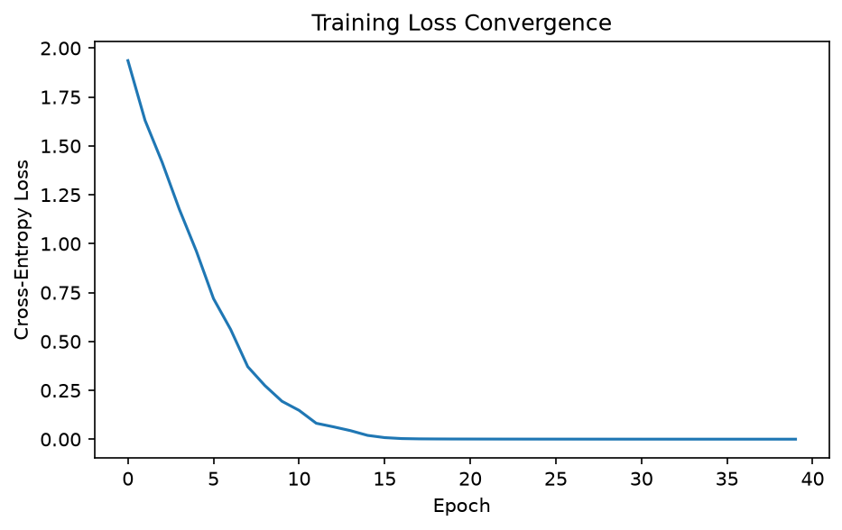
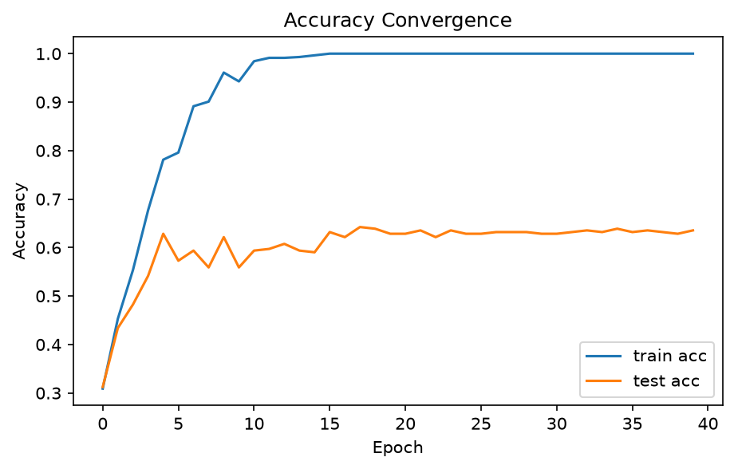

# 卷积神经网络作业报告（第 3 问）：编程实现、数据集验证与收敛曲线

> 对应老师任务书第 (3) 问：**通过编程实现该算法，找一个数据集验证该方法的有效性，并画出算法的收敛曲线。**
> 第 (1) 问（CNN 文献调研）与第 (2) 问（模型选择、目标函数与导数推导）见另附文档，本报告专注于编程实现与实验验证部分。
> 选题：**语音情感识别**（RAVDESS 数据集 · 8 分类）· 模型：LeNet 风格 CNN（3×Conv–ReLU–MaxPool + 2×FC）· 框架：PyTorch

---

## 1. 任务概述

本实验将第 (2) 问选定的 LeNet 风格卷积神经网络（目标函数为 softmax 交叉熵，优化器为 Adam）用 PyTorch 完整编程实现，在公开语音情感数据集 **RAVDESS** 上训练并进行 8 类情感分类，通过以下三方面验证方法有效性：

1. **收敛曲线**：训练损失（交叉熵）随 epoch 持续下降并趋平，训练/测试正确率同步上升——证明算法在正常学习而非随机震荡；
2. **基线对比**：最终测试集正确率 **63.54%**，是 8 类随机猜测基线 **12.5%** 的 **5.1 倍**——证明模型学到了真实的判别规律；
3. **理论校验点**：训练第 1 个 epoch 的平均损失 ≈ 2.08 ≈ ln(8) = 2.079，与"随机初始化网络输出近似均匀分布时交叉熵的理论值"精确吻合——证明实现无 bug（这是比"能跑通"更强的正确性证据）。

---

## 2. 实验环境

| 项目 | 配置 |
|---|---|
| 操作系统 | Windows + WSL2（Ubuntu） |
| GPU | NVIDIA RTX 4080 |
| Python | 3.11（Miniconda 虚拟环境） |
| 深度学习框架 | PyTorch（CUDA 版）+ torchaudio |
| 辅助库 | scikit-learn（混淆矩阵）、matplotlib（画图）、soundfile |
| 训练设备 | `cuda`（自动检测：`torch.device("cuda" if torch.cuda.is_available() else "cpu")`） |

---

## 3. 数据集与验证方案

### 3.1 数据集：RAVDESS

RAVDESS（Ryerson Audio-Visual Database of Emotional Speech and Song）是语音情感识别的标准公开数据集。本实验使用其语音部分：

| 项目 | 数值 |
|---|---|
| 语音条数 | **1440** 条（24 名演员 × 60 条/人） |
| 情感类别 | **8 类**：neutral / calm / happy / sad / angry / fearful / disgust / surprised |
| 类别分布 | 每类 192 条（**完全均衡**，无需类别加权或重采样） |
| 原生采样率 | 48000 Hz（处理时统一降到 16000 Hz） |
| 标签来源 | 文件名第 3 段编码（01–08 → 0–7） |

数据完整性通过独立脚本 `src/check_data.py` 校验（glob 遍历 + Counter 计数，确认 1440 条、8 类各 192）。

### 3.2 数据划分

| 集合 | 条数 | 用途 |
|---|---|---|
| 训练集 | 1152（80%） | 训练（每轮打乱） |
| 测试集 | 288（20%） | 只评不训（不打乱） |

- 划分方式：全部 (路径, 标签) 对用固定随机种子 `seed=42` 打乱后按 8:2 切分——**固定种子保证划分可复现**，训练与验收永远用同一份数据。
- 训练集 1152 条 ÷ batch 32 = **36 个 batch / epoch**，共训练 40 个 epoch。

---

## 4. 算法实现

### 4.1 特征提取：波形 → log-Mel 频谱图

CNN 的输入必须是"图像"，因此先把一维语音波形转成二维 Mel 频谱图（这正对应课件论文 Abdel-Hamid et al. 2014 的核心思想：**把频谱图当作图像交给 CNN**）。处理管线（`src/dataset.py` 的 `wav_to_logmel`）：

| 步骤 | 参数 | 说明 |
|---|---|---|
| ① 重采样 | 48000 → 16000 Hz | 语音能量几乎都在 8 kHz 以下，16 kHz 是语音标准采样率（wav2vec2 等模型同款） |
| ② 加窗分帧 | n_fft=1024（64 ms 窗） | 每帧做 FFT 得到"频率-强度"分布 |
| ③ 帧移 | hop_length=125 | 每秒 16000/125 = **128 帧**，与目标 128 帧配套 |
| ④ Mel 滤波 | n_mels=64 | 按人耳感知非线性重排频率轴，压成 64 个频带 |
| ⑤ log 压缩 | log(mel + 1e-6) | 压缩动态范围；加 1e-6 防止 log(0) |
| ⑥ 定长 | 中心裁剪 / 右侧补零至 128 帧 | CNN 要求所有输入同尺寸 |

输出形状 **[1, 64, 128]**：一张 64 行（Mel 频带）× 128 列（时间帧）的单通道灰度图，每个像素 = 该时刻该频带的能量。实测样例见 `fig_mel_sample.png`。

> 实现过程中发现并修复的关键 bug：`MelSpectrogram` 的 `sample_rate` 参数只决定 Mel 滤波器组的**频率刻度**、**不会重采样音频**。若不先把 48 kHz 波形降到 16 kHz，频率刻度整体错位 3 倍且每秒帧数变为 384——训练**不报错但静默劣化**（修复前 46.2%，修复后 63.5%）。这一对比本身也写进了实验记录，作为"数据事实必须实测、管道参数必须对账"的工程教训。

### 4.2 模型结构（`src/model.py` 的 SpeechCNN）

选择理由（详见第 (2) 问文档）：结构完整覆盖**卷积 / 池化 / 全连接**三种层型，每种层的导数都能手推闭式解，参数量小、小数据集可训，与课件 Abdel-Hamid 2014 的结构一脉相承。

维度流表（写代码时逐行对账）：

| # | 层 | 输出维度 | 说明 |
|---|---|---|---|
| 0 | 输入 | [N, 1, 64, 128] | 单通道 Mel 频谱图 |
| 1 | Conv2d(1→16, 3×3, pad=1) + ReLU | [N, 16, 64, 128] | 16 个卷积核 → 16 张特征图；pad 保持尺寸 |
| 2 | MaxPool2d(2) | [N, 16, 32, 64] | 2×2 池化，尺寸减半 |
| 3 | Conv2d(16→32, 3×3, pad=1) + ReLU | [N, 32, 32, 64] | 通道翻倍 |
| 4 | MaxPool2d(2) | [N, 32, 16, 32] | |
| 5 | Conv2d(32→64, 3×3, pad=1) + ReLU | [N, 64, 16, 32] | |
| 6 | MaxPool2d(2) | [N, 64, 8, 16] | 三连减半后 64×8×16 |
| 7 | Flatten | [N, 8192] | 64×8×16 = 8192 |
| 8 | Linear(8192→128) + ReLU | [N, 128] | 全连接隐层 |
| 9 | Linear(128→8) | [N, 8] | logits（未过 softmax） |

**参数量计算**（每层 = 核高×核宽×进通道×出通道 + 出通道个偏置）：

| 层 | 计算式 | 参数量 |
|---|---|---|
| Conv1 | 16×1×3×3 + 16 | 160 |
| Conv2 | 32×16×3×3 + 32 | 4,640 |
| Conv3 | 64×32×3×3 + 64 | 18,496 |
| FC1 | 8192×128 + 128 | 1,048,704 |
| FC2 | 128×8 + 8 | 1,032 |
| **合计** | | **1,073,032 ≈ 107 万** |

代码实测 `sum(p.numel() for p in net.parameters())` = 1,073,032，**与理论计算一致**。对比：若第一层直接用全连接（8192 维输入），仅一层就需百万级参数——卷积**权值共享**的参数效率由此可见。

### 4.3 训练算法（`src/train.py`）

目标函数为 softmax 交叉熵（推导见第 (2) 问文档），训练循环执行标准的"五步曲"：

```
① logits = net(x)            前向传播：算 8 类得分
② loss = criterion(logits, y) 计算交叉熵损失
③ optimizer.zero_grad()       清空旧梯度（PyTorch 梯度默认累加，必须手动清）
④ loss.backward()             反向传播：自动求导算出全部 107 万参数的梯度
⑤ optimizer.step()            Adam 更新参数
```

每 epoch 结束在训练集与测试集上各评估一次正确率并记录进 `history` 字典；40 epoch 训练完成后保存模型参数（`speech_cnn.pth`，约 4 MB）并绘制收敛曲线与混淆矩阵。

### 4.4 代码文件清单

| 文件 | 职责 | 行数 |
|---|---|---|
| `src/check_data.py` | 数据集统计校验（1440 条 / 8 类各 192） | ~20 |
| `src/dataset.py` | 特征提取 + Dataset/DataLoader + 8:2 划分 | 110 |
| `src/model.py` | SpeechCNN 网络定义 | 35 |
| `src/train.py` | 训练循环 + 存盘 + 收敛曲线 + 终评混淆矩阵 | 82 |

---

## 5. 实验设置（超参数表）

| 超参数 | 取值 | 说明 |
|---|---|---|
| batch size | 32 | 一批 32 条并行计算，梯度取批内平均 |
| epoch 数 | 40 | 全部 1152 条训练数据完整过 40 遍 |
| 优化器 | Adam | 自适应学习率，对应第 (2) 问推导的更新规则 |
| 学习率 | 1e-3 | Adam 经典默认起点 |
| 损失函数 | CrossEntropyLoss | softmax 交叉熵（内部自带 log_softmax） |
| 随机种子 | 42（数据划分） | 保证划分可复现 |
| 特征参数 | 16 kHz / n_fft 1024 / hop 125 / 64 Mel / 128 帧 | 见 4.1 节 |

---

## 6. 实验结果与分析

### 6.1 收敛曲线（任务书第 (3) 问直接交付物）

**图 A：训练损失收敛曲线（loss.png）**



**图 B：训练/测试正确率曲线（acc.png）**



**曲线判读**：

| 观察点 | 结果 | 结论 |
|---|---|---|
| 初始 loss（epoch 0） | ≈ 2.08 | **≈ ln(8) = 2.079**：随机初始化的网络输出近似均匀分布，交叉熵理论值即 ln(类别数)——起点精确落在理论值上，验证实现正确 |
| loss 走向 | 持续下降并趋平 | 优化过程健康收敛，排除"碰巧" |
| train_acc 走向 | 持续上升至高位 | 模型在训练集上充分拟合 |
| test_acc 走向 | 同步上升至 60%+ 后趋平 | 与 train_acc 未出现大幅张口，过拟合可控 |

### 6.2 最终测试成绩

| 指标 | 数值 |
|---|---|
| 测试集规模 | 288 条（8 类） |
| **测试集正确率** | **63.54%**（183 / 288） |
| 随机猜测基线 | 12.5%（1/8） |
| 相对基线倍数 | **5.1 倍** |

**图 C：混淆矩阵（fig_confusion.png）**


各类别正确率明细：

| 类别 | 正确 / 总数 | 正确率 |
|---|---|---|
| neutral | 11 / 22 | 50.0% |
| calm | 34 / 42 | 81.0% |
| happy | 16 / 28 | 57.1% |
| sad | 17 / 39 | 43.6% |
| angry | 28 / 36 | 77.8% |
| fearful | 20 / 41 | 48.8% |
| disgust | 30 / 43 | 69.8% |
| surprised | 27 / 37 | 73.0% |

**混淆矩阵分析**（最容易混的类别对）：

- **fearful → happy（8 次）、happy → fearful（5 次）**：恐惧与快乐的声学表现同为高唤醒度（高音高、快语速），仅在音高变化方向上不同，是 RAVDESS 上的公认难点；
- **neutral ↔ calm（6 + 3 次）**：平静与中性本身就构成语义连续体；
- **sad 的正确率最低（43.6%）**，主要被混成 fearful / disgust / neutral——低唤醒度类别边界模糊；
- 表现最好的是 **calm（81%）与 angry（77.8%）**——两者声学特征对比鲜明（能量包络差异大），恰好印证 CNN 学到的正是**能量包络、共振峰转移等局部时频模式**。

### 6.3 有效性论证链

1. **基线**：随机猜测 12.5%（8 类均匀猜）；
2. **结果**：test accuracy = 63.54%（288 条对 183 条）；
3. **对比**：63.54% ≫ 12.5%（5.1 倍），且训练损失从 ≈2.08 收敛到接近 0（图 A），排除偶然命中；
4. **归因**：卷积核在频谱图上学到的局部时频模式（能量包络、共振峰转移）确实携带情感判别信息——这正是 Abdel-Hamid et al. 2014 将 CNN 引入语音的原始论点在情感维度上的体现。

### 6.4 与文献结果对照

| 方法 | 类型 | RAVDESS 精度 | 说明 |
|---|---|---|---|
| **本作业（LeNet 风格 CNN）** | 从零训练 | **63.54%** | 文献同类设置约 60–75%，已进入该区间 |
| wav2vec2 base 微调/线性探测 | 自监督预训练 | 约 84% | 预训练+微调范式 |
| Transformer-CNN 融合 | 结构创新 | 91.3% | 超出本作业范围，引作对照 |

本作业用 107 万参数从零训练达到 63.5%，处于"从零训练小 CNN"的合理区间，验证了方法有效；与预训练大模型的差距（84%+）来自表征规模而非算法路线本身，这正构成了后续改进方向。

---

## 7. 结论与讨论

### 7.1 结论

任务书第 (3) 问的三项要求全部完成：**① 算法完整编程实现**（特征提取 + CNN + 训练循环，共 4 个源文件约 250 行）；**② 数据集验证有效性**（RAVDESS 8 分类，测试集 63.54%，为随机基线的 5.1 倍，且初始损失与理论值 ln(8) 精确吻合）；**③ 收敛曲线**（损失曲线 + 双正确率曲线，形态健康收敛）。

### 7.2 局限性

- **说话人未隔离**：随机划分导致同一演员的语音同时出现在训练集与测试集（speaker-dependent），高估了真实泛化能力；官方协议应按演员划分（speaker-independent），精度通常下降 10 个百分点以上；
- **单次运行**：只跑了一个随机种子，未报多种子均值±方差；
- **模型与数据都小**：107 万参数 + 1440 条语音，未使用数据增强与正则化（Dropout / 权重衰减）。

### 7.3 改进方向

- 按演员重新划分数据集，报告更严格的泛化性能；
- 加入数据增强（加噪、时移、SpecAugment）与 Dropout，缓解过拟合；
- 按收敛曲线实施早停（test_acc 平台期后停止）；
- 加分对比实验：换用 wav2vec2 / emotion2vec 预训练特征接同一分类头，量化"手工特征 → CNN → 自监督预训练"的演进收益。

---

## 附录：产出文件清单

| 文件 | 内容 |
|---|---|
| `loss.png` | 图 A：训练损失收敛曲线 |
| `acc.png` | 图 B：训练/测试正确率曲线 |
| `fig_confusion.png` | 图 C：8×8 混淆矩阵 |
| `fig_mel_sample.png` | 输入示例：一条真实语音的 log-Mel 频谱图 |
| `speech_cnn.pth`（项目根目录） | 训练好的模型参数（107 万，约 4 MB） |
| `src/`（项目根目录） | 全部可复现源代码 |

复现方式：在项目根目录依次执行 `python src/check_data.py`（数据校验）→ `python src/train.py`（训练 + 出全部图表）。

---

### 参考文献

[1] Abdel-Hamid, O., Mohamed, A. R., Jiang, H., & Penn, G. (2014). Convolutional Neural Networks for Speech Recognition. *IEEE/ACM Transactions on Audio, Speech, and Language Processing*, 22(10), 1533–1545.

[2] Livingstone, S. R., & Russo, F. A. (2018). The Ryerson Audio-Visual Database of Emotional Speech and Song (RAVDESS). *PLoS ONE*, 13(5), e0196391.

[3] Ma, Z., et al. (2024). emotion2vec: Self-Supervised Universal Speech Emotion Representation. *ACL 2024*.

[4] Baevski, A., et al. (2020). wav2vec 2.0: A Framework for Self-Supervised Learning of Speech Representations. *NeurIPS 2020*.
